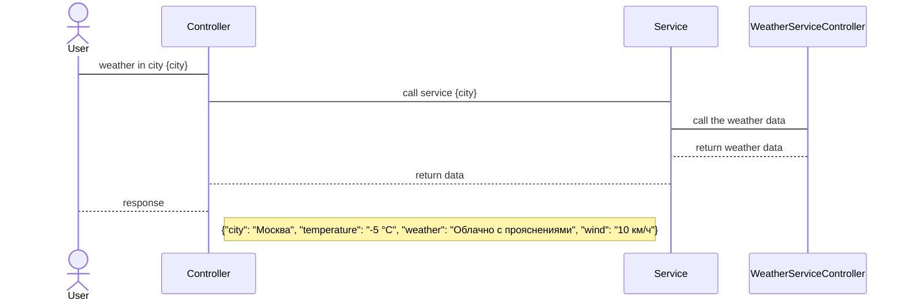

## Условия задачи:

Разработать приложение на NodeJS с использованием TS и библиотеки Express, которое предоставляет интерфейс в виде end-point RESTful API (http) для получения погоды в указанном городе. Получить температуру, влажность и скорость ветра.

Ограничения реализации: 
- **Протокол**: HTTP  
- **Формат данных**: JSON. Результаты погоды передавать в виде json.  
- Запрос только одного города (бесплатная лицензия поддерживает ограниченное кол-во запросов)

⚠️ Важное сообщение: данным пример учебный. По сути это просто враппер над https://openweathermap.org/api, который имеет все уже необходимые API. 


## Функциональные требования
Релиз 1.
Обеспечить получение текущей погоды в указанном городе  
Релиз 2.
Поддержка разных единиц измерения погоды (градусы Цельсия, Фаренгейта)  
Релиз 3.
Получение прогноза погоды в указанном городе на количество дней вперед  
Релиз 4.
Сравнение погоды в разных городах  
Релиз 5.
Сравнение прогноза погоды в разных городах  

## Пользовательские требования
Пользователь обращается к системе с помощью HTTP запросов, указав город в строке запроса.

## Проектирование REST API
Процесс интеграции: Запрос с клиента состояние погоды в указанном городе.
### Участники:
Клиент  
Система погоды
### Процесс:
Клиент составляет запрос, указав в запросе город, в котором его интересует погода  
Система получает запрос  
Система проверяет запрос на корректность  
Система проверяет есть ли такой город в базе погоды  
Система отдает ответ на запрос с погодой в виде json   
### Проектирование метода.
#### Диаграмма последовательности

#### Запрос погоды в заданном городе
| Метод | Описание |
| --- | --- |
| `GET` | Получение информации о погоде в заданном городе |
| **URL-адрес** | `/api/v1/weatherincity?city={city}` |
| **Параметры запроса** | `city` - название города, для которого запрашивается информация о погоде |
| **Тело запроса** | Нет |
| **Заголовки запроса** | Нет |
| **Успешный ответ** | Код состояния: `200 OK`<br>Тело ответа: JSON-объект, содержащий информацию о погоде в заданном городе |
| **Ошибка запроса** | Код состояния: `404 Not Found`<br>Тело ответа: JSON-объект с сообщением об ошибке |
#### Параметры запроса
| Параметр | Тип | Описание |
| --- | --- | --- |
| `city` | строка | **Обязательный.** Название города, для которого запрашивается погода. |
| `units` | строка | Единицы измерения, используемые для температуры. Возможные значения: `metric`, `imperial`, `standard`. По умолчанию используются единицы измерения по системе СИ (метрическая система). |
| `lang` | строка | Язык, на котором должен быть возвращен ответ. Возможные значения: `en`, `ru`, `uk`, `pl`, `de`, `es`, `fr`, `it`, `pt`, `ro`, `tr`. По умолчанию используется английский язык (`en`). |
| `appid` | строка | **Обязательный.** Ключ API, используемый для доступа к данным о погоде. |
#### Пример запроса
```http
GET /api/v1/weatherincity?city=London&units=metric&lang=en&appid=abcdefg123456
```
#### Пример ответа
```json
    {
      "city": "Москва",
      "temperature": "-5 °C",
      "weather": "Облачно с прояснениями",
      "wind": "10 км/ч"
    }
```
## Архитектура системы и проектное решение

- Пользовательский интерфейс
  - Представлен RESTful API на Node.js с использованием пакета express
- Middleware
  - Обрабатывает GET запроса по роуту /api/v1/weatherincity
  - Валидирует параметры запроса на наличие обязательного параметра `city`
- Controller
  - Использует маршрутизацию запросов с помощью пакета express
  - При получении запроса на /api/v1/weatherincity передает его в слой бизнес-логики
- Adapter
  - Обращается к API сервису https://openweathermap.org/api с помощью пакета axios
  - Передает параметры запроса в формате, необходимом для API сервиса с ключом API и названием города
- Бизнес-логика
  - Получает запрос от Controller и трансформирует его в формат, необходимый для API сервиса, добавляя к запросу ключ API и приводит название города к нужному формату.
  - Отправляет запрос к API сервису с помощью Adapter и получает ответ
  - Обрабатывает полученные данные, выбирая только необходимые поля и трансформируя их для передачи в ответ клиенту в формате json
- Exceprion handler
  - Обрабатывает ошибки, возникающие в Middleware, Controller и Business Logic.
  - Возврат пользователю ответа в едином формате с уведомлением об ошибке
  - Логирование ошибок для последующего анализа
