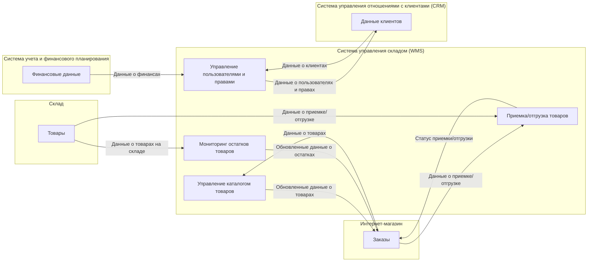

```mermaid
graph LR

    subgraph WMS["Система управления складом (WMS)"]
        CatalogManagement["Управление каталогом товаров"]
        GoodsReceptionAndShipping["Приемка/отгрузка товаров"]
        InventoryMonitoring["Мониторинг остатков товаров"]
        UserManagement["Управление пользователями и правами"]
    end

    subgraph InternetShop["Интернет-магазин"]
        Orders["Заказы"]
    end

    subgraph Warehouse["Склад"]
        Goods["Товары"]
    end

    subgraph CRM["Система управления отношениями с клиентами (CRM)"]
        CustomerData["Данные клиентов"]
    end

    subgraph Accounting["Система учета и финансового планирования"]
        FinancialData["Финансовые данные"]
    end

    Orders -->|Данные о товарах| CatalogManagement
    Orders -->|Данные о приемке/отгрузке| GoodsReceptionAndShipping
    CustomerData -->|Данные о клиентах| UserManagement
    FinancialData -->|Данные о финансах| UserManagement

    Goods -->|Данные о товарах на складе| InventoryMonitoring
    Goods -->|Данные о приемке/отгрузке| GoodsReceptionAndShipping

    CatalogManagement -->|Обновленные данные о товарах| Orders
    GoodsReceptionAndShipping -->|Статус приемки/отгрузки| Orders
    InventoryMonitoring -->|Обновленные данные о остатках| Orders
    UserManagement -->|Данные о пользователях и правах| CustomerData
```
