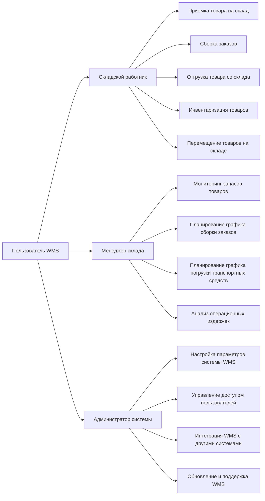
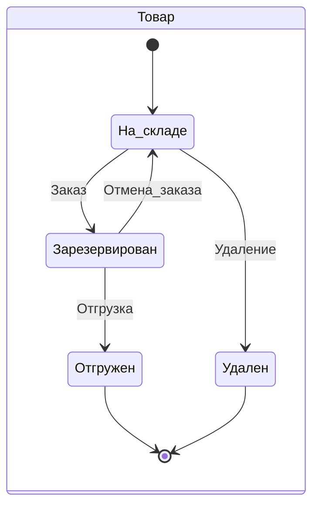
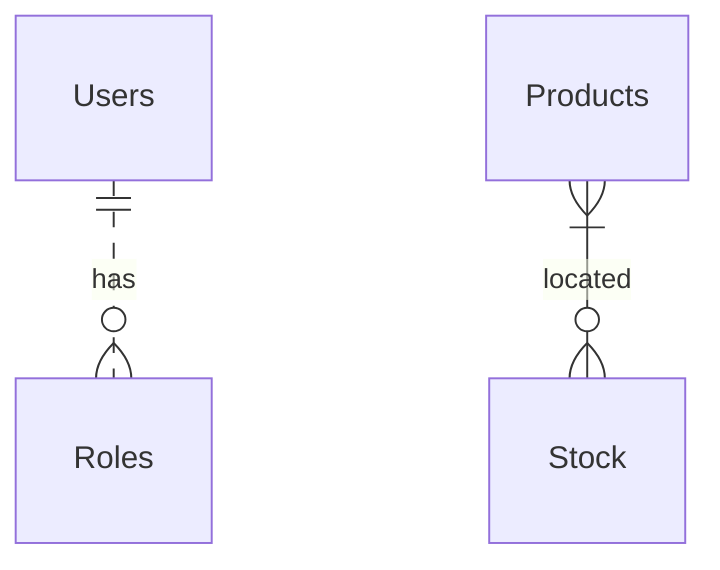
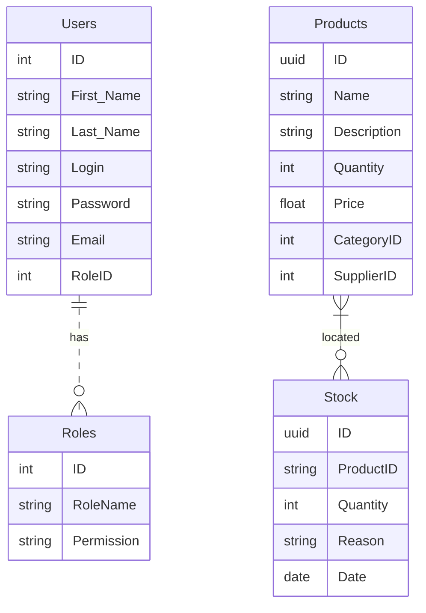
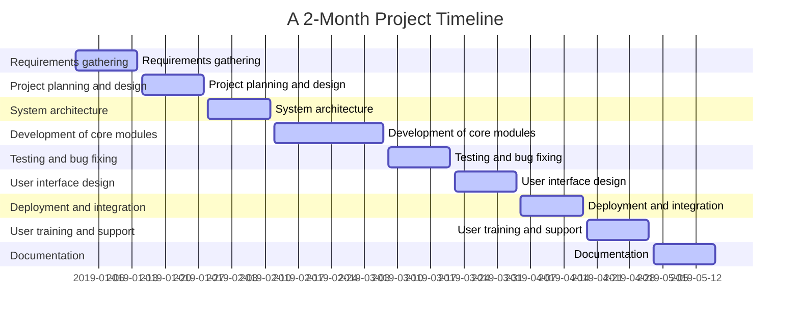

# Система управления складом (WMS) - серверная часть (backend NodeJS/TS)

## Оглавление

1. [Введение](#введение-в-проект)
2. [Бизнес требования](#бизнес-требования)
3. [Концепция системы](#концепция-системы-фрагмент-карточки-проекта)
4. [Пользовательские требования](#пользовательские-требования)
5. [Функциональные требования](#основные-функциональные-требования)
6. [Пользователи](#пользователи-системы)
7. [Роли пользователей](#пользователи-системы)
8. [Проектирование REST API](#проектирование-rest-api)
9. [Участники](#участники)
10. [HTTP ответы ресурса Пользователи](#http-ответы-ресурса-пользователи)
11. [HTTP ответы ресурса Продукты](#http-ответы-ресурса-продукты)
12. [Архитектура приложения](#архитектура-приложения)
13. [Проектирование модели предметной области](#проектирование-модели-предметной-области)
14. [ER diagram](#er-diagram-users-and-products)
15. [Физическая модель данных для ORM Prisma NodeJS](#физическая-модель-данных-для-orm-prisma-nodejs)
16. [Список литературы](#используемая-литература-в-ходе-подготовки-проекта)

------------
**⚠️ RUN**  
1 env config:

PORT=set the port as number  
SALT=set the salt as number  
SECRET='set the secret as string' 
SKIP = 0
TAKE = 20

2 npm ci && npm start 
3 e2e test: npm test:e2e

------------
## Техническое введение

⚠️ Это учебный проект курса https://www.udemy.com/course/nodejs-start/ (https://learn.purpleschool.ru/public/products) в рамках которого я выступаю в ролях:

- Junior Backend Developer for JS/NodeJS/TS (implementing backend)
- Middle System Analyst (describing business and system requirements)

В роли **Junior Backend Developer**:
- непосредственно сама реализация приложения;  
- проектирование слоеной архитектуры (middlewares, exceptions filters,  controller, error handler, services, repository, orm prisma);
- реализация CRUD операции с ресурсом (товары на складе);  
- реализация JWT авторизация с ролевой моделью;  
- реализация документации REST API (swagger);
- использование при разработке тестирования (unit, e2e);
- использование DI, логгирования ошибок, работа Git и тп.
- разработка Telegram-bot с использованием функционала слоя бизнес-логики (DI)
    
В роли **Middle System Analyst**:
- выделение видов требования;
- проектирование архитектуры приложения;
- разработка и описание бизнес-требований и их артифактов;
- разработка и описание пользовательских требований (Use cases, User stories, Job stories, User stories mapping ==доработать==);
- разработка и описание функциональных требований;
- проработка нефункциональных требований (==доработать==);
- проработка качества требований и критериев приемки(==доработать==);
- проработка Event storming(==доработать==)
- выделение агрегатов доменных областей и bounded contexts(==доработать==)
- проектирование Модели предметной области и баз данных;
- проектирование REST API;
- формулирование измеримых требований к качеству интерфейсов согласно подхода стандартов семейства HCI (Human-Computer Interaction)(==доработать==)
- базовые угрозы информационной безопасности(==доработать==)
- проверка требований на INCOSE Requirements Writing Guide(==доработать==)
  
&#128736;  Инструменты для редактирования README.md
- https://github.com/GnuriaN/format-README/blob/master/README.md
- https://structurizr.com/
- https://tableconvert.com/markdown-generator
- https://pandao.github.io/editor.md/en.html
- https://editor.swagger.io/
- https://emojio.ru/objects/d83ddee0-1f6e0-molot-i-gaechnyy-klyuch.html
- https://www.udemy.com/course/microservices-with-node-js-and-react/learn/lecture/19099026#overview пример проектирования метода by Stephen Grider
  
------------
## Введение в проект

В рамках проекта имитируется проект разработки WMS для интернет-магазина. Задача раздела помочь команде разработки ознакомится с контекстом задачи.

Наш интернет-магазин является активно развивающимся проектом, который занимается продажей товаров в онлайн-режиме.

Одной из важнейших доменных областей нашего интернет-магазина является Склад. Задача нашего проекта - обеспечить эффективное и надежное управление товарными запасами для поддержки онлайн-продаж, с минимальными операционными расходами на складские операции.

Текущая боль нашего проекта заключается в отсутствии системы управления складскими операциями (WMS). Для решения этой проблемы необходимо провести анализ требований к системе WMS и выбрать подходящую систему, которая удовлетворит наши потребности. Реализация данного проекта позволит нам повысить эффективность управления запасами товаров и улучшить обслуживание наших клиентов, что приведет к увеличению прибыли и укреплению нашей позиции на рынке электронной коммерции.

⚠️Примечание:
Количественные показатели целей бизнеса вида:
> Освоить Х% рынка за Y месяцев. Увеличить сектор рынка в стране X на Y%
> за Z месяцев. Достигнуть объема продаж X единиц или дохода, равного
> $Y, за Z месяцев.
>
не рассматриваются в рамках портфолио.
Артефакт анализа бизнес-требований Vision так же не рассматривается.

## Бизнес требования

Бизнес - систематическая деятельность, направленная на получение прибыли.

**Для** :  
>  - определения смысла проекта и обоснования его необходимости;
>  - разработки основы контракта; 
>  - разработки критериев приемки проекта;
>  - определения рамок проекта; 
>  - критериев приоритезации задач в ходе  разработки; 
>  - для формирования Product owners backlog,

необходимо выделить **бизнес-требования** к проекту, так как задача информационной системы или программного обеспечения достижение целей бизнеса за счет автоматизации бизнес-процессов.

Основная потребность бизнеса в сфере электронной коммерции, связанная с продажей товаров, может быть сформулирована следующим образом:

> Обеспечение эффективного и надежного управления товарными запасами для
> поддержки онлайн-продаж

Чтобы ответить на вопрос “Зачем бизнесу нужен этот проект?” рассмотрим пример, на основе которого будет сформулирован ответ:

> В электронной коммерции необходимо удовлетворять потребности клиентов
> и удерживать их внимание. Для этого, с точки зрения WMS, важно знать
> актуальное количество товара в наличии на складе. В противном случае,
> существует вероятность, что клиент будет разочарован, так как он не
> получит товар, который заказывал, либо товар, который есть в наличии
> не будет выставлен в Каталоге интернет-магазина как доступный. В
> итоге, клиент может обратиться к конкурентам, где найдет необходимый
> товар, и наш интернет-магазин потеряет клиента. Поэтому знать точное
> количество товаров на складе важно для сохранения
> конкурентоспособности и удержания клиентов.

**Зачем** это нужно:
> Обеспечить конкурентоспособность интернет-магазина за счет:
>  - учета актуальных остатков товаров 
>  - минимизации времени выполнения всех складских операций, в частности сборки заказов 
>  - оптимизации использования полезной площади хранения склада 
>  - минимизации операционных издержек

Какие **проблемы** решает система:
> - неактуальные остатки
> - переполнение склада
> - недоиспользование площадей склада
> - неоптимальное расположение товара на складе, что приводит к повышенным затратам на поиск и перемещение товаров;
> - неоптимальное время сборки заказов из-за неоптимального расположения товаров на складе
> - ошибки в сборке заказа, которые приводят к затратам на возврат заказа или к репутационным рискам
> - трудоемкость и возможные ошибки при ручном планировании графика сборки заказов
> - трудоемкость и возможные ошибки при ручном планировании графики погрузки транспортных средств

Решение указанных проблем позволит не терять доход из-за оттока клиентов к конкурентами по причине отсутствия товара, а также позволит снизить и удерживать уровень операционных расходов в рамках запланированных бюджетов. Соответственно, потребность бизнеса заключается в решении указанных ранее проблем:

> Бизнесу в сфере электронной коммерции необходимо обеспечить постоянную
> доступность товаров для своих покупателей, а также оптимизировать
> процессы хранения, перемещения и контроля запасов.

Для достижения этой цели требуется разработка и внедрение системы управления складом (WMS), которая позволит более эффективно управлять товарными запасами, снижать издержки и улучшать обслуживание клиентов.

Выделим бизнес-потребности в таблицу.

### Бизнес-потребности

|                                      Какую проблему решаем                                     |                Потребность               |                                                                 Описание                                                                 |
|:----------------------------------------------------------------------------------------------:|:----------------------------------------:|:----------------------------------------------------------------------------------------------------------------------------------------:|
| Неактуальные остатки                                                                           | Управление инвентаризацией               | Точное отслеживание и управление уровнем запасов, местоположением и перемещением товаров на складе.                                      |
| Обработка и выполнение заказов                                                                 | Обработка и выполнение заказов           | Эффективная обработка входящих заказов, комплектация, упаковка и доставка, чтобы удовлетворить потребности клиентов.                     |
| Управление трудовыми ресурсами                                                                 | Управление трудовыми ресурсами           | Оптимизация распределения рабочей силы, отслеживание производительности и балансировка нагрузки для эффективной работы.                  |
| Интеграция и обмен данными                                                                     | Интеграция и обмен данными               | Бесшовное взаимодействие и обмен данными с другими корпоративными системами, такими как ERP, TMS и платформы электронной коммерции.      |
| Отчетность и аналитика                                                                         | Отчетность и аналитика                   | Получение оперативных данных и ключевых показателей эффективности (KPI) для принятия обоснованных решений и улучшения процессов.         |
| Переполнение,  недоиспользование площадей склада,  неоптимальное расположение товара на складе | Оптимизация и использование пространства | Максимизация складской емкости и эффективность размещения товаров для сокращения затрат и улучшения работы на складе.                    |
| Приемка и размещение товаров                                                                   | Приемка и размещение товаров             | Оптимизация процессов приемки, проверки и хранения входящих товаров для обеспечения точности и эффективности.                            |
| Управление возвратами                                                                          | Управление возвратами                    | Эффективное управление возвратами от клиентов, пополнение запасов и распределение товаров для снижения затрат и удовлетворения клиентов. |
| Контроль качества и соответствие нормам                                                        | Контроль качества и соответствие нормам  | Обеспечение соблюдения стандартов качества, требований безопасности и отраслевых нормативов в процессах работы на складе.                |
| Масштабируемость и гибкость                                                                    | Масштабируемость и гибкость              | Адаптация к изменениям в бизнесе, колебаниям спроса и развивающимся операционным требованиям.                                            |                 |

### Реестр бизнес-требований
Для обеспечения трассируемости требований, сформулируем реестр бизнес-требований.
| Код требования | Описание требования |
| :--- | :--- |
| BREQ-01 | Система WMS должна обеспечивать точный учет остатков товаров на складе |
| BREQ-02 | Система WMS должна обеспечивать оптимизацию использования полезной площади склада |
| BREQ-03 | Система WMS должна обеспечивать минимизацию времени выполнения складских операций, в том числе сборки заказов |
| BREQ-04 | Система WMS должна обеспечивать оптимальное расположение товаров на складе для минимизации времени поиска и перемещения товаров |
| BREQ-05 | Система WMS должна обеспечивать минимизацию операционных издержек на складе |
| BREQ-06 | Система WMS должна обеспечивать автоматическое планирование графика сборки заказов |
| BREQ-07 | Система WMS должна обеспечивать автоматическое планирование графика погрузки транспортных средств |
| BREQ-08 | Система WMS должна обеспечивать возможность оперативного контроля за движением товаров на складе |
| BREQ-09 | Система WMS должна обеспечивать возможность управления и контроля за процессом приемки товаров на склад |
| BREQ-10 | Система WMS должна обеспечивать возможность управления и контроля за процессом отгрузки товаров со склада |
| BREQ-11 | Система WMS должна обеспечивать возможность быстрой и точной инвентаризации товаров на складе |
| BREQ-12 | Система WMS должна обеспечивать возможность работы в режиме онлайн для мониторинга текущей ситуации на складе |
| BREQ-13 | Система WMS должна обеспечивать возможность интеграции с другими системами и программным обеспечением в рамках интернет-магазина |
| BREQ-14 | Система WMS должна обеспечивать возможность реализации новых функций и модулей в дальнейшей перспективе |
| BREQ-15 | Система WMS должна обеспечивать высокую степень безопасности и защиты данных, хранящихся на складе |

### Реестр бизнес-правил
| Код BRULE | Описание BRULE | Код требования |
| :--- | :--- | :--- |
| BRULE-01 | Остатки товаров на складе должны обновляться автоматически после каждой операции приемки, отгрузки, перемещения или инвентаризации товаров | BREQ-01 |
| BRULE-02 | Товары на складе должны располагаться в соответствии с их характеристиками и частотой обращения, чтобы максимально использовать полезную площадь склада | BREQ-02 |
| BRULE-03 | Процесс сборки заказов должен быть организован оптимально с учетом расположения товаров на складе, чтобы минимизировать время выполнения операций | BREQ-03 |
| BRULE-04 | Товары на складе должны располагаться в соответствии с их характеристиками и частотой обращения, чтобы минимизировать время поиска и перемещения товаров | BREQ-04 |
| BRULE-05 | Размещение товаров на складе и выполнение складских операций должны быть организованы таким образом, чтобы минимизировать операционные издержки | BREQ-05 |
| BRULE-06 | График сборки заказов должен формироваться автоматически на основе текущей загруженности склада и времени, необходимого для выполнения операций | BREQ-06 |
| BRULE-07 | График погрузки транспортных средств должен формироваться автоматически на основе текущей загруженности склада и времени, необходимого для выполнения операций | BREQ-07 |
| BRULE-08 | Текущее расположение товаров на складе должно быть доступно для оперативного контроля | BREQ-08 |


## Концепция системы (Фрагмент Карточки проекта)


| Карточка проекта              |                                                                                                                                                                                                                                          |
|-------------------------------|------------------------------------------------------------------------------------------------------------------------------------------------------------------------------------------------------------------------------------------|
| Автоматизируемая деятельность | Управление товарными запасами и складскими операциями для интернет-магазина                                                                                                                                                                           |
| Заинтересованные стороны      | Пользователи услуг интернет-магазина, Владелец интернет-магазина, Работники склада, Поставщики товаров                                                                                                                                                                             |
| Текущее решение               | Учет и регистрация товаров на складе ведутся вручную с использованием бумажных журналов, дозаказ товаров со сниженным запасами производится не вовремя.                                                                                                                                                            |
| Решаемые проблемы             | Снижение вероятности ошибок, вызванных человеческим фактором: ошибки при записи в журнал, расчет количества остатков и времени сборки заказов, снижение времени выполнения складских операций, оптимизация использования полезной площади хранения склада, минимизация операционных издержек |
| Целевая ситуация              |                                                                                                                                                                                                                                          |
| Цель для заказчика            | Увеличить эффективность и надежность управления товарными запасами для поддержки онлайн-продаж, сократить операционные издержки на 25% и сохранить конкурентоспособность интернет-магазина.                                                                                                                               |
| Назначение                    | Для пользователей услуг интернет-магазина: обеспечить наличие популярных товаров, снизить вероятность несоответствия товара заказу;                                                                                                      |
|                               | Для работников склада: упростить процессы приемки и выдачи товаров, инвентаризации склада, минимизировать время сборки заказов;                                                                                                                           |
|                               | Для поставщиков товаров: получить актуальную информацию о наличии товаров на складе.                                                                                                                            | 
**Основные фичи системы:**

1. Отслеживание остатков и перемещение товаров на складе
2. Организация процесса приемки и выдачи товаров со склада
3. Организация и планирование процесса сборки заказов
4. Генерация отчетов о движении товаров на складе

### Стейкхолдеры
Перед сбором пользовательских историй, определим стейкхолдеров системы.
**Стейкхолдеры WMS:**
Владельцы интернет-магазина: Заинтересованы в оптимизации складских операций и снижении операционных издержек для повышения прибыльности бизнеса.
Операционные менеджеры: Заинтересованы в улучшении качества обслуживания клиентов и ускорении выполнения заказов.
IT-специалисты: Ответственны за поддержку и интеграцию WMS с другими системами компании.
Поставщики товаров: Заинтересованы в точном и своевременном контроле и учете поставляемых товаров на складе интернет-магазина.
Клиенты интернет-магазина: Заинтересованы в актуальности товарных предложений и быстром выполнении своих заказов.

## Пользовательские требования
### Общие положения
> Лексическая формула Пользовательских требований: 
> Система должна позволять Пользователю [РОЛЬ][ДЕЙСТВИЕ][ОБЪЕКТ ДЕЙСТВИЯ][атрибуты объекта]
> 
> **Пользовательские требования** - это требования, выраженные пользователями и описывающие, каким образом система должна быть использована. Эти требования обычно формулируются на естественном языке и представляют собой описание того, что должна делать система для пользователя, а не как она это должна делать.  
**Таким образом**, пользовательские требования фокусируются на том, что должна делать система для пользователя, а функциональные требования - на том, каким образом это должно происходить в системе.

После определения бизнес-требований и высокоуровневых возможностей необходимо детализировать требования к системе с точки зрения работы Пользователей системы. Для этого необходимо выделить основные профили Пользователей. Далее, необходимо провести сбор пользовательских историй. Пользовательская история в обязательном порядке должна иметь трассировку на родительское бизнес-требование.


### Определение основных профилей пользователей


Диаграмма Use case

**Пользователи WMS:**
|Пользователи WMS  |Описание роли  |
|--|--|
| Складские работники |Ответственны за выполнение операций на складе, таких как приемка, отгрузка, перемещение и инвентаризация товаров. Им необходимо использовать WMS для контроля запасов и эффективного выполнения своих рабочих обязанностей.  |
| Менеджеры склада |Ответственны за управление и контроль складской деятельности. Им необходимо использовать WMS для мониторинга производительности, планирования графиков и оптимизации складских операций.  |
| Администраторы WMS |Ответственны за настройку, поддержку и обновление системы WMS. Им необходимо использовать WMS для обеспечения стабильной работы системы и интеграции с другими программными продуктами компании.  |

### Пользовательские истории (User story)

1. Складской работник:
   - Как складской работник, я хочу добавить новый товар на склад, чтобы учитывать его в системе WMS (Цель: обеспечить точный учет остатков товаров на складе).
   - Как складской работник, я хочу просматривать информацию о товаре на складе, чтобы знать его характеристики и количество (Цель: обеспечить точный учет остатков товаров на складе).
   - Как складской работник, я хочу обновлять информацию о товаре на складе, чтобы отражать актуальные данные (Цель: обеспечить точный учет остатков товаров на складе).
   - Как складской работник, я хочу удалить товар со склада, если он больше не доступен или не будет использоваться (Цель: оптимизация использования полезной площади склада).
   - Как складской работник, я хочу видеть список всех товаров на складе, чтобы иметь общий обзор запасов (Цель: обеспечить точный учет остатков товаров на складе).

2. Менеджер склада:
   - Как менеджер склада, я хочу добавлять новых пользователей системы WMS, чтобы предоставить им доступ к системе (Цель: обеспечить возможность работы с системой WMS для сотрудников склада).
   - Как менеджер склада, я хочу просматривать информацию о пользователях системы WMS, чтобы знать их роли и обязанности (Цель: обеспечить контроль и управление персоналом склада).
   - Как менеджер склада, я хочу обновлять информацию о пользователях системы WMS, чтобы отражать актуальные данные (Цель: обеспечить контроль и управление персоналом склада).
   - Как менеджер склада, я хочу удалять пользователей системы WMS, если они больше не работают с системой или на складе (Цель: обеспечить контроль и управление персоналом склада).
   - Как менеджер склада, я хочу видеть список всех пользователей системы WMS, чтобы иметь общий обзор персонала и их ролей (Цель: обеспечить контроль и управление персоналом склада).

3. Администратор системы:
   - Как администратор системы, я хочу добавлять новых пользователей системы WMS, чтобы предоставить им доступ к системе (Цель: обеспечить возможность работы с системой WMS для сотрудников склада).
   - Как администратор системы, я хочу просматривать информацию о пользователях системы WMS, чтобы знать их роли и обязанности (Цель: обеспечить безопасность и контроль доступа к системе).
   - Как администратор системы, я хочу обновлять информацию о пользователях системы WMS, чтобы отражать актуальные данные (Цель: обеспечить безопасность и контроль доступа к системе).
   - Как администратор системы, я хочу удалять пользователей системы WMS, если они больше не работают с системой или на складе (Цель: обеспечить безопасность и контроль доступа к системе).
   - Как администратор системы, я хочу видеть список всех пользователей системы WMS, чтобы иметь общий обзор персонала и их ролей (Цель: обеспечить безопасность и контроль доступа к системе).
  - 
На основе анализа User stories, выделен список требований:

~~1. Обеспечить актуальность остатков товаров на складе (Высокий приоритет)
2. Обеспечить оптимальное использование полезной площади склада (Высокий приоритет)
3. Минимизировать время выполнения складских операций, в том числе сборки заказов (Высокий приоритет)
4. Обеспечить оптимальное расположение товаров на складе (Высокий приоритет)
5. Минимизировать операционные издержки на складе (Средний приоритет)
6. Обеспечить автоматическое планирование графика сборки заказов (Средний приоритет)
7. Обеспечить автоматическое планирование графика погрузки транспортных средств (Средний приоритет)
8. Обеспечить возможность оперативного контроля за движением товаров на складе (Средний приоритет)
9. Обеспечить возможность управления и контроля за процессом приемки товаров на склад (Средний приоритет)
10. Обеспечить возможность управления и контроля за процессом отгрузки товаров со склада (Средний приоритет)
11. Обеспечить возможность быстрой и точной инвентаризации товаров на складе (Средний приоритет)
12. Обеспечить возможность работы в режиме онлайн для мониторинга текущей ситуации на складе (Низкий приоритет)
13. Обеспечить возможность интеграции с другими системами и программным обеспечением в рамках интернет-магазина (Низкий приоритет)
14. Обеспечить возможность реализации новых функций и модулей в дальнейшей перспективе (Низкий приоритет)
15. Обеспечить высокую степень безопасности и защиты данных, хранящихся на складе (Низкий приоритет)
16. Обеспечить безопасность и контроль доступа к системе (Низкий приоритет)
17. Обеспечить оптимальное расположение товаров на складе на основе закупочной деятельности (Низкий приоритет)~~

Приоритизация требований основывается на их важности для бизнес-процесса и конечных пользователей системы. Высокий приоритет отражает требования, которые критически важны для успеха проекта и удовлетворения потребностей пользователей.

### Реестр пользовательских требований. 

| №USERREQ | Пользовательское требование                                                                                            |
|----------|------------------------------------------------------------------------------------------------------------------------|
| 1 Пользователь.Авторизация       | Возможность авторизироваться в системе и получать доступ к своим данным и функционалу в соответствии с ролью.          |
| 2 Пользователь.Создание      | Возможность создавать нового пользователя в системе с набором прав доступа.                                             |
| 3 Пользователь.Удаление       | Возможность удаления пользователя.                                             |
| 4 Пользователь.Просмотр.Товары        | Возможность просматривать список товаров или один товар с остатками на складе с возможностью фильтрации по категориям и характеристикам товаров.  |
| 5 Пользователь.Добавление.Товара       | Возможность добавлять новый товар на склад с указанием причины добавления и источника.                                 |
| 6 Пользователь.Удаление.Товара       | Возможность удалять товар со склада с указанием причины убытия и направления убытия.                                   |
| 7 Пользователь.Обновление.Товара       | Возможность обновлять характеристики товара на складе с указанием причины изменения.                                    |
| 8 Пользователь.Поиск.Товара       | Возможность поиска товара на складе с использованием фильтрации по характеристикам товара.                             |
| 9 Пользователь.ИзменениеКоличества.Товара       | Возможность изменять количество товара на складе с указанием причины изменения.                                        |

### Роли пользователей в системе

Ролевая модель **Роль: Администратор**
|  №USERREQ | Описание   |
| :------------: | :------------: |
| 2 | Создание нового пользователя  |
| 3 | Удаление пользователя  |
| 5 | Добавление нового товара  |
| 6 | Удаление товара  |
| 7 | Обновление информации о товаре  |
| 9 | Изменение остатков на складе |

Ролевая модель **Роль: Начальник склада**
|  №UserReq | Описание   |
| :------------: | :------------: |
| 9 | Изменение остатков на складе |

Ролевая модель **Роль: общий доступ для всех зарегистрированных сотрудников склада**
|  №UserReq | Описание   |
| :------------: | :------------: |
| 1 | Авторизация  |
| 4 | Получение списка товаров |
| 4 | Получение конкретного товара |
| 8  | Поиск товара с поисковыми параметрами фильтрации |

## Основные функциональные требования

> Функциональные требования приведены согласно лексическим формулам: 
> [Условие][Субъект][Действие][Объект][Ограничение/Значение]
> Система должна [ДЕЙСТВИЕ][ОБЪЕКТ ДЕЙСТВИЯ][атрибуты объекта]
**Функциональные требования** описывают, каким образом система должна выполнять конкретную функцию или задачу. Они описывают, что должна делать система и как она должна это делать. Функциональные требования обычно выражаются в терминах конкретных функций, операций или процессов, которые система должна выполнять.  

### Функциональные требования
1. Система должна хранить информацию о количестве товара на складе
2. Система должна поддерживать авторизированный доступ к системе с ограничением по доступу к функционалу согласно ролевой модели ([Роли пользователей](#пользователи-системы)). 
3. Система должна обеспечивать генерацию нового типа Пользователя с набором прав доступа (Администратор, Начальник склада)
4. Система должна обеспечить по запросу Пользователя операцию по предоставлению всех товаров на складе.   
5. Система должна обеспечить по запросу Пользователя операцию по добавлению товара на склад с указанием причины добавления и источника.
6. Система должна обеспечить по запросу Пользователя операцию по удалению товара со склада, направление убытия и причина убытия.  
7. Система должна обеспечить по запросу Пользователя операцию по изменению свойств товара с указанием причин изменения. Нулевое значение количества отстатков не приводит к удалению товара со склада.
8. Система должна обеспечить поиск с фильтрацией товара на складе по различным параметрам, таким как наименование товара, количество, стоимость, дата добавления.

## Проектирование REST API

> Общий подход к проектированию REST API. Перед началом проектирования
> REST API, необходимо проработать модель предметной области и выделить
> сущности, логику работы которых реализует система. В нашем примере,
> выделено две сущности: Пользователь и Товары (на складе) и определим
> CRUDLs операции для них. Далее, опишем методы и параметры запросов ,
> ожидаемые ответы, включая http статусы.

#### Разбиение на ресурсы (сущности) и методы работы с ними
**Управление ресурсом "Пользователи"**
1. Авторизация пользователя
2. Создание нового пользователя с набором ролей
5. Обновление информации о пользователе
6. Удаление пользователя
 
| **№** | **Path**                   | **Method** | **Body**  | **Response**              | **Description**                                |
|-------|----------------------------|------------|-----------|---------------------------|------------------------------------------------|
| 1     | /users                     | GET        | -         | Список пользователей      | Получить список всех пользователей             |
| 2     | /users/{id}                | GET        | -         | Информация о пользователе | Получить информацию о конкретном пользователе  |
| 3     | /users                     | POST       | User data | Новый пользователь        | Создать нового пользователя                    |
| 4     | /users/{id}                | PUT        | User data | Обновленный пользователь  | Обновить информацию о пользователе             |
| 5     | /users/{id}                | DELETE     | -         | -                         | Удалить пользователя                           |
| 6     | /users/{id}/roles          | GET        | -         | Список ролей пользователя | Получить список ролей пользователя             |
| 7     | /users/{id}/roles          | POST       | Role data | -                         | Добавить роль пользователю                     |
| 8     | /users/{id}/roles/{roleId} | DELETE     | -         | -                         | Удалить роль у пользователя                    |
| 9     | /login                     | POST       | User creds | Jwt token                | Аутентификация пользователя                    |
#### Описание структуры объектов в теле запроса
##### User data
```json
{
  "name": "John Doe",
  "email": "johndoe@example.com",
  "password": "password123",
  "role": "User"
}
```

##### Role data
```json
{
  "name": "Admin",
  "description": "Administrator role with full access."
}
```

##### Response Список пользователей
```json
[
  {
    "id": "1",
    "name": "John Doe",
    "email": "johndoe@example.com",
    "role": "User"
  },
  {
    "id": "2",
    "name": "Jane Doe",
    "email": "janedoe@example.com",
    "role": "Admin"
  }
]
```

##### Response Информация о пользователе
```json
{
  "id": "1",
  "name": "John Doe",
  "email": "johndoe@example.com",
  "role": "User"
}
```

##### Response Новый пользователь
```json
{
  "id": "3",
  "name": "Alice Smith",
  "email": "alicesmith@example.com",
  "role": "User"
}
```

##### Response Список ролей пользователя
```json
[
  {
    "id": "1",
    "name": "Admin",
    "description": "Administrator role with full access."
  },
  {
    "id": "2",
    "name": "User",
    "description": "Regular user role."
  }
]
```

##### User creds
```json
{
  "email": "johndoe@example.com",
  "password": "password123",
}
```

**Управление ресурсом "Товары на складе"**
1. Получение списка товаров
2. Получение информации о конкретном товаре
3. Создание нового товара
4. Обновление информации о товаре
5. Удаление товара
6. Поиск товара с поисковыми параметрами фильтрации
7. Изменение остатков на складе (отдельный метод на изменение количества товара на складе)
8. Получение остатка конкретного товара



|   | № | Path                 | Method | Body         | Response                     |
|---|---|----------------------|--------|--------------|------------------------------|
|   | 1 | /products            | GET    | -            | Список товаров               |
|   | 2 | /products/{id}       | GET    | -            | Информация о товаре          |
|   | 3 | /products            | POST   | Product data | Новый товар                  |
|   | 4 | /products/{id}       | PUT    | Product data | Обновленный товар            |
|   | 5 | /products/{id}       | DELETE | -            | -                            |
|   | 6 | /products/search     | GET    | -            | Список товаров               |
|   | 7 | /products/{id}/stock | PUT    | Stock data   | Измененный остаток товара    |
|   | 8 | /products/{id}/stock | GET    | -            | Информация об остатке товара |

#### Описание структуры объектов в теле запроса
##### Product data and Stock data
```javascript
Product data = {
    'name': str,
    'category': str,
    'description': str,
    'characteristics': dict
}

Stock data = {
    'quantity': int,
    'reason': str
}
```

##### Responses objects
```javascript
Список товаров = [
    {
        'id': int,
        'name': str,
        'category': str,
        'description': str,
        'characteristics': dict,
        'quantity': int
    },
    {...},
    {...}
]

Информация о товаре = {
    'id': int,
    'name': str,
    'category': str,
    'description': str,
    'characteristics': dict,
    'quantity': int
}

Новый товар = {
    'id': int,
    'name': str,
    'category': str,
    'description': str,
    'characteristics': dict,
    'quantity': int
}

Обновленный товар = {
    'id': int,
    'name': str,
    'category': str,
    'description': str,
    'characteristics': dict,
    'quantity': int
}

Измененный остаток товара = {
    'id': int,
    'quantity': int,
    'reason': str
}

Информация об остатке товара = {
    'id': int,
    'quantity': int
}

```

### Участники:
Работник склада - Администратор  
Работник склада - Работник: "Начальник склада"  
Система управления складом (бекенд)  

### HTTP ответы ресурса Пользователи
| **№** | **Path**                   | **Method** | **Successful HTTP code** | **Unsuccessful HTTP code** | **Description**                               |
|-------|----------------------------|------------|--------------------------|----------------------------|------------------------------------------------|
| 1     | /users                     | GET        | 200                      | 401, 403, 404              | Получить список всех пользователей             |
| 2     | /users/{id}                | GET        | 200                      | 401, 403, 404              | Получить информацию о конкретном пользователе  |
| 3     | /users                     | POST       | 201                      | 400, 401, 403              | Создать нового пользователя                    |
| 4     | /users/{id}                | PUT        | 200                      | 400, 401, 403, 404         | Обновить информацию о пользователе             |
| 5     | /users/{id}                | DELETE     | 204                      | 401, 403, 404              | Удалить пользователя                           |
| 6     | /users/{id}/roles          | GET        | 200                      | 401, 403, 404              | Получить список ролей пользователя             |
| 7     | /users/{id}/roles          | POST       | 201                      | 400, 401, 403, 404         | Добавить роль пользователю                     |
| 8     | /users/{id}/roles/{roleId} | DELETE     | 204                      | 401, 403, 404              | Удалить роль у пользователя                    |
| 9     | /login                     | POST       | 200                      | 400, 401                   | Аутентификация пользователя                    |


### HTTP ответы ресурса Продукты
| **№** | **Path**                 | **Method** | **Успешный HTTP-код** | **Неуспешный HTTP-код** | **Описание**                                 | **** |
|-------|--------------------------|------------|-----------------------|-------------------------|-----------------------------------------------|------|
| 1     | /products                | GET        | 200                   | 404                     | Получить список всех товаров                  |      |
| 2     | /products/{id}           | GET        | 200                   | 404                     | Получить информацию о товаре по ID            |      |
| 3     | /products                | POST       | 201                   | 400, 401, 500           | Создать новый товар                           |      |
| 4     | /products/{id}           | PUT        | 200                   | 400, 401, 404, 500      | Обновить информацию о товаре по ID            |      |
| 5     | /products/{id}           | DELETE     | 204                   | 401, 404, 500           | Удалить товар по ID                           |      |
| 6     | /products/{id}/stock     | GET        | 200                   | 404                     | Получить информацию об остатках товара по ID  |      |
| 7     | /products/{id}/stock     | POST       | 200                   | 400, 401, 404, 500      | Изменить остатки товара по ID                 |      |
| 8     | /products/{id}/stock     | PUT        | 200                   | 400, 401, 404, 500      | Обновить информацию об остатках товара по ID  |      |
| 9     | /products/{id}/stock     | DELETE     | 204                   | 401, 404, 500           | Удалить информацию об остатках товара по ID   |      |
| 10    | /products/{id}/thumbnail | PUT        | 200                   | 400, 401, 404, 500      | Загрузить изображение для товара по ID        |      |


#### Значение кодов ответов HTTP
| **№** | **Код ответа HTTP** | **Описание**                                                                                    | **Users_api**                                                                                  | **Products_api**                              |
|-------|---------------------|-------------------------------------------------------------------------------------------------|------------------------------------------------------------------------------------------------|------------------------------------------------|
| 1 | 200                 | Успешный запрос, данные успешно возвращены                                                      | Получение списка пользователей, информации о пользователе, списка товаров, информации о товаре | Получение списка товаров, информации о товаре  |
| 2 | 201                 | Запрос успешно выполнен, новый ресурс был создан                                                | Создание нового пользователя, товара                                                           | Создание нового товара                         |
| 3 | 204                 | Успешный запрос, но нет данных для возврата                                                     | Обновление данных пользователя, товара                                                         | Обновление данных товара                       |
| 4 | 400                 | Ошибка запроса, запрос не может быть обработан сервером                                         | Некорректный запрос                                                                            | Некорректный запрос                            |
| 5 | 401                 | Ошибка авторизации, отсутствуют или некорректные авторизационные данные                         | Ошибка авторизации                                                                             | Ошибка авторизации                             |
| 6 | 403                 | Ошибка доступа, сервер понимает запрос, но отказывается его выполнять из-за ограничений доступа | Доступ запрещен                                                                                | Доступ запрещен                                |
| 7 | 404                 | Ошибка запроса, запрашиваемый ресурс не найден                                                  | Пользователь или ресурс не найден                                                              | Товар или ресурс не найден                     |
| 8 | 409                 | Ошибка конфликта, запрос не может быть обработан из-за конфликтующих данных                     | Дублирование существующего пользователя                                                        | Дублирование существующего товара              |
| 9 | 500                 | Ошибка сервера, запрос не может быть обработан из-за ошибки на стороне сервера                  | Ошибка на стороне сервера                                                                      | Ошибка на стороне се                           |

## Архитектура приложения

В основе приложения лежит слоеная архитектура, с выделением следующих модулей:
- слой бизнес-логики (services Products service, Users service)
- слой контроллеров (Products controller, Users controller)
- слой работы с репозиторием (Products repository, Users repository)
- слой middleware, DTO
- cлой для работы с Telegram ботом (bot.connector)

- Пользовательский интерфейс
  - Представлен RESTful API на Node.js с использованием пакета express
- Middleware
  - Обрабатывает запросы и валидирует параметры запроса на наличие обязательного параметра
- Controller
  - Использует маршрутизацию запросов с помощью пакета express и вызывает методы слоя бизнес-логики
- Бизнес-логика
  - Получает запрос от Controller;
  - Обрабатывает полученные данные, согласно бизнес-логике, обращается к слою Репозитория;
- Exceprion handler
  - Обрабатывает ошибки, возникающие в Middleware, Controller и Business Logic.
  - Возврат пользователю ответа в едином формате с уведомлением об ошибке
  - Логирование ошибок для последующего анализа
 - Авторизация и ролевая модель:
  - используется JWT token.

## Проектирование модели предметной области
### Сущности Entities
Моделирование предметной области необходимо для выявления сущностей и их атрибутов, а также определяются связи между сущностями (1:1, 1:n). По результатам моделирования предметной области разрабатывается схема базы данных.
|   |          |                                                                                                                                                                                           |
|---|----------|-------------------------------------------------------------------------------------------------------------------------------------------------------------------------------------------|
| № | Сущность | Описание                                                                                                                                                                                  |
| 1 | Users    | Таблица для хранения информации о пользователях, такой как логин, пароль, электронная почта, ФИО и другие атрибуты в зависимости от требований к системе.                                 |
| 2 | Roles    | Таблица для хранения информации о различных ролях пользователей в системе. Каждая роль может иметь уникальный идентификатор и набор разрешений для доступа к различным функциям системы.  |
| 3 | Products | Таблица для хранения информации о товарах, такой как название, описание, категория, характеристики, цена и другие атрибуты в зависимости от требований к системе.                         |
| 4 | Stock    | Таблица для хранения информации о наличии товаров на складе, такой как идентификатор товара, количество и причина изменения остатков на складе.                                           |

#### Users
| **1** | **Атрибут** | **Описание**                             |
|-------|-------------|-------------------------------------------|
| 2     | ID          | Уникальный идентификатор пользователя     |
| 3 | Login       | Логин пользователя для входа в систему    |
| 4 | Password    | Пароль пользователя для входа в систему   |
| 5 | Email       | Электронная почта пользователя для связи  |
| 6 | FullName    | Полное имя пользователя                   |
| 7 | RoleID      | Идентификатор роли пользователя в системе |

#### Roles 
| **1** | **Атрибут** | **Описание**                               |
|-------|-------------|---------------------------------------------|
| 2     | ID          | Уникальный идентификатор роли               |
| 3 | Name        | Название роли                               |
| 4 | Permissions | Список разрешений, связанных с данной ролью |

#### Products
| **1** | **Атрибут** | **Описание**                              |
|-------|-------------|--------------------------------------------|
| 2     | ID          | Уникальный идентификатор товара            |
| 3 | Name        | Название товара                            |
| 4 | Size_Length | Длина товара                               |
| 5 | Size_Height | Высота товара                              |
| 6 | Size_Width  | Ширина товара                              |
| 7 | Weight      | Вес товара                                 |
| 8 | Description | Описание товара                            |
| 9 | Price       | Цена товара                                |
| 10 | ActualDate  | Дата, на которую установлена цена на товар |

#### Stock
| **1** | **Атрибут** | **Описание**                              |
|-------|-------------|--------------------------------------------|
| 2     | ID          | Уникальный идентификатор записи на складе  |
| 3 | ProductID   | Идентификатор товара                       |
| 4 | Quantity    | Количество товара на складе                |
| 5     | Reason      | Причина изменения остатков на складе       |
| 6     | Date        | Дата изменения остатков на складе          |


## ER diagram Users and Products


## Физическая модель базы данных


## Физическая модель данных для ORM Prisma NodeJS
```javascript
    model User {
      id         Int      @id @default(autoincrement())
      firstName  String
      lastName   String
      login      String   @unique
      password   String
      email   String
      role       Role     @default(USER)
    }
      
    model Product {
      id          Int       @id @default(autoincrement())
      name        String
      description String?
      price       Float
      inventories Inventory[]
    }
    
    model Inventory {
      id         Int      @id @default(autoincrement())
      quantity   Int
      updateDate DateTime @default(now())
      productId  Int
      product    Product  @relation(fields: [productId], references: [id])
    }
     
    enum Role {
      ADMIN
      CLIENT
      EMPLOYEE
    }
```

График проекта



## Используемая литература в ходе подготовки проекта

1. Dean, L. Managing Software Requirements.
2. Wiegers, K. and Bitti, L. Cars: Requirements Analysis and Specification for Software Engineers. Second Edition. Microsoft Press.
3. Rational Unified Process (RUP).
4. Guide to the Software Engineering Body of Knowledge (SWEBOK).
5. IEEE. (1998). IEEE Recommended Practice for Software Requirements Specifications (IEEE 830).
6. ГОСТ 34.003 - 90. Информационная технология. Комплекс стандартов на автоматизированные системы. Основные положения.
7. ГОСТ 34.604 - 92. Информационная технология. Комплекс стандартов на автоматизированные системы. Требования к программным средствам.

Дополнительный список (планирую ознакомится):

8. ISO/IEC/IEEE 29148:2018 Systems and software engineering -- Life cycle processes -- Requirements engineering
9. ISO/IEC/IEEE 12207:2017 Systems and software engineering -- Software life cycle processes
10. ISO/IEC 12207:1995 Information technology -- Software life cycle processes
11. EN 50126-1:2017 Railway applications -- The specification and demonstration of Reliability, Availability, Maintainability and Safety (RAMS) -- Part 1: Generic RAMS process
12. EN 50600-1:2012 Information technology -- Data centre facilities and infrastructures -- Part 1: General concepts and requirements
13. ISO/IEC 15504-5:2012 Information technology -- Process assessment -- Part 5: An exemplar Process Assessment Model for IT service management (ISO/IEC 20000-1)
14. EN 62304:2006 Medical device software -- Software life cycle processes.
