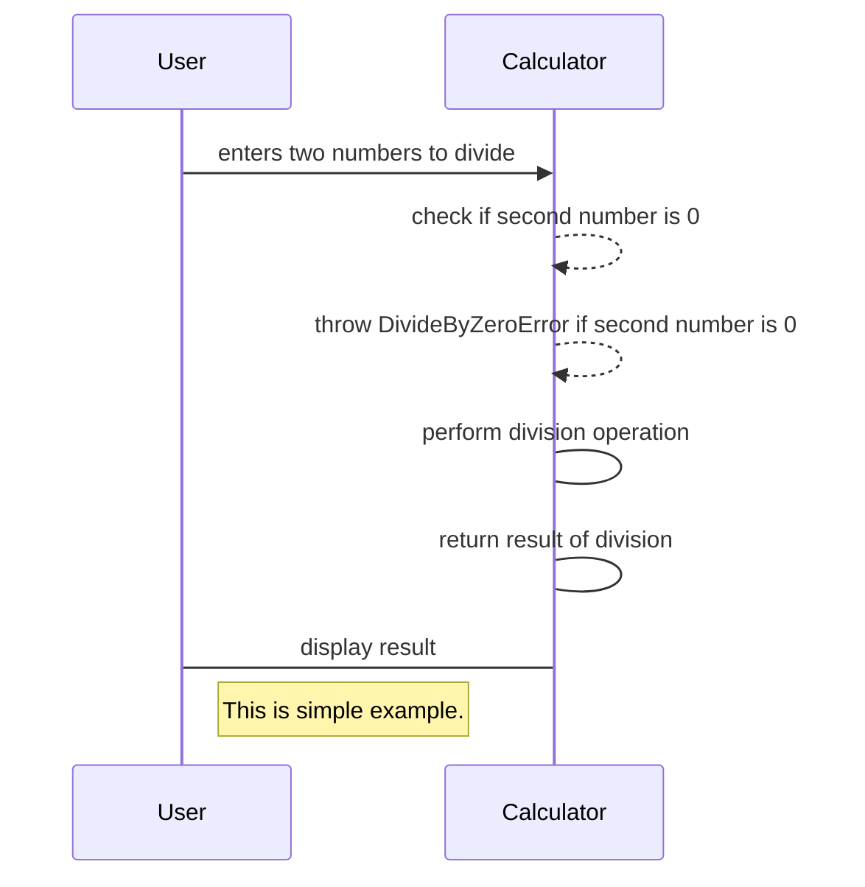
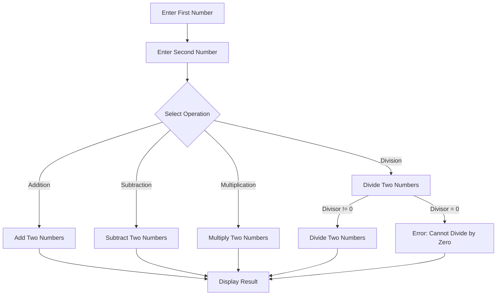
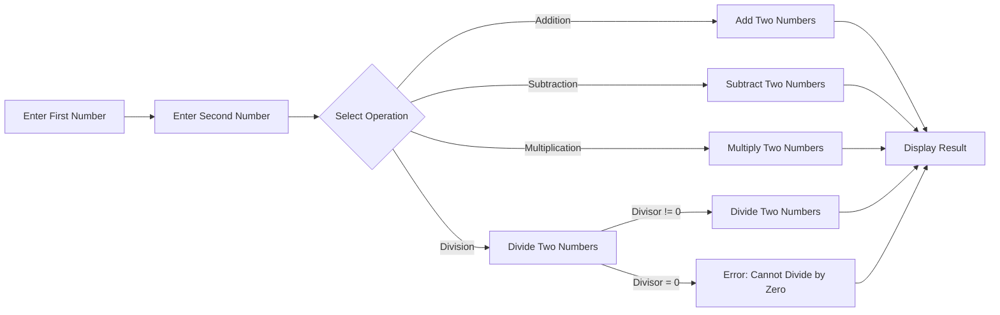

<h4 align="center" href="https://learn.purpleschool.ru/public/products">NodeJS backend</h4> 
<h1 align="center">Исходная формулировка задания</h1>
<h2 align="center">Задание 4-1-calc</h2>
<h2 align="center">Сервис Калькулятор-CLI</h2>

##### Исходная формулировка задания:
  Разработать простейщий калькулятор (сложение, вычитание, умножение, деление). Входные данные получить из строки запуска в терминале
node calc arg1 arg2 operation, где arg1, arg2 - аргументы для калькулятора, operation - требуемая операция.

Сделать минимальный набор проверок входных аргументов на соответствие числовому типу данных (без граничных условий).
Требования к реализации - разделить на модули: основной модуль и модуль математических функций.
Язык разработки: JavaScript. NodeJS.

Функционал: сложение, вычитание, умножение и деление.
Вызов справки:node calc.js help.

<h1 align="center">Software requirements. Спецификация требований</h1>
<h2 align="center">Функциональные требования</h2>

_почему нет сценариев тестирования?_

Функциональные требования к калькулятору могут быть определены как следующие:

1. Калькулятор должен иметь возможность выполнять базовые математические операции, такие как сложение, вычитание, умножение и деление.
2. Калькулятор должен иметь возможность обрабатывать отрицательные и десятичные числа.
3. Калькулятор должен иметь возможность сохранять результат предыдущих вычислений и использовать его в следующих вычислениях.
4. Калькулятор должен иметь возможность очистки текущего результата и начала нового вычисления.
5. Калькулятор должен обрабатывать ошибки пользовательского ввода и сообщать пользователю об этих ошибках.
6. 
7. 

<h2 align="center">Нефункциональные требования</h2>
Нефункциональные требования — это описание требований, которые не связаны напрямую с функциональностью приложения, но которые важны для его эффективной и безопасной работы. Некоторые примеры нефункциональных требований для простого калькулятора могут включать в себя:

**Производительность**: калькулятор должен быть быстрым и отзывчивым, чтобы пользователь мог быстро выполнять вычисления без задержек. Скорость расчета не должна превышать 5 секунд. Если превышает, то вывести оповещение о трудоемкости вычисления и предложить или продолжить или остановить вычисления.

**Надежность**: калькулятор должен быть надежным и стабильным, чтобы пользователи могли полагаться на его работу.

**Безопасность**: калькулятор не должен позволять вводить некорректные данные, и должен быть защищен от злонамеренных пользователей.

**Поддержка различных форматов**: калькулятор должен поддерживать различные форматы чисел, такие как целые числа и числа с плавающей запятой.
**Производительность**: калькулятор должен быстро и точно выполнять вычисления даже при большом объеме входных данных.

**Надежность**: калькулятор должен быть стабильным и не должен выдавать неверные результаты или ошибки.

**Безопасность**: калькулятор должен защищать от возможных атак, таких как инъекция SQL или ввод некорректных данных, которые могут привести к ошибкам.

**Пользовательский интерфейс**: калькулятор должен иметь понятный и простой пользовательский интерфейс, который позволяет легко вводить данные и получать результаты. Интерфейс также должен быть эргономичным и удобным в использовании. Поэтому удобнее CLI клиента нет. Использовать лучшие решения для командной строки.

**Масштабируемость:** калькулятор должен быть способен масштабироваться и добавлять новые функции и операции без изменения основного кода. Это позволит легко обновлять и расширять функциональность калькулятора в будущем.

<h2 align="center">User Stories</h2>
Некоторые из основных User story для простейшего калькулятора могут быть:

- Как пользователь, я хочу иметь возможность вводить числа и операции для выполнения математических вычислений.
- Как пользователь, я хочу иметь возможность видеть результат вычислений после каждой операции.
- Как пользователь, я хочу иметь возможность выполнить последовательность операций, а не только одну операцию за раз.
- Как пользователь, я хочу иметь возможность очистить результат вычислений и начать заново.
- Как пользователь, я хочу иметь возможность получать ошибку, если ввод не является числом или если происходит попытка деления на ноль.
- Как пользователь, я хочу иметь возможность использовать клавиатуру для ввода чисел и операций.
- Как пользователь, я хочу иметь возможность сохранить результат вычислений для последующего использования.
- Как пользователь, я хочу иметь возможность выбирать из разных режимов калькулятора (например, простой, научный, финансовый и т.д.) с соответствующими функциями и возможностями.

Эти User story могут быть использованы в качестве основы для разработки функциональности простейшего калькулятора. Конечно, могут быть добавлены и другие требования в зависимости от конкретных потребностей и целей разработки.

<h2 align="center">Use case</h2>
Основной Use Case для калькулятора с альтернативными сценариями может выглядеть следующим образом:

Название: Выполнение математических операций в калькуляторе

Основной поток:

Пользователь вводит число и выбирает математическую операцию (+, -, *, /).
Пользователь вводит второе число.
Калькулятор вычисляет результат операции.
Калькулятор выводит результат на экран.
Альтернативный сценарий 1:

2а. При вводе числа пользователь допускает ошибку (например, вводит букву вместо числа).
2б. Калькулятор сообщает об ошибке и просит пользователя повторить ввод числа.
Альтернативный сценарий 2:

3а. При выполнении операции калькулятор выдает ошибку деления на ноль.
3б. Калькулятор сообщает об ошибке и просит пользователя изменить ввод.
Альтернативный сценарий 3:

1а. Пользователь вводит некорректный символ для математической операции.
1б. Калькулятор сообщает об ошибке и просит пользователя повторить ввод операции.

<h2 align="center">Sequence diagram (plantUML)</h2>

    actor User
    participant Calculator
    User -> Calculator : enters two numbers to divide
    Calculator -> Calculator : check if second number is 0
    Calculator -> Calculator : throw DivideByZeroError if second number is 0
    Calculator -> Calculator : perform division operation
    Calculator -> Calculator : return result of division
    Calculator -> User : display result
    @enduml

## UML diagrams

You can render UML diagrams using [Mermaid](https://mermaidjs.github.io/). For example, this will produce a sequence diagram:

