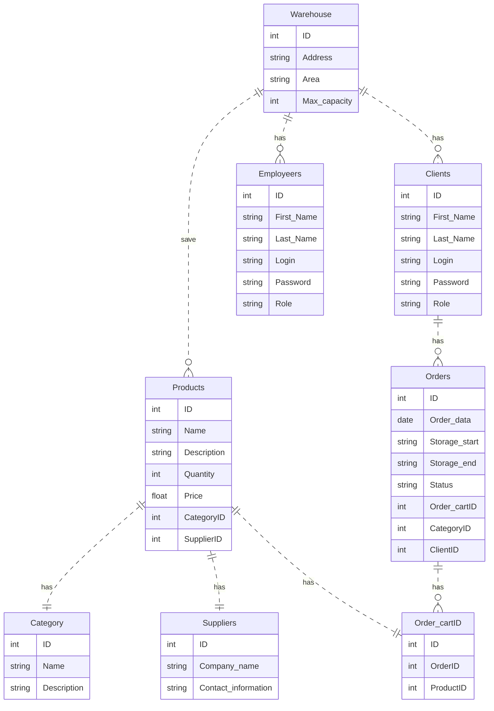

# Система управления складом версия 0.0.1
## Тип проекта: серверная часть (бекенд NodeJS) системы управления складом.  

## Карточка проекта (Концепция системы)

| Карточка проекта              |                                                                                                                                                                                                                                          |
|-------------------------------|------------------------------------------------------------------------------------------------------------------------------------------------------------------------------------------------------------------------------------------|
| Автоматизируемая деятельность | Управление складом (отслеживание актуальным состоянием склада)                                                                                                                                                                           |
| Заинтересованные стороны      | Пользователи услуг склада, Владельц склада, Работники склада                                                                                                                                                                             |
| Текущее решение               | Учет и регистрация товаров на складе ведется вручную с использованием журналов                                                                                                                                                           |
| Решаемые проблемы             | Уменьшение ошибок, вызванных человеческим фактором: ошибки при записи в журнал, расчет количества остатков, учет суммарного веса, объема товаров, снижение затрат на бумажные носители, увеличение скорости обслуживания клиентов склада |
| Целевая ситуация              |                                                                                                                                                                                                                                          |
| Цель для заказчика            | Снизить расходы на операционную деятельность по управлению склада на 20%, увеличить приток клиентов на 15%                                                                                                                               |
| Назначение                    | Для пользователй услуг склада: увеличить скорость обслуживания от момента поступления заявки до выдачи или приемки товара на склад,                                                                                                      |
|                               | Для работника склада: автоматизировать процессы приемки и выдачи товаров, инвентаризации склада                                                                                                                                          |

## Пользователи системы

|               Пользователь         | Описание  |
|------------------------------------|---|
| Заказчик          | Владельц склада   |
| Клиент  | Пользователь услуг склада  |
| Работник           | Работник склада   |

## Роли пользователей в системе

|               Пользователь         | Функционал  |
|------------------------------------|---|
| **Администратор**          | Авторизация   |
|   | Просмотр списка товаров с остатком    |
|            |  Добавление товара |
|            |  Удаление товара |
|            |  Изменение товара |
|            |  Поиск товара |
|            |  Создание новых пользователей |
|            |  Просмотр отчетов о товарах в наличии |
|            |  Просмотр отчетов о клиентах склада |
|            |  Просмотр отчетов о зарегистрированных работниках склада |
| **Клиент**     |  Авторизация |
|            |  Просмотр заказов на хранение|
| **Работник** |  **Начальник склада**: |
|            |  Просмотр списка товаров с остатком  |
|            |  Изменение остатка|

## Основные функциональные требования

Система должна обеспечить хранение информации о заполненности склада товарами.  
Система должна поддерживать авторизированный доступ к системе.  
Система должна обеспечивать доступ к функционалу согласно ролевой модели.  
Система должна обеспечивать генерацию нового типа Пользователя с набором прав доступа.  
Система должна обеспечить по запросу Пользователя операцию по добавлению товара на склад с указанием причины добавления и источника.  
Система должна обеспечить по запросу Пользователя операцию по убытию товара со склада, направление убытия и причина убытия.  
Система должна обеспечить по запросу Пользователя операцию по изменению свойств товара с указанием причин изменения.  
Система должна обеспечить по запросу Пользователя операцию по изменению свойств товара с указанием причин изменения.  
Система должна по запросу Пользователя сгенерировать отчет об остатках товара на складе.  
Система должна по запросу Пользователя обеспечить поиск с фильтрацией товара на складе.  

Формула требований: [Условие][Субъект][Действие][Объект][Ограничение/Значение]  

## Дополнительные требования

Документацию на API привести в формате openAPI. Предоставить swagger.

## Модель предметной области. ER diagram

