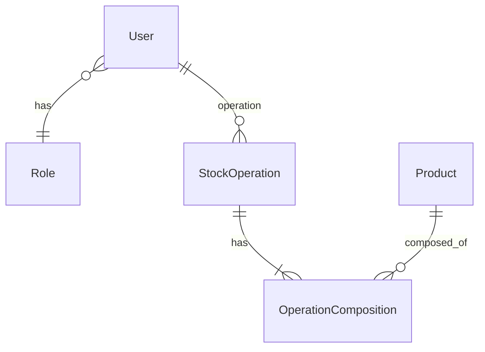
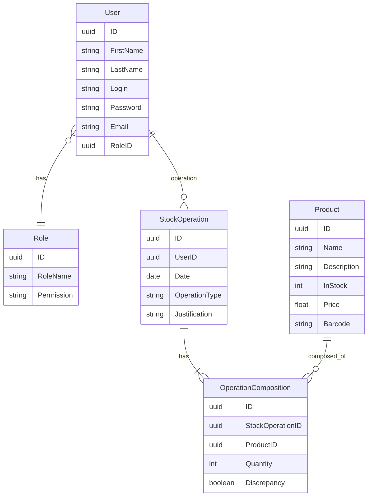
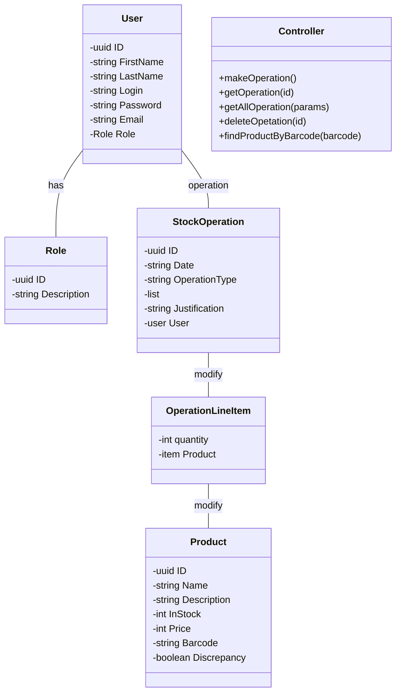
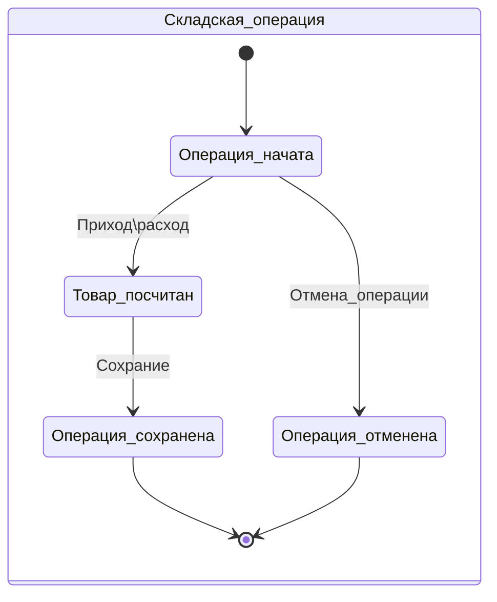
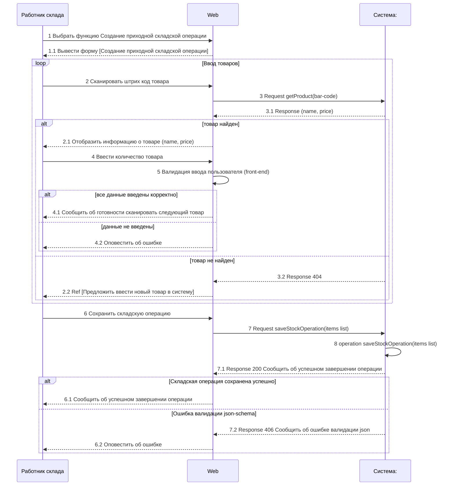

# Система управления складом (WMS) - ядро приложения (backend NodeJS/TS)

> ### "Hostis optimi est bonum." - Voltaire
> _The best is the enemy of the good - "Лучшее - враг хорошего" Вольтер_

Часть 1. Система управления складом (WMS/(backend NodeJS/TS)) - текущий репозиторий   
Часть 2 [Разработка Enterprise-приложений](https://github.com/PortnovAlex80/enterprise/blob/main/README.md)

В рамках проекта имитируется проект разработки WMS для интернет-магазина. Необходимо учитывать, что реальная система складского учета очень сложная, поэтому в проекте используется очень упрощенная модель, задача которой демонстрация навыков, перечисленных в  [Описание портфолио](#описание-портфолио). 

**Краткая суть проекта**: в репозитории предоставлена документация на учебный проект WMS, включающая в себя артефакты: бизнес-требования,  Use cases, Context diagram, ERD, Class diagram, SD, спецификация REST API и т.д. Те, представлена и проектная работа и [реализация проектного решения на NodeJS/TS](https://github.com/PortnovAlex80/node_js_pro/tree/developer/api-warehouse). 

Т.е. показан сквозной пример разработки ПО: анализ -> проектирование ->имплементация -> покрытие unit&e2e тестами. 
Для отрисовки диаграмм использован plantUML (код диаграмм в данном [репозитории](https://github.com/PortnovAlex80/node_js_pro/tree/developer/api-warehouse/diagrams), рендеринг на [PlantUML Web Server](https://www.plantuml.com/plantuml/uml/SyfFKj2rKt3CoKnELR1Io4ZDoSa70000)).  А также mermaid с рендерингом на github непосредственно в readme.md.

Как проверить что репозиторий мой? См историю коммитов кода и readme.md
## Оглавление

1. [Введение](#введение-в-проект)
2. [Run](#RUN-APP)
3. [Описание портфолио](#описание-портфолио)
4. [Введение в проект](#Введение-в-проект)
5. [Бизнес требования](#бизнес-требования)
6. [Концепция системы](#концепция-системы-фрагмент-карточки-проекта)
7. [Контекстная диаграмма](#контекстная-диаграмма)
8. [Варианты использования. Use cases](#use-cases)
9. [Моделирование предметной области](#моделирование-предметной-области)
10. [Entity Relationship Diagram](#entity-relationship-diagram)
11. [Use case для первого релиза (MVP)](#use-case-для-первого-релиза-mvp)
12. [Системная диаграмма последовательности UC-1.1](#системная-диаграмма-последовательности)
13. [Проектирование REST API](#проектирование-rest-api)
14. [Опциональный раздел по требованиям](#опциональный-раздел-по-требованиям)
15. [User story for Telegram-bot](#user-story-for-telegram-bot)
16. [Архитектура приложения](#приложение)
17. [График подготовки релиза MVP](#график-подготовки-релиза-mvp)
18. [Список литературы](#используемая-литература-в-ходе-подготовки-проекта)

------------
## RUN APP
**⚠️**  
Step 1 
env config:
PORT=set the port as number  
SALT=set the salt as number  
SECRET='set the secret as string'    
SKIP = 0  
TAKE = 20  
Step 2    
npm ci && npm start   
Step 3  
e2e test:  
npm test:e2e  

------------
## Описание портфолио

⚠️ Это учебный проект курса https://www.udemy.com/course/nodejs-start/  в рамках которого я выступаю как Software engineer, включая роли:
- Junior Backend Developer for JS/NodeJS/TS (implementing backend)
- Middle System Analyst (describing business(5%) and system(95%) requirements)

В роли **Junior Backend Developer**:
- непосредственно сама реализация приложения;  
- проектирование слоеной архитектуры с использованием middlewares, exceptions filters, error handler, слоев service, repository, controller;
- реализация CRUD операции с ресурсом (товары на складе);  
- реализация JWT авторизации с ролевой моделью;  
- реализация REST API;
- документирование REST API (swagger json/yaml);
- работа с ORM и реляционной БД (prisma orm);
- применение unit и e2e тестирования;
- использование DI, логгирование ошибок, работа Git;
- разработка бекенда для Telegram-bot. 
    
В роли **Middle System Analyst**:
- разработка и описание бизнес-требований и их артифактов;
- использование нотаций UML;
- разработка контекстной диаграммы;
- разработка Бизнес и системных Use cases;
- проектирование Модели предметной области и баз данных (ERD);
- проектирование классов;
- разработка диаграммы последовательности (SD);
- проектирование REST API;
- трассировка требований;

Во второй части портфолио планируется представить (проработано в черновиках, планируется к 09/2023):
- Event storming(==разработано, добавить ссылку miro== )
- выделение агрегатов доменных областей и bounded contexts(==разработано, добавить ссылку miro==)
этап 2:
- разработка и описание пользовательских требований (Use cases, User stories, Job stories, User stories mapping ==доработать==);
- разработка и описание функциональных требований;
- проработка качества требований и критериев приемки(==доработать==);
- проработка нефункциональных требований (==доработать==);
-  формулирование измеримых требований к качеству интерфейсов согласно подхода стандартов семейства HCI (Human-Computer Interaction)(==доработать==)
- базовые угрозы информационной безопасности(==доработать==)
- проверка требований на INCOSE Requirements Writing Guide(==доработать==)
  
<details>
<summary> &#128736;  Инструменты для редактирования README.md</summary>

- https://github.com/GnuriaN/format-README/blob/master/README.md
- https://structurizr.com/
- https://tableconvert.com/markdown-generator
- https://pandao.github.io/editor.md/en.html
- https://editor.swagger.io/
- https://emojio.ru/objects/d83ddee0-1f6e0-molot-i-gaechnyy-klyuch.html
- https://www.udemy.com/course/microservices-with-node-js-and-react/learn/lecture/19099026#overview пример проектирования метода by Stephen Grider
- https://gitlab.com/microarch-ru 

</details>

------------
## Введение в проект

> ⚠️ В рамках проекта имитируется проект разработки WMS для
> интернет-магазина. Необходимо учитывать, что реальная система
> складского учета очень сложная, поэтому в проекте используется очень
> упрощенная модель, задача которой демонстрация навыков, перечисленных
> в  [Техническом введении](#техническое-введение).
> 
<details>
<summary> &#128736;  Алгоритм проектирования </summary>

> **Технология:** Проектирование системы производится по следующему алгоритму:   
> 1 Бизнес-контекст (black box): 
> + Контекстная диаграмма (данные)
> + бизнес Use cases (функции)  
> 
> 2 Переходный уровень (grey box): 
> + Диаграмма концептуальных классов (данные)  
> + реестр системных Use cases (функции)  
> 
> 3 Системный уровень (white box):  
> + диаграмма классов или словарь данных (данные)
> + детальные Use case (функции и взаимодействие)
> + диаграммы последовательности
> 
> 4 Проектирование REST API


</details>

Задача раздела помочь команде разработки ознакомится с бизнес-контекстом задачи. 

Наш интернет-магазин является активно развивающимся проектом, который занимается продажей товаров в онлайн-режиме.

Одной из важнейших доменных областей нашего интернет-магазина является Склад. Задача нашего проекта - обеспечить эффективное и надежное управление товарными запасами для поддержки онлайн-продаж, с минимальными операционными расходами на складские операции.

Текущая боль нашего проекта заключается в отсутствии системы управления складскими операциями (WMS). Для решения этой проблемы необходимо провести анализ требований к системе WMS и выбрать подходящую систему, которая удовлетворит наши потребности. Реализация данного проекта позволит нам повысить эффективность управления запасами товаров и улучшить обслуживание наших клиентов, что приведет к увеличению прибыли и укреплению нашей позиции на рынке электронной коммерции.

⚠️Примечание:
Количественные показатели целей бизнеса вида:
> Освоить Х% рынка за Y месяцев. Увеличить сектор рынка в стране X на Y%
> за Z месяцев. Достигнуть объема продаж X единиц или дохода, равного
> $Y, за Z месяцев.
>
не рассматриваются в рамках портфолио.
Артефакт анализа бизнес-требований Vision так же не рассматривается. 

## Бизнес требования

Бизнес - систематическая деятельность, направленная на получение прибыли.

**Для** :  
>  - определения смысла проекта и обоснования его необходимости;
>  - разработки основы контракта; 
>  - разработки критериев приемки проекта;
>  - определения рамок проекта; 
>  - критериев приоритезации задач в ходе  разработки; 
>  - для формирования Product owners backlog,

необходимо выделить **бизнес-требования** к проекту, так как задача информационной системы или программного обеспечения достижение целей бизнеса за счет автоматизации бизнес-процессов.

Основная потребность бизнеса в сфере электронной коммерции, связанная с продажей товаров, может быть сформулирована следующим образом:

> Обеспечение эффективного и надежного управления товарными запасами для
> поддержки онлайн-продаж

Чтобы ответить на вопрос “Зачем бизнесу нужен этот проект?” рассмотрим пример, на основе которого будет сформулирован ответ:

> В электронной коммерции необходимо удовлетворять потребности клиентов
> и удерживать их внимание. Для этого, с точки зрения WMS, важно знать
> актуальное количество товара в наличии на складе. В противном случае,
> существует вероятность, что клиент будет разочарован, так как он не
> получит товар, который заказывал, либо товар, который есть в наличии
> не будет выставлен в Каталоге интернет-магазина как доступный. В
> итоге, клиент может обратиться к конкурентам, где найдет необходимый
> товар, и наш интернет-магазин потеряет клиента. Поэтому знать точное
> количество товаров на складе важно для сохранения
> конкурентоспособности и удержания клиентов. Так как это позволит запланировать поставки нового товара.

**Зачем** это нужно:
> Обеспечить конкурентоспособность интернет-магазина за счет:
>  - учета актуальных остатков товаров 
>  - минимизации времени выполнения всех складских операций, в частности сборки заказов 
>  - оптимизации использования полезной площади хранения склада 
>  - минимизации операционных издержек

Какие **проблемы** решает система:
> - неактуальные остатки
> - переполнение склада
> - недоиспользование площадей склада
> - неоптимальное расположение товара на складе, что приводит к повышенным затратам на поиск и перемещение товаров;
> - неоптимальное время сборки заказов из-за неоптимального расположения товаров на складе
> - ошибки в сборке заказа, которые приводят к затратам на возврат заказа или к репутационным рискам
> - трудоемкость и возможные ошибки при ручном планировании графика сборки заказов

Решение указанных проблем позволит не терять доход из-за оттока клиентов к конкурентами по причине отсутствия товара, а также позволит снизить и удерживать уровень операционных расходов в рамках запланированных бюджетов. Соответственно, потребность бизнеса заключается в решении указанных ранее проблем:

> Бизнесу в сфере электронной коммерции необходимо обеспечить постоянную
> доступность товаров для своих покупателей, а также оптимизировать
> процессы хранения, перемещения и контроля запасов.

Для достижения этой цели требуется разработка и внедрение системы управления складом (WMS), которая позволит более эффективно управлять товарными запасами, снижать издержки и улучшать обслуживание клиентов.

В обобщенном виде в рамках проекта выделим две основные бизнес-потребности:
| Бизнес-потребность | Описание  |
|--|--|
| Знать точное кол-во товаров на складе на момент запроса | Нужно для планирования поставок, чтобы обеспечить непрерывность продаж |
| Минимизировать затраты на перемещение товара по складу | Нужно для снижения затрат на содержание склада  |
| Минимизировать простои транспортных средств логистических служб | Нужно для снижения затрат на логистику  |

Сформулируем реестр бизнес-требования на основе потребностей для последующей **трассировки** требований.

### Реестр бизнес-требований

<details>
<summary> &#128736;  Шаблон кода требования</summary>
Роль/Система + Глагол/Отглагольное существительное + Объект действия
</details>

| Код требования | Описание требования |
| :--- | :--- |
| BREQ-01 WMS.УчетОстатков | Система WMS должна обеспечивать точный учет остатков товаров на складе согласно BRULE-01 |
| BREQ-02 WMS.УправлениеХранениемТовара| Система WMS должна обеспечивать хранение товара с оптимальным расположением на складе для минимизации времени поиска и перемещения товара к месту сборки согласно BRULE-02,|
| BREQ-03 WMS.ФормированиеГрафикаСборки| Система WMS должна обеспечивать автоматическое формирование графика сборки заказов|

### Реестр бизнес-правил
| Код BRULE | Описание BRULE | Код требования |
| :--- | :--- | :--- |
| BRULE-01 | Остатки товаров на складе должны обновляться автоматически после каждой операции приемки, отгрузки (сборки), перемещения или инвентаризации товаров | BREQ-01 WMS.УчетОстатков |
| BRULE-02 | Товары на складе должны располагаться в соответствии с их характеристиками (габариты, вес, пожароопасность) и **частотой обращения**, чтобы максимально использовать полезную площадь склада и **время поиска и перемещения** товаров | BREQ-02 WMS.УправлениеХранениемТовара |
| BRULE-03 | График сборки заказов должен формироваться автоматически на основе текущей загруженности   склада(кол-во операций из BRULE-01) и времени, необходимого для выполнения этих операций | BREQ-03 WMS.ФормированиеГрафикаСборки |

### Стейкхолдеры

**Владельцы интернет-магазина:** Заинтересованы в оптимизации складских операций и снижении операционных издержек для повышения прибыльности бизнеса.  
**Менеджеры интернет-магазина:** Заинтересованы в улучшении качества обслуживания клиентов и ускорении выполнения заказов.  
**IT-специалисты:** Ответственны за поддержку и интеграцию WMS с другими системами компании.  
**Поставщики товаров:** Заинтересованы в точном и своевременном контроле и учете поставляемых товаров на складе интернет-магазина.  
**Клиенты интернет-магазина:** Заинтересованы в актуальности товарных предложений и быстром выполнении своих заказов.  

### Концепция системы (Фрагмент "Карточки проекта")

> Карточка проекта используется для снижения уровня сложности реальной
> системы WMS до практического задания курса по NodeJS

| **Карточка проекта**              |                                                                                                                                                                                                                                          |
|-------|--------|
| Тема проекта | Управление товарными запасами и складскими операциями для интернет-магазина                                                                                                                                                                           |
| Категория системы                                                                                                                                                                           | Серверное приложение имеющее REST API для интеграции и Telegram-bot
 | Заказчик                                                                                                                                                                           | Департамент электронной коммерции Торгового дома "Итальянские Диваны"
 | **Настоящая ситуация**                                                                                                                                                                          
| Решаемые проблемы             | Автоматизация ручных рутинных операций [BRULE-01], учет которых ведется вручную и с использованием бумажных журналов учета |
 |   Заинтересованные стороны      | Пользователи услуг интернет-магазина, Владелец интернет-магазина, Менеджеры интернет-магазина, Работники склада, Поставщики товаров                                                                                                                                                                             |
| Текущее решение               | Учет и регистрация товаров на складе ведутся вручную с использованием бумажных журналов, дозаказ товаров со сниженным запасами производится не вовремя, инвентаризация происходит нерегулярно, водители и курьеры долго ждут сборки заказов или отгрузки, что приводит к штрафным санкциям.                                                                                                                                                            |
| **Целевая ситуация**              |                                                                                                                                                                                                                                          |
| Цель для заказчика            | Увеличить эффективность и надежность управления товарными запасами для поддержки онлайн-продаж, сократить операционные издержки на 25% и сохранить конкурентоспособность интернет-магазина.                                                                                                                               |
| Назначение                    | **Для пользователей услуг и менеджеров(*) интернет-магазина**: обеспечить наличие товаров, снизить вероятность несоответствия товара заказу;  (* - бонусная часть зарплаты менеджеров интернет-магазина зависит от продаж)                                                                                                    |
|                               | **Для работников склада**: упростить процессы приемки и выдачи товаров [BRULE-01], инвентаризации склада, минимизировать время сборки заказов[BRULE-02], сократить "пробег" на перемещения товаров при сборке заказов[BRULE-02], сократить кол-во ручных операции[BRULE-01] ;                                                                                                                           |
|                               | **Для менеджеров склада**: добавление/удаление нового товара в каталог, мониторинг остатков товаров,  формирование графика сборки заказов и графиков погрузки транспортных средств  логистических служб, работа с отчетами о работе склада ;                                                                                                                           |
|  **Концепция решения**  | 
|  Количество видов пользователей | 1 Работники склада |
|   | 2 Менеджеры склада|
|   | 3 Администраторы WMS |
|  **Ключевые свойства и возможности** (features) |  |
|   | Управление каталогом (справочником) товаров |
|   | Приемка/отгрузка товаров |
|   | Мониторинг остатков товаров |
||Управление пользователями и правами|
| **Для работников склада**  | |
| |1 Складские операции (Приемка/отгрузка товара) (Update quantity)  |
|   | 2 Инвентаризация (future release) |
|   |3 Сборка заказа (future release) |
|**Для менеджера склада**  | |
| | 1 Управление каталогом (справочником) товаров (CRUDL)|
|  |2 Мониторинг остатков товаров в через REST API и Telegram-bot (inStock)  | 
|  |3 Планирование графика сборки заказов (future release) |
|  |4 Работа с отчетами о работе склада(future release) |
| **Для Администраторов склада**  | |
|  |1 Управление пользователями (CRUDL) |
|  | 2 Настройка прав доступа пользователям (ABAC)|
|  |3 Настройка параметров системы WMS(future release)|
|  |4 Обновление и поддержка WMS(future release)|

## Контекстная диаграмма

<details>
<summary> &#128736;  Учебные пометки </summary>

 Где потренироваться: на воркшопе - [Школа системного анализа "Use Case: основы"](https://systems.education/usecase-workshop) и на других воркшопах.  
 
**Технология:** порядок разработки контекстной диаграммы:  
 - [ ] Из числа заинтересованных лиц собирается рабочая группа (обычно
       от 3 до 5 человек)
 - [ ] Рабочая группа фиксирует в центре диаграммы  **название** 
       конкретной системы
 - [ ] Рабочая группа выдвигает и отображает  **группы**  пользователей,
       которые должны взаимодействовать с системой, обсуждает их
       перечень, дополняет его (группа первого контакта с системой)
 - [ ] Рабочая группа выдвигает и отображает  **смежные системы**,
       которые должны взаимодействовать с системой, обсуждает их
       перечень, дополняет его
 - [ ] Рабочая группа последовательно проходит по каждому элементу
       окружения и описывает  **потоки данных**, связывающие его с
       системой
 - [ ] Рабочая группа проводит  **тестирование**  контекстной диаграммы,
       дополняя диаграмму по ходу тестирования
</details>


**Таблица** Групп пользователей и смежных систем
|Наименование  |Описание  |
|--|--|
|Система  |Описание  |
|Склад  |Черный ящик  |
|Группа пользователей  |Работник склада  |
|  |Менеджер склада |
|  |Администратор  |
|Смежные системы  |Интернет-магазин  |
|  |Служба доставки  |

**Таблица** Данных 
|Данные  |Описание  |
|--|--|
|Пользователи  | Данные о пользователях  |
|Группы пользователи  | Данные о группе пользователях  |
|Отчет о пользователях| Информация о пользователях и их действиях|
|Каталог товаров| Перечень товаров на складе (справочник)|
|Товарная накладная| Перечень товаров для складских операций |
|Информация об остатках| Информация о остатках товара на складе|
|Отчет по складским операциям| Информация об истории складских операций |
|График и место погрузки| Данные о графике и месте погрузки (ворота склада) собранного заказа |
|Заявки на сборку заказа| Заявка на сборку заказа (формирует Служба доставки после подтверждения оплаты заказа Интернет-магазином)|
|Заказы| Информация о заказах|
|Складские операции (приход/расход)|Информация об операциях с товарами на складе|

## Use cases

### Общие положения

<details>
<summary>&#128736;  Учебные пометки </summary>

Где потренироваться: на воркшопе - [Школа системного анализа "Use Case: основы"](https://systems.education/usecase-workshop)

Use cases используются для проектирования и выявления требований, выявления связанности действий пользователя и системы, определения границ системы.
</details>

Таблица акторов
|Наименование  |Описание  |
|--|--|
|Система  |Описание  |
|Группа пользователей  |Работник склада  |
|  |Менеджер склада |
|  |Администратор  |
|Смежные системы  |Интернет-магазин  |
|  |Служба доставки  |

### Диаграмма бизнес Use cases 


> **Бизнес Use-case** 
> Бизнес use-case определяет бизнес-возможность. 
> Например:
> Бизнес возможность - Управление складскими операциями
> Бизнес возможность - Обработка заявок на сборку заказов
> Бизнес возможность - Мониторинг остатков товаров 
>Также в качестве бизнес UC может выступать формулировка одного из шагов бизнес процесса.

**Пользователи WMS:**
|Пользователи |Описание роли  |
|--|--|
| Работники склада |Ответственны за выполнение операций на складе, таких как приемка, отгрузка, перемещение и инвентаризация товаров. Им необходимо использовать WMS для контроля запасов и эффективного выполнения своих рабочих обязанностей.  |
| Менеджеры склада |Ответственны за управление и контроль складской деятельности. Им необходимо использовать WMS для мониторинга производительности, планирования графиков и оптимизации складских операций.  |
| Администраторы WMS |Ответственны за настройку, поддержку и обновление системы WMS. Им необходимо использовать WMS для обеспечения стабильной работы системы и интеграции с другими программными продуктами компании.  |

<details>
<summary>&#128736;  Чек-лист </summary>
 - [ ] Сопоставить функциональность в Use cases с Контекстной диаграммой
       (сопоставление функционала с данным)
</details>

### Реестр системных Use cases 

На основании высокоуровневых бизнес-use cases разработан реестр системных Use cases.

| Участник |Код UC  | Описание | Приоритет|
|--|--|--|--|
|Работник склада  |UC-1|Управление складскими операциями  | |
|  | UC-1.1 |Создать приходную складской операции  | Высокий |
|  | UC-1.2 |Создать расходную складской операции  | Высокий |
|Менеджер склада |UC-2|Управление каталогом товаров  | |
|  |UC-2.1  |Добавить товар| Высокий  |
|  |UC-2.2  |Удалить товар| Высокий  |
|  |UC-2.3  |Изменить товар| Высокий  |
|  |UC-2.4  |Посмотреть список товаров с учетом фильтров поиска| Высокий  |
|  |UC-2.5 |Отчет по складским операциям над товарами| |
|Менеджер склада |UC-3|Мониторинг остатков товаров  | |
|  | UC-3.1 |Отчет по остаткам товаров| |
|Администратор |UC-4|Управление пользователями и группами доступа  | |
|  | UC-4.1 |CRUD операции с пользователями   | Высокий  |
|  | UC-4.2 |Просмотреть список пользователей   | Высокий  |
|  | UC-4.3 |CRUD операции группы доступа| |

<details>
<summary>&#128736;  Чек-лист </summary>

проверить на полноту:
 - [ ] трассировка до пользовательских или бизнес-требований  
 - [ ] привязка к шагам бизнес-процессов  
 - [ ] проверка на CRUDLs  (проверить сущности и их операции)
</details>
 
Дальнейшая детализация требований будет ориентирована на реализацию функционала согласно указанным **Product owner`ом приоритетам**. В первом релизе продукта ожидается функции с приоритетом **Высокий**.

## Моделирование предметной области

<details>
<summary>&#128736;  Учебные пометки </summary>

Где потренироваться: на воркшопе - [Школа системного анализа "Моделирование предметной области"](https://systems.education/mpo-workshop)

**Технология:** порядок моделирования предметной области:

 - [ ] На основе контекстной диаграммы построить модель состава данных
 - [ ] Проверить наличие связи между всеми информационными сущностями
  - [ ] Указать наличие установленных связей на схеме (построить модель структуры) 
  - [ ] Установить пропущенные информационные сущности 

</details>

### Выделение сущностей из контекстной диаграммы
Сущности выделены только для UC с приоритетом **Высокий**.
| № | Таблица | Описание  |
|--|--|--|
| 1 | User    | Таблица для хранения информации о пользователях, такой как логин, пароль, электронная почта, ФИО и другие атрибуты в зависимости от требований к системе.                               | 
| 2 | Role    | Таблица для хранения информации о различных ролях пользователей в системе. Каждая роль может иметь уникальный идентификатор и набор разрешений для доступа к различным функциям системы.  |
| 3 | Product | Таблица для хранения информации о товарах, такой как название, описание, категория, характеристики, цена и другие атрибуты в зависимости от требований к системе.                         |
| 4 | StockOperation | Таблица для хранения информации Заявках на проведение складских операциях, совершенных Пользователями с товарами на складе.                                           |
| 5 | OperationComposition | Таблица для хранения перечня (список) товаров, участвующих в складских операциях (для разрыва связи N-N)                                           |


### Entity Relationship Diagram



### Entity Relationship Diagram (ERD) с атрибутами

### Диаграмма классов

Диаграмма классов представлена без методов. Команда разработки не приветствует проработку методов. Тимлид попросил оставить им свободу для решений.

</details>



### Use case для первого релиза (MVP)

<details>
<summary>&#128736;  Примечание </summary>

В реальном проекте будет составлен отдельный документ с Use case для каждого варианта использования в реестре.

</details>

#### Use case UC-1.1 Создать приходную складской операции
 **Источник:** Business Use Case Управление складскими операциями 
**ID:** UC-1.1 
 **Название:** UC 1.1 Создать приходную складской операции  
 **Действующее лицо:** Работник склада 
 **Предусловие:** Пользователь авторизован в системе и имеет права на создание приходной складской операции
**Основной поток:** 
 1. **Пользователь** выбирает функцию Создание приходной складской операции
 2. **Система** выводит форму [Создание приходной складской операции] для ввода информации. В форме уже заполнены значения, недоступные для изменения:
-   Тип операции = Приход
-   Обоснование = Поставка
-   Дата = Текущая дата
-   Ответственный = Текущий авторизованный пользователь
3. **Пользователь** вносит данные о товаре, который он принимает, а именно считывает штрих код товара
4. **Система** ищет в справочнике товаров элемент по штрих-коду. Товар найден. **Система** добавляет товар в состав товаров и отображает на экране:
-   Наименование товара
-   Цену
5. **Пользователь** вводит количество товара.  
6. Повтор п. 3-5 для каждого товара из накладной
7. **Пользователь** выбирает функцию Сохранить данные
8. **Система** убеждается в полноте данных, введенных пользователем
9. **Система** сохраняет введенные пользователем данные и обновляет актуальные остатки.
10. **Система** сообщает о успешном завершении операции

**Расширение:**
**4a. Товар по штрих-коду не найден в системе**
* 4а1.Система предлагает ввести новый товар в систему. Ссылка на юскейс “Создание товара”
* 4а2 Переход на п. 5 основного сценария

**7a. Данные по количеству в накладной и фактическому количеству не совпадают**
* 7а1.Пользователь устанавливает флаг Есть расхождения = Истина
* 7а2.Переход на п.6 основного сценария

**9a. Данные не введены**
* 9а1 Система обнаруживает обязательные поля, в которые пользователь не ввел данные
* 9а2 Система оповещает пользователя об ошибке
* 9а3 Выполнение сценария возвращает в основной поток в п.5

**9б. Данные введены некорректно**
* 9б1 Система обнаруживает поля, в которые пользователь ввел * некорректные данные
* 9б2 Система оповещает пользователя об ошибке
* 9б3 Выполнение сценария возвращается в основной поток в п.5

**10а. Ошибка обращения в БД**
* 10а1 Система оповещает пользователя об ошибке при обращении к БД
* 10а2 Завершение выполнения сценария

#### Use case UC-1.2 Создать расходную складской операции
 **Источник:** Business Use Case Управление складскими операциями 
**ID:** UC-1.2 
 **Название:** UC 1.2 Создать расходную складской операции  
 **Действующее лицо:** Работник склада 
 **Предусловие:** Пользователь авторизован в системе и имеет права на создание расходную складской операции
**Основной поток:** 
 1. **Пользователь** выбирает функцию Создание расходную складской операции
 2. **Система** выводит форму [Создание расходную складской операции] для ввода информации. В форме уже заполнены значения, недоступные для изменения:
-   Тип операции = Приход
-   Обоснование = Сборка заказа
-   Дата = Текущая дата
-   Ответственный = Текущий авторизованный пользователь
3. **Пользователь** вносит данные о товаре, который он расходует, а именно считывает штрих код товара
4. **Система** ищет в справочнике товаров элемент по штрих-коду. Товар найден. **Система** добавляет товар в состав Заказа и отображает на экране:
- Наименование товара
- Цену
- Остаток
5. **Пользователь** вводит количество товара для расхода.
6. **Система** проверяет количество товара для расхода на остаток. Остатка достаточно для расхода.
7. Повтор п. 3-5 для каждого товара из накладной
8. **Пользователь** выбирает функцию Сохранить данные
9. **Система** убеждается в полноте данных, введенных пользователем
10. **Система** проверяет достаточность остатков товаров на складе.
11. **Система** сохраняет введенные пользователем данные и обновляет актуальные остатки.
12. **Система** сообщает о успешном завершении операции

**Расширение:**
**4a. Товар по штрих-коду не найден в системе**
* 4а1.Система на основе рекомендательного алгоритма [BRULE-17] предлагает заменить товар на другой. Ссылка на юскейс “Замена товара”
* 4а2 Переход на п. 5 основного сценария

**6a. Наличного остатка на складе недостаточно для расходной операции**
* 6а1.Система сообщает о недостатке товара и на основе рекомендательного алгоритма [BRULE-17] предлагает заменить товар на другой. Ссылка на юскейс “Замена товара”
* 6а2 Система передает Менеджеру склада отчет о недостатке товара в Информации об остатках.
* 6а3 Переход на п. 5 основного сценария

**9a. Данные не введены**
* 9а1 Система обнаруживает обязательные поля, в которые пользователь не ввел данные
* 9а2 Система оповещает пользователя об ошибке
* 9а3 Выполнение сценария возвращает в основной поток в п.5

**9б. Данные введены некорректно**
* 9б1 Система обнаруживает поля, в которые пользователь ввел некорректные данные
* 9б2 Система оповещает пользователя об ошибке
* 9б3 Выполнение сценария возвращается в основной поток в п.5

**10а. Остатков на складе недостаточно**
* 10а1 Система оповещает пользователя об ошибке
* 10а2 Выполнение сценария возвращается в основной поток в п.5

**11а. Ошибка обращения в БД**
* 10а1 Система оповещает пользователя об ошибке при обращении к БД
* 10а2 Завершение выполнения сценария

### Диаграмма состояний.


### Системная диаграмма последовательности

<details>
<summary>&#128736;  Учебные пометки </summary>

Примечание:  для упрощения выберем, что сканер возвращает штрих-код товара (bar-code) в Web форму. На практике сканер может быть подключен к порту, и бек опрашивает сканер. Принципиально, поиск по бар коду будет на беке, но для наглядности отобразим процесс через Web.
</details>


Примечание: нотация Ref в mermaid не поддерживается на момент разработки диаграммы.

# Проектирование REST API

<details>
<summary>&#128736;  Учебные пометки </summary>

Общий подход к проектированию REST API:
Перед началом проектирования REST API, необходимо проработать модель предметной области и выделить сущности, и их логику работы. 
На основе диаграммы последовательности выделим запросы и данные. 
В нашем примере, выделено две сущности: Пользователь и Товары (на складе) и определим CRUDLs операции для них. 
Далее, описываются методы и параметры запросов , ожидаемые ответы, включая http статусы. 
В приложении warehouse-api поднят swagger.
</details>


## Проектирование по диаграмме Последовательности (SD)

| № шага | Описание | Запрос | Ответ |
|---|---|---|---|
| 3 | Получить информацию о продукте по бар-коду (штрих-коду) | GET [https://v1/route/products/{barCode}](https://v1/route/products/) | Информация о товаре |
| 7| Создать новую операцию на складе | POST [https://v1/route/stockoperations](https://v1/route/operations) <br> Тело запроса: <br> `{ "userID": "<user_uuid>", "date": "<date>", "operationType": "<operation_type>", "justification": "<justification>", "products:": [{ "name": "<product_name>", "description": "<description>", "incomingamount": <incoming_amount>, "barcode": "<barcode>" },...] }` | Информация о созданной операции или ошибка |

<details>
<summary>&#128736;  Учебные пометки </summary>

**Примечание**: далее представлен расширенный вариант таблицы, который мог бы быть на реальном проекте. По каждому ресурсу возможно проектирование CRUDLs операций, в работе показано фрагментами, чтобы не загромождать проект. 
Например, ниже представлен сжатый вариант продолжения таблицы описания диаграммы последовательности.
</details>

| № шага | Описание | Запрос | Ответ |
|---|---|---|---|
| 3 | Получить информацию о продукте по бар-коду (штрих-коду) | GET [https://v1/route/products/{barCode}](https://v1/route/products/) | Информация о товаре |
| 7 | Обновить информацию о продукте по бар-коду (штрих-коду) | PATCH [https://v1/route/products/{barCode}](https://v1/route/products/) <br> Тело запроса: <br> `{ "quantity": <new_quantity> }` | Информация об успешном обновлении или ошибке |
| ... | Создать нового пользователя | POST [https://v1/route/users](https://v1/route/users) <br> Тело запроса: <br> `{ "firstName": "<first_name>", "lastName": "<last_name>", "login": "<login>", "password": "<password>", "email": "<email>", "roleID": "<role_uuid>" }` | Информация о созданном пользователе или ошибка |
| ...| Получить информацию о пользователе | GET [https://v1/route/users/{uuid}](https://v1/route/users/) | Информация о пользователе или ошибка |
| ...| Создать новый товар | POST [https://v1/route/products](https://v1/route/products) <br> Тело запроса: <br> `{ "name": "<product_name>", "description": "<description>", "inStock": <in_stock>, "price": <price>, "barcode": "<barcode>" }` | Информация о созданном товаре или ошибка |

### Спецификация методов

> По аналогии можно продолжить для всех необходимых методов REST API
 
#### **Метод 1: GET - Получить информацию о продукте по бар-коду (штрих-коду)**

**Входные параметры:**
| Название | Тип | Обязательность | Значение по умолчанию | Комментарий |
|---|---|---|---|---|
| barCode | string | Да | - | Штрих-код товара |

**Выходные параметры:**
| Название | Тип | Обязательность | Значение по умолчанию | Комментарий |
|---|---|---|---|---|
| ID | string(uuid) | Да | - | Уникальный id товара |
| Name | string | Да | - | Название товара |
| Description | string | Нет | - | Описание товара |
| InStock | int | Да | - | Количество товара на складе |
| Price | float | Да | - | Цена товара |
| Barcode | string | Да | - | Штрих-код товара |
| Discrepancy| boolean | Да | - | Несоответствие наличию на складе  |

#### **Метод 2: PATCH - Обновить информацию о продукте по бар-коду (штрих-коду)**

**Входные параметры:**
| Название | Тип | Обязательность | Значение по умолчанию | Комментарий |
|---|---|---|---|---|
| barCode | string | Да | - | Штрих-код товара |
| quantity | int | Да | - | Новое количество товара на складе |

**Выходные параметры:**
Response
| Название | Тип | Обязательность | Значение по умолчанию | Комментарий |
|---|---|---|---|---|
| message | string | Да | - | Сообщение об успешном обновлении или об ошибке |

#### Значение кодов ответов HTTP
| **№** | **Код ответа HTTP** | **Описание**                                                                                    | **User**                                                                                  | **Product**                              |
|-------|---------------------|-------------------------------------------------------------------------------------------------|------------------------------------------------------------------------------------------------|------------------------------------------------|
| 1 | 200                 | Успешный запрос, данные успешно возвращены                                                      | Получение списка пользователей, информации о пользователе, списка товаров, информации о товаре | Получение списка товаров, информации о товаре  |
| 2 | 201                 | Запрос успешно выполнен, новый ресурс был создан                                                | Создание нового пользователя, товара                                                           | Создание нового товара                         |
| 3 | 204                 | Успешный запрос, но нет данных для возврата                                                     | Обновление данных пользователя, товара                                                         | Обновление данных товара                       |
| 4 | 400                 | Ошибка запроса, запрос не может быть обработан сервером                                         | Некорректный запрос                                                                            | Некорректный запрос                            |
| 5 | 401                 | Ошибка авторизации, отсутствуют или некорректные авторизационные данные                         | Ошибка авторизации                                                                             | Ошибка авторизации                             |
| 6 | 403                 | Ошибка доступа, сервер понимает запрос, но отказывается его выполнять из-за ограничений доступа | Доступ запрещен                                                                                | Доступ запрещен                                |
| 7 | 404                 | Ошибка запроса, запрашиваемый ресурс не найден                                                  | Пользователь или ресурс не найден                                                              | Товар или ресурс не найден                     |
| 8 | 409                 | Ошибка конфликта, запрос не может быть обработан из-за конфликтующих данных                     | Дублирование существующего пользователя                                                        | Дублирование существующего товара              |
| 9 | 500                 | Ошибка сервера, запрос не может быть обработан из-за ошибки на стороне сервера                  | Ошибка на стороне сервера                                                                      | Ошибка на стороне се                           |

### Роли пользователей в системе

Ролевая модель **Роль: Администратор**
|  № | Описание   |
| :------------: | :------------: |
| 1 | Создание нового пользователя  |
| 2 | Удаление пользователя  |
| 3 | Добавление нового товара  |
| 4 | Удаление товара  |
| 5 | Обновление информации о товаре  |
| 6 | Изменение остатков на складе |

Ролевая модель **Роль: Начальник склада**
|  № | Описание   |
| :------------: | :------------: |
| 1 | Изменение остатков на складе |

Ролевая модель **Роль: общий доступ для всех зарегистрированных сотрудников склада**
|  № | Описание   |
| :------------: | :------------: |
| 1 | Авторизация  |
| 2 | Получение списка товаров |
| 3 | Получение конкретного товара |
| 4  | Поиск товара с поисковыми параметрами фильтрации |

###  Проектирование структуры объектов запросов 

<details>
<summary>&#128736;  Учебные пометки </summary>

**Примечание:** большинство мною опрошенных команд разработки **против** детального документирования структур объектов, так как очень сложно и поддерживать документацию в актуальном состоянии и иногда аналитики могут пропустить важные при реализации моменты. Но все же, в качестве примера приведем описание структуры объектов в теле запросов и ответов.  

</details>

#### Структуры объекта Пользователь (user)
##### User data
```json
{
  "name": "John Doe",
  "email": "johndoe@example.com",
  "password": "password123",
  "role": "User"
}
```
##### Role data
```json
{
  "name": "Admin",
  "description": "Administrator role with full access."
}
```
#### Структуры объекта Продукт(product)
##### Product data and Stock data
```javascript
Product data = {
    'name': str,
    'category': str,
    'description': str,
    'characteristics': dict
}

Stock data = {
    'quantity': int,
    'reason': str
}

##### Responses objects
```javascript
Список товаров = [
    {
        'id': int,
        'name': str,
        'category': str,
        'description': str,
        'characteristics': dict,
        'quantity': int
    },
    {...},
    {...}
]
```
## Опциональный раздел по требованиям

⚠️ Дальнейший раздел не "причесывался" с ранее разработанными Use cases. 
В некоторых проектах Use cases могут быть точечно дополнены функциональными требованиями.  Могут потребоваться и нефункциональные требования (иногда их называют архитектурные характеристики). 

### Функциональные требования

В случае необходимости, системные Use case могут быть дополнены функциональными требования.
Требования носят демонстрационных характер и могут не отражать, то что реализовано в коде.

<details>
<summary>&#128736;  Учебные пометки </summary>

Функциональные требования приведены согласно лексическим формулам:  
 [Условие][Субъект][Действие][Объект][Ограничение/Значение] Система должна [ДЕЙСТВИЕ][ОБЪЕКТ ДЕЙСТВИЯ][атрибуты объекта]
 
**Функциональные требования** описывают, каким образом система должна выполнять конкретную функцию или задачу. Они описывают, что должна делать система и как она должна это делать. Функциональные требования обычно выражаются в терминах конкретных функций, операций или процессов, которые система должна выполнять.

</details>

1. Система должна хранить информацию о количестве товара на складе
2. Система должна поддерживать авторизированный доступ к системе с ограничением по доступу к функционалу согласно ролевой модели. 
3. Система должна обеспечивать генерацию нового типа Пользователя с набором прав доступа (Администратор, Начальник склада)
4. Система должна обеспечить по запросу Пользователя операцию по предоставлению всех товаров на складе.   
5. Система должна обеспечить по запросу Пользователя операцию по добавлению товара на склад с указанием причины добавления и источника.
6. Система должна обеспечить по запросу Пользователя операцию по удалению товара со склада, направление убытия и причина убытия.  
7. Система должна обеспечить по запросу Пользователя операцию по изменению свойств товара с указанием причин изменения. Нулевое значение количества отстатков не приводит к удалению товара со склада.
8. Система должна обеспечить поиск с фильтрацией товара на складе по различным параметрам, таким как наименование товара, количество, стоимость, дата добавления.

### User story for Telegram-bot

⚠️ Продуктовый подход рассмотрен в другом портфолио. Но так как в рамках проекта  WMS (warehouse-api) разработан телеграмм-бот, приведем краткое описание требований.

<details>
<summary>&#128736;  Учебные пометки </summary>

При создании продукта необходимо учитывать потребности пользователей. Если продукт будет неудобный и не будет покрывать истинных потребностей пользователей, то его просто никто не купит. Поэтому в продуктовой разработке **user и job story** это основа разработки. Убедиться в том, что мы делаем крутую фичу, которая будет реально полезна и востребована пользователями, и даст нам конкурентное преимущество в сравнении с другими продуктами.
</details>

**Проблема:**

Площадь склада довольно большая и складским работникам нужно перемещаться по складу и иметь мобильное устройство, с помощью которого можно было бы регистрировать операции в месте где например происходит инвентаризация.

Процесс инвентаризации обычно происходит как:

1.  Менеджер печатает на листе ведомость с перечнем товаров и количеством, которое учтено в системе
2.  Потом идет с этим листком к полке и начинает считать фактическое количество, пишет его на лист
3.  Потом идет к программе и вбивает в неё фактическое количество
4.  Программа на основе расхождения учетного остатка и фактического регистрирует оприходование или списание.

Тут много времени уходит на переписывание и вбивание данных, риск ошибок большой. Поэтому желательно если бы у кладовщика было бы мобильное устройство, с помощью которого можно было бы поиск товара в каталоге производить по штрих-коду (в устройстве должен быть встроенный сканер) + сразу вводить в устройство фактическое количество (с помощью клавиатуры или голосом например), то бизнес процесс явно бы ускорился и снизился риск ошибок. Такие специальные устройства и сервисы есть. Например 1С Кладовщик.
  
Кстати и юскейсы, основанные на пользовательских историях будут звучать и строиться немного по другому.
  
**Пример:**
  
Если думать в терминах CRUDL, то вот есть сущности Каталог(список товаров) и Товар. Вот они связаны отношением 1: N или N : N. Вот нужны кейсы для того, чтобы каждую сущность создать, удалить, изменить, прочитать, просмотреть список и попутно проставить связь. Всё просто. Простота это наверное единственный плюс этого подхода.
  
Если думать о контексте, в котором находится пользователь, и о его потребностях, то раз у нас склад, то нужно будет писать **job story**.
  
Представь что с тобой разговаривает менеджер склада. Практически жалуется, как на приеме у врача. Он будет говорить **не про сущности системы**. Он о них вообще не думает. Он про **свои проблемы** будет говорить.
  
Менеджер склада занимается вводом товаров. (В реальности конечно этим занимается отдел закупок или маркетинга, который работает с поставщиками и решает какой ассортимент будет продаваться в интернет магазине).

**Рассказ менеджера склада**:
Мне как менеджеру склада (на котором обязанности маркетолога в рамках учебного примера) необходимо регистрировать товары, которые компания планирует закупать у поставщиков и продавать в интернет магазине. Необходимо учитывать более 3000 наименований товаров. Обычно (в 90% случаев) новые товары в ассортименте “появляются” пачками по 200 шт. У меня есть каталоги поставщиков в бумажном и электронном виде. Бывают ситуации, когда приходят заявки на ввод новых единичных товаров в ассортимент от других подразделений. 
Потом еще выясняется, что есть возможность выгрузки каталога поставщиков с сайта поставщиков в формате excel. А еще у поставщиков есть публичный API, по которому можно получить список товаров по фильтру.

**job story** по результатам интервью:

-   Как менеджеру склада, выполняющего по совместительству обязанности маркетолога, мне необходима возможность массового ввода товаров из файла excel, так как я выбираю на сайте поставщиков нужные мне товары и выгружаю их в файл.

<details>
<summary>&#128736;  Учебные пометки </summary>

Представьте как бы “обрадовался” менеджер, если бы ему предоставили возможность ввода товаров руками и только по одной штуке в соответствии с CRUDL.
Эта job story должна быть включена в MVP, так как это способ ввода товаров в большинстве случаев.

Конечно все CRUDL операции с сущностями будут нужны, но далеко не всегда их нужно вытаскивать в интерфейс пользователя или API прямо вот в таком вот виде. Это вопрос проектирования интерфейса, ориентированного на реальные потребности. Об этом хорошо написано в книге Арно Логе "Проектирование web api"
</details>


## Приложение

<details>
<summary>&#128736;  Учебные пометки </summary>

Примеры:
https://github.com/rmanguinho/clean-ts-api
https://github.com/specialorange/FDXCM/blob/master/README.rdoc
https://habr.com/ru/articles/740796/ - Телеграмм боты
</details>

### Описание общей структуры приложения 


### Описание доменных слоев Users and Producs layers


# График разработки проектных артефактов

**⚠️**  Внимание!**⚠️**  
> Пример разработки по waterfall!  Пример планирования
> разработки по гибким методологиям планируется предоставить в другом
> портфолио. Сроки и продолжительность работ  - **условные**. 
> Задача текущего графика - показать последовательность разработки артефактов командами аналитиков, разработки, тестирования. 

Диаграмма Ганта процесса разработки артефактов команд.


## Используемая литература в ходе подготовки проекта

> Примечание: приведенный список литературы был использован при
> подготовке проекта в той или иной мере.
 
1. Dean, L. Managing Software Requirements.
2. Wiegers, K. and Bitti, L. Cars: Requirements Analysis and Specification for Software Engineers. Second Edition. Microsoft Press.
3. Rational Unified Process (RUP).
4. Guide to the Software Engineering Body of Knowledge (SWEBOK).
5. IEEE. (1998). IEEE Recommended Practice for Software Requirements Specifications (IEEE 830).
6. ГОСТ 34.003 - 90. Информационная технология. Комплекс стандартов на автоматизированные системы. Основные положения.
7. ГОСТ 34.604 - 92. Информационная технология. Комплекс стандартов на автоматизированные системы. Требования к программным средствам.

Дополнительный список (планирую ознакомится):

8. ISO/IEC/IEEE 29148:2018 Systems and software engineering -- Life cycle processes -- Requirements engineering
9. ISO/IEC/IEEE 12207:2017 Systems and software engineering -- Software life cycle processes
10. ISO/IEC 12207:1995 Information technology -- Software life cycle processes
11. EN 50126-1:2017 Railway applications -- The specification and demonstration of Reliability, Availability, Maintainability and Safety (RAMS) -- Part 1: Generic RAMS process
12. EN 50600-1:2012 Information technology -- Data centre facilities and infrastructures -- Part 1: General concepts and requirements
13. ISO/IEC 15504-5:2012 Information technology -- Process assessment -- Part 5: An exemplar Process Assessment Model for IT service management (ISO/IEC 20000-1)
14. EN 62304:2006 Medical device software -- Software life cycle processes.
