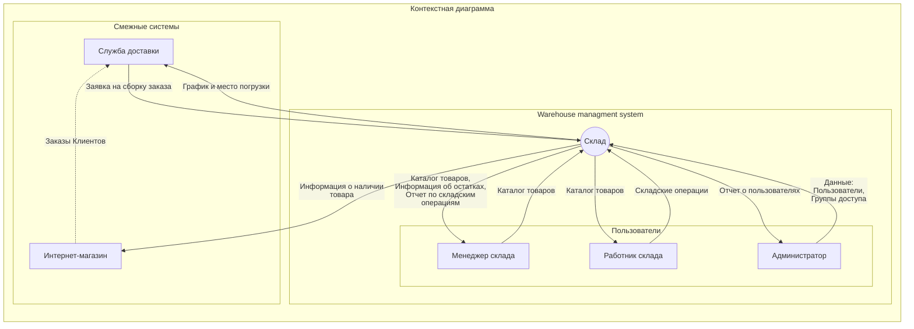
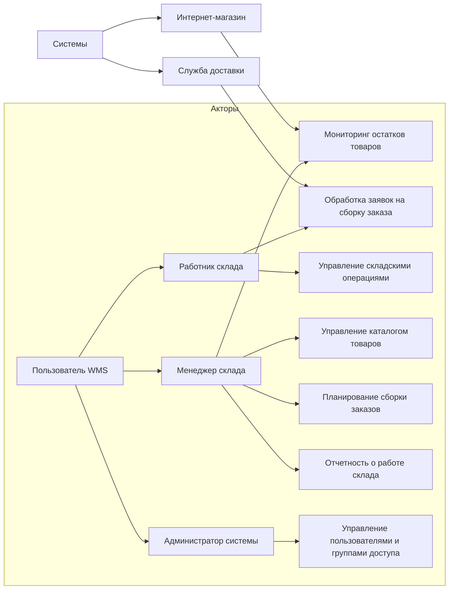
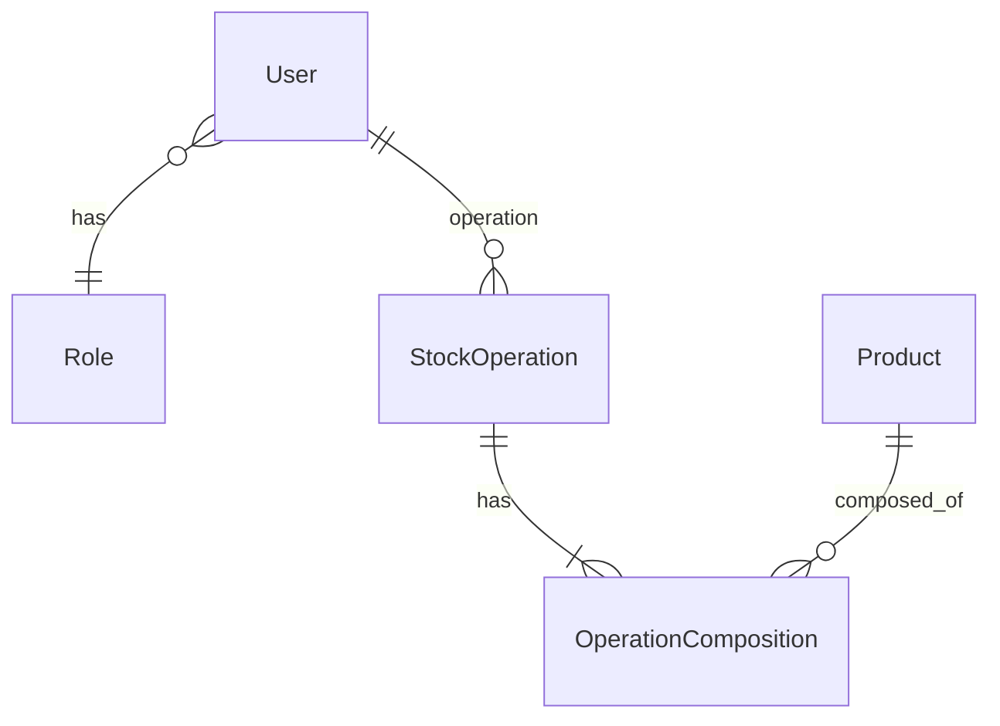
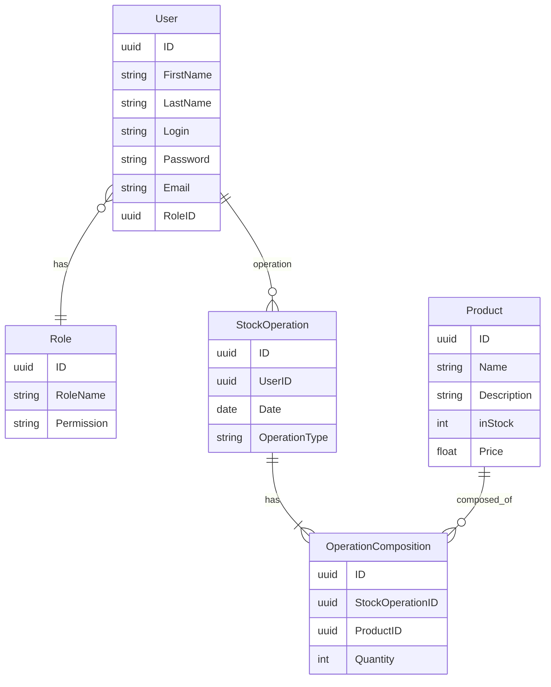
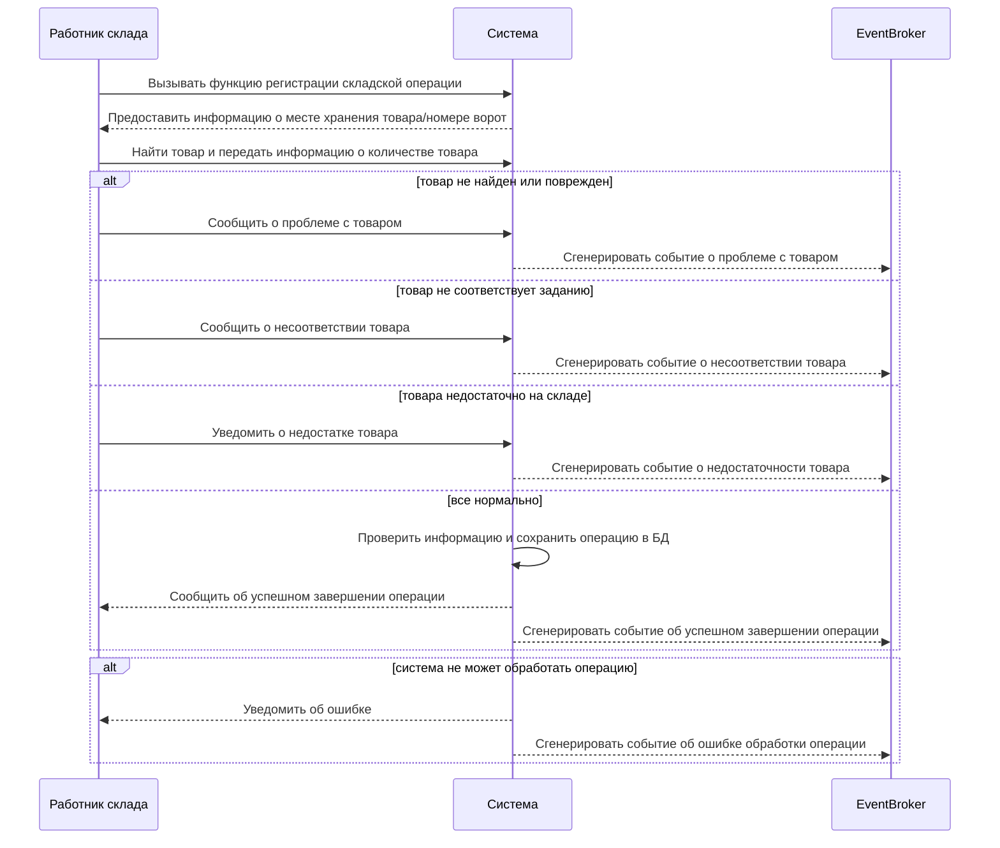
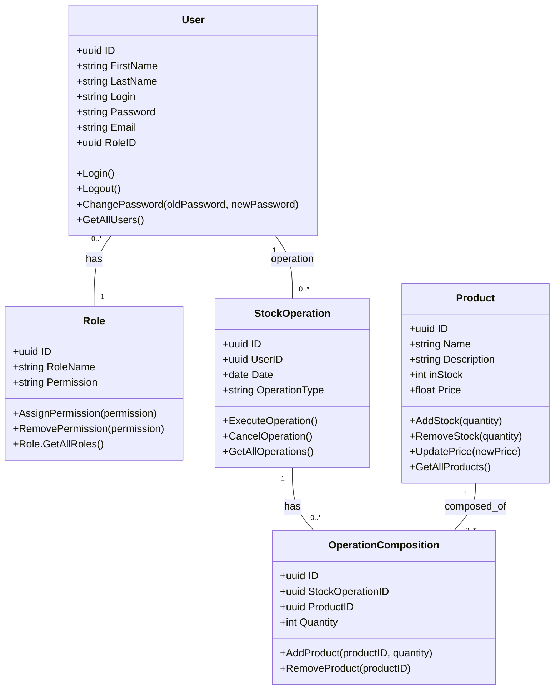
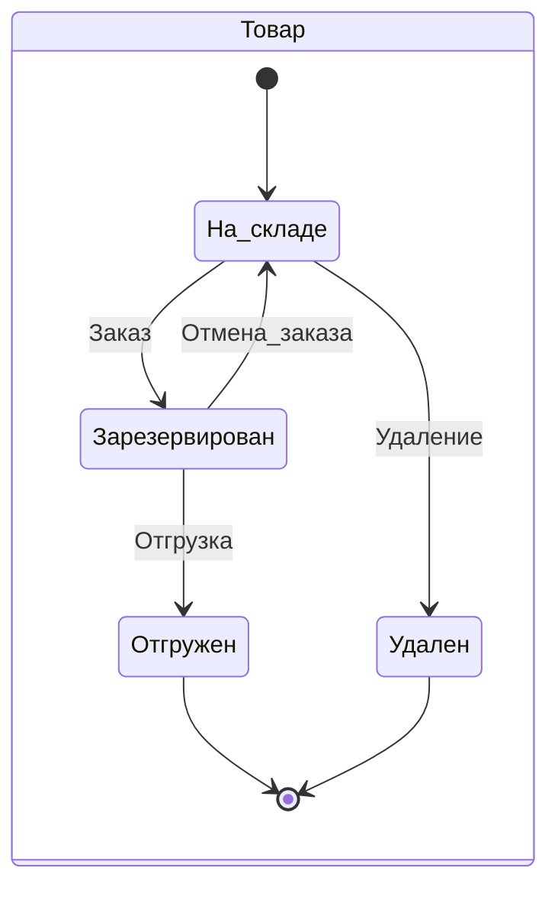
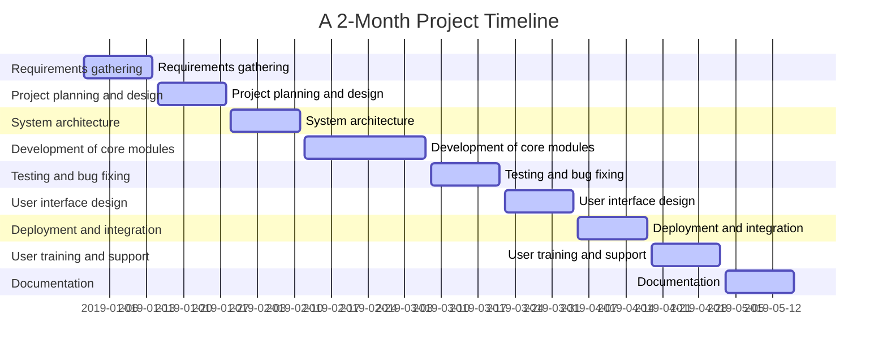

# Система управления складом (WMS) - серверная часть (backend NodeJS/TS)

В рамках проекта имитируется проект разработки WMS для интернет-магазина. Необходимо учитывать, что реальная система складского учета очень сложная, поэтому в проекте используется очень упрощенная модель, задача которой демонстрация навыков, перечисленных в  [Техническом введении](#техническое-введение). 

## Оглавление

ЕСЛИ ВИДИТЕ ЭТО ПРИМЕЧАНИЕ, ЗНАЧИТ ПРОЕКТ АКТИВНЫЙ И ПОСТОЯННО ДОРАБАТЫВАЕТСЯ.

ОЖИДАЕМЫЙ СРОК ЗАВЕРШЕНИЯ 
1 ЭТАПА - 10 июня (проектирование документации)
ЭТАП 2 - рефакторинг кода (приведение к документации) без сроков из-за обучения на другом очень напряженном курсе.
Найти нотации для графиков, возможно перейти на С4

1. [Введение](#введение-в-проект)
2. [Бизнес требования](#бизнес-требования)
3. [Концепция системы](#концепция-системы-фрагмент-карточки-проекта)
4. [Пользовательские требования](#пользовательские-требования)
5. [Функциональные требования](#основные-функциональные-требования)
6. [Пользователи](#пользователи-системы)
7. [Роли пользователей](#пользователи-системы)
8. [Проектирование REST API](#проектирование-rest-api)
9. [Участники](#участники)
10. [HTTP ответы ресурса Пользователи](#http-ответы-ресурса-пользователи)
11. [HTTP ответы ресурса Продукты](#http-ответы-ресурса-продукты)
12. [Архитектура приложения](#архитектура-приложения)
13. [Проектирование модели предметной области](#проектирование-модели-предметной-области)
14. [ER diagram](#er-diagram-users-and-products)
15. [Физическая модель данных для ORM Prisma NodeJS](#физическая-модель-данных-для-orm-prisma-nodejs)
16. [Список литературы](#используемая-литература-в-ходе-подготовки-проекта)

------------
**⚠️ RUN**  
1 env config:

PORT=set the port as number  
SALT=set the salt as number  
SECRET='set the secret as string' 
SKIP = 0
TAKE = 20

2 npm ci && npm start 
3 e2e test: npm test:e2e

------------
## Техническое введение

⚠️ Это учебный проект курса https://www.udemy.com/course/nodejs-start/ 
https://purpleschool.ru/course/nodejs
(https://learn.purpleschool.ru/public/products) в рамках которого я выступаю в ролях:

- Junior Backend Developer for JS/NodeJS/TS (implementing backend)
- Middle System Analyst (describing business and system requirements)

В роли **Junior Backend Developer**:
- непосредственно сама реализация приложения;  
- проектирование слоеной архитектуры (middlewares, exceptions filters,  controller, error handler, services, repository, orm prisma);
- реализация CRUD операции с ресурсом (товары на складе);  
- реализация JWT авторизация с ролевой моделью;  
- реализация документации REST API (swagger);
- использование при разработке тестирования (unit, e2e);
- использование DI, логгирования ошибок, работа Git и тп.
- разработка Telegram-bot с использованием функционала слоя бизнес-логики (DI)
- привести к Чистой архитектуре и TDD  https://github.com/rmanguinho/clean-ts-api
    
В роли **Middle System Analyst**:
привести к https://gitlab.com/microarch-ru
- выделение видов требования;
- проектирование архитектуры приложения;
- разработка и описание бизнес-требований и их артифактов;
- Event storming(==доработать==)
- выделение агрегатов доменных областей и bounded contexts(==доработать==)
- разработка и описание пользовательских требований (Use cases, User stories, Job stories, User stories mapping ==доработать==);
- разработка и описание функциональных требований;
- проработка нефункциональных требований (==доработать==);
- проработка качества требований и критериев приемки(==доработать==);
- проектирование Модели предметной области и баз данных;
- проектирование REST API;
- формулирование измеримых требований к качеству интерфейсов согласно подхода стандартов семейства HCI (Human-Computer Interaction)(==доработать==)
- базовые угрозы информационной безопасности(==доработать==)
- проверка требований на INCOSE Requirements Writing Guide(==доработать==)
  
&#128736;  Инструменты для редактирования README.md
- https://github.com/GnuriaN/format-README/blob/master/README.md
- https://structurizr.com/
- https://tableconvert.com/markdown-generator
- https://pandao.github.io/editor.md/en.html
- https://editor.swagger.io/
- https://emojio.ru/objects/d83ddee0-1f6e0-molot-i-gaechnyy-klyuch.html
- https://www.udemy.com/course/microservices-with-node-js-and-react/learn/lecture/19099026#overview пример проектирования метода by Stephen Grider
  
------------
## Введение в проект

> ⚠️ В рамках проекта имитируется проект разработки WMS для
> интернет-магазина. Необходимо учитывать, что реальная система
> складского учета очень сложная, поэтому в проекте используется очень
> упрощенная модель, задача которой демонстрация навыков, перечисленных
> в  [Техническом введении](#техническое-введение).
> 

> **Технология:** Проектирование системы производится по следующему алгоритму: Бизнес-контекст (black box): Контекстная диаграмма (данные)
> + диаграмма бизнес Use cases (функции)   Переходный уровень (grey box): Диаграмма концептуальных классов (данные) + реестр системных Use
> cases (функции)   Системный уровень (white box): Диаграмма классов или
> словарь данных (данные) + детальные Use case (функции и
> взаимодействие)

Задача раздела помочь команде разработки ознакомится с бизнес-контекстом задачи. 

Наш интернет-магазин является активно развивающимся проектом, который занимается продажей товаров в онлайн-режиме.

Одной из важнейших доменных областей нашего интернет-магазина является Склад. Задача нашего проекта - обеспечить эффективное и надежное управление товарными запасами для поддержки онлайн-продаж, с минимальными операционными расходами на складские операции.

Текущая боль нашего проекта заключается в отсутствии системы управления складскими операциями (WMS). Для решения этой проблемы необходимо провести анализ требований к системе WMS и выбрать подходящую систему, которая удовлетворит наши потребности. Реализация данного проекта позволит нам повысить эффективность управления запасами товаров и улучшить обслуживание наших клиентов, что приведет к увеличению прибыли и укреплению нашей позиции на рынке электронной коммерции.

⚠️Примечание:
Количественные показатели целей бизнеса вида:
> Освоить Х% рынка за Y месяцев. Увеличить сектор рынка в стране X на Y%
> за Z месяцев. Достигнуть объема продаж X единиц или дохода, равного
> $Y, за Z месяцев.
>
не рассматриваются в рамках портфолио.
Артефакт анализа бизнес-требований Vision так же не рассматривается. 

## Бизнес требования

Бизнес - систематическая деятельность, направленная на получение прибыли.

**Для** :  
>  - определения смысла проекта и обоснования его необходимости;
>  - разработки основы контракта; 
>  - разработки критериев приемки проекта;
>  - определения рамок проекта; 
>  - критериев приоритезации задач в ходе  разработки; 
>  - для формирования Product owners backlog,

необходимо выделить **бизнес-требования** к проекту, так как задача информационной системы или программного обеспечения достижение целей бизнеса за счет автоматизации бизнес-процессов.

Основная потребность бизнеса в сфере электронной коммерции, связанная с продажей товаров, может быть сформулирована следующим образом:

> Обеспечение эффективного и надежного управления товарными запасами для
> поддержки онлайн-продаж

Чтобы ответить на вопрос “Зачем бизнесу нужен этот проект?” рассмотрим пример, на основе которого будет сформулирован ответ:

> В электронной коммерции необходимо удовлетворять потребности клиентов
> и удерживать их внимание. Для этого, с точки зрения WMS, важно знать
> актуальное количество товара в наличии на складе. В противном случае,
> существует вероятность, что клиент будет разочарован, так как он не
> получит товар, который заказывал, либо товар, который есть в наличии
> не будет выставлен в Каталоге интернет-магазина как доступный. В
> итоге, клиент может обратиться к конкурентам, где найдет необходимый
> товар, и наш интернет-магазин потеряет клиента. Поэтому знать точное
> количество товаров на складе важно для сохранения
> конкурентоспособности и удержания клиентов. Так как это позволит запланировать поставки нового товара.

**Зачем** это нужно:
> Обеспечить конкурентоспособность интернет-магазина за счет:
>  - учета актуальных остатков товаров 
>  - минимизации времени выполнения всех складских операций, в частности сборки заказов 
>  - оптимизации использования полезной площади хранения склада 
>  - минимизации операционных издержек

Какие **проблемы** решает система:
> - неактуальные остатки
> - переполнение склада
> - недоиспользование площадей склада
> - неоптимальное расположение товара на складе, что приводит к повышенным затратам на поиск и перемещение товаров;
> - неоптимальное время сборки заказов из-за неоптимального расположения товаров на складе
> - ошибки в сборке заказа, которые приводят к затратам на возврат заказа или к репутационным рискам
> - трудоемкость и возможные ошибки при ручном планировании графика сборки заказов

Решение указанных проблем позволит не терять доход из-за оттока клиентов к конкурентами по причине отсутствия товара, а также позволит снизить и удерживать уровень операционных расходов в рамках запланированных бюджетов. Соответственно, потребность бизнеса заключается в решении указанных ранее проблем:

> Бизнесу в сфере электронной коммерции необходимо обеспечить постоянную
> доступность товаров для своих покупателей, а также оптимизировать
> процессы хранения, перемещения и контроля запасов.

Для достижения этой цели требуется разработка и внедрение системы управления складом (WMS), которая позволит более эффективно управлять товарными запасами, снижать издержки и улучшать обслуживание клиентов.

В обобщенном виде в рамках проекта выделим две основные бизнес-потребности:
| Бизнес-потребность | Описание  |
|--|--|
| Знать точное кол-во товаров на складе на момент запроса | Нужно для планирования поставок, чтобы обеспечить непрерывность продаж |
| Минимизировать затраты на перемещение товара по складу | Нужно для снижения затрат на содержание склада  |
| Минимизировать простои транспортных средств логистических служб | Нужно для снижения затрат на логистику  |
Сформулируем реестр бизнес-требования на основе потребностей для последующей **трассировки** требований.

### Реестр бизнес-требований

Шаблон кода требования - Роль/Система + Глагол/Отглагольное существительное + Объект действия

| Код требования | Описание требования |
| :--- | :--- |
| BREQ-01 WMS.УчетОстатков | Система WMS должна обеспечивать точный учет остатков товаров на складе согласно BRULE-01 |
| BREQ-02 WMS.УправлениеХранениемТовара| Система WMS должна обеспечивать хранение товара с оптимальным расположением на складе для минимизации времени поиска и перемещения товара к месту сборки согласно BRULE-02,|
| BREQ-03 WMS.ФормированиеГрафикаСборки| Система WMS должна обеспечивать автоматическое формирование графика сборки заказов|

### Реестр бизнес-правил
| Код BRULE | Описание BRULE | Код требования |
| :--- | :--- | :--- |
| BRULE-01 | Остатки товаров на складе должны обновляться автоматически после каждой операции приемки, отгрузки (сборки), перемещения или инвентаризации товаров | BREQ-01 WMS.УчетОстатков |
| BRULE-02 | Товары на складе должны располагаться в соответствии с их характеристиками (габариты, вес, пожароопасность) и **частотой обращения**, чтобы максимально использовать полезную площадь склада и **время поиска и перемещения** товаров | BREQ-02 WMS.УправлениеХранениемТовара |
| BRULE-03 | График сборки заказов должен формироваться автоматически на основе текущей загруженности   склада(кол-во операций из BRULE-01) и времени, необходимого для выполнения этих операций | BREQ-03 WMS.ФормированиеГрафикаСборки |

### Стейкхолдеры

**Владельцы интернет-магазина:** Заинтересованы в оптимизации складских операций и снижении операционных издержек для повышения прибыльности бизнеса.  
**Менеджеры интернет-магазина:** Заинтересованы в улучшении качества обслуживания клиентов и ускорении выполнения заказов.  
**IT-специалисты:** Ответственны за поддержку и интеграцию WMS с другими системами компании.  
**Поставщики товаров:** Заинтересованы в точном и своевременном контроле и учете поставляемых товаров на складе интернет-магазина.  
**Клиенты интернет-магазина:** Заинтересованы в актуальности товарных предложений и быстром выполнении своих заказов.  

### Концепция системы (Фрагмент Карточки проекта)

> Карточка проекта используется для снижения уровня сложности реальной
> системы WMS до практического задания курса по NodeJS

| **Карточка проекта**              |                                                                                                                                                                                                                                          |
|-------|--------|
| Тема проекта | Управление товарными запасами и складскими операциями для интернет-магазина                                                                                                                                                                           |
| Категория системы                                                                                                                                                                           | Серверное приложение имеющее REST API для интеграции и Telegram-bot
 | Заказчик                                                                                                                                                                           | Департамент электронной коммерции Торгового дома "Итальянские Диваны"
 | **Настоящая ситуация**                                                                                                                                                                          
| Решаемые проблемы             | Автоматизация ручных рутинных операций [BRULE-01], учет которых ведется вручную и с использованием бумажных журналов учета |
 |   Заинтересованные стороны      | Пользователи услуг интернет-магазина, Владелец интернет-магазина, Менеджеры интернет-магазина, Работники склада, Поставщики товаров                                                                                                                                                                             |
| Текущее решение               | Учет и регистрация товаров на складе ведутся вручную с использованием бумажных журналов, дозаказ товаров со сниженным запасами производится не вовремя, инвентаризация происходит нерегулярно, водители и курьеры долго ждут сборки заказов или отгрузки, что приводит к штрафным санкциям.                                                                                                                                                            |
| **Целевая ситуация**              |                                                                                                                                                                                                                                          |
| Цель для заказчика            | Увеличить эффективность и надежность управления товарными запасами для поддержки онлайн-продаж, сократить операционные издержки на 25% и сохранить конкурентоспособность интернет-магазина.                                                                                                                               |
| Назначение                    | **Для пользователей услуг и менеджеров(*) интернет-магазина**: обеспечить наличие товаров, снизить вероятность несоответствия товара заказу;  (* - бонусная часть зарплаты менеджеров интернет-магазина зависит от продаж)                                                                                                    |
|                               | **Для работников склада**: упростить процессы приемки и выдачи товаров [BRULE-01], инвентаризации склада, минимизировать время сборки заказов[BRULE-02], сократить "пробег" на перемещения товаров при сборке заказов[BRULE-02], сократить кол-во ручных операции[BRULE-01] ;                                                                                                                           |
|                               | **Для менеджеров склада**: добавление/удаление нового товара в каталог, мониторинг остатков товаров,  формирование графика сборки заказов и графиков погрузки транспортных средств  логистических служб, работа с отчетами о работе склада ;                                                                                                                           |
|  **Концепция решения**  | 
|  Количество видов пользователей | 1 Работники склада |
|   | 2 Менеджеры склада|
|   | 3 Администраторы WMS |
|  **Ключевые свойства и возможности** (features) |  |
|   | Управление каталогом (справочником) товаров |
|   | Приемка/отгрузка товаров |
|   | Мониторинг остатков товаров |
||Управление пользователями и правами|
| **Для работников склада**  | |
| |1 Складские операции (Приемка/отгрузка товара) (Update quantity)  |
|   | 2 Инвентаризация (future release) |
|   |3 Сборка заказа (future release) |
|**Для менеджера склада**  | |
| | 1 Управление каталогом (справочником) товаров (CRUDL)|
|  |2 Мониторинг остатков товаров в через REST API и Telegram-bot (inStock)  | 
|  |3 Планирование графика сборки заказов (future release) |
|  |4 Работа с отчетами о работе склада(future release) |
| **Для Администраторов склада**  | |
|  |1 Управление пользователями (CRUDL) |
|  | 2 Настройка прав доступа пользователям (ABAC)|
|  |3 Настройка параметров системы WMS(future release)|
|  |4 Обновление и поддержка WMS(future release)|


## Граница проекта. Контекстная диаграмма
>  Где потренироваться: на воркшопе - [Школа системного анализа "Use Case: основы"](https://systems.education/usecase-workshop) и на других воркшопах.
> **Технология:** порядок разработки контекстной диаграммы:  
> 
>  - [ ] Из числа заинтересованных лиц собирается рабочая группа (обычно
>        от 3 до 5 человек)
>  - [ ] Рабочая группа фиксирует в центре диаграммы  **название** 
>        конкретной системы
>  - [ ] Рабочая группа выдвигает и отображает  **группы**  пользователей,
>        которые должны взаимодействовать с системой, обсуждает их
>        перечень, дополняет его (группа первого контакта с системой)
>  - [ ] Рабочая группа выдвигает и отображает  **смежные системы**,
>        которые должны взаимодействовать с системой, обсуждает их
>        перечень, дополняет его
>  - [ ] Рабочая группа последовательно проходит по каждому элементу
>        окружения и описывает  **потоки данных**, связывающие его с
>        системой
>  - [ ] Рабочая группа проводит  **тестирование**  контекстной диаграммы,
>        дополняя диаграмму по ходу тестирования

Таблица Групп пользователей и смежных систем
|Наименование  |Описание  |
|--|--|
|Система  |Описание  |
|Склад  |Черный ящик  |
|Группа пользователей  |Работник склада  |
|  |Менеджер склада |
|  |Администратор  |
|Смежные системы  |Интернет-магазин  |
|  |Служба доставки  |

Таблица Данных 
|Данные  |Описание  |
|--|--|
|Пользователи  | Данные о пользователях  |
|Группы пользователи  | Данные о группе пользователях  |
|Отчет о пользователях| Информация о пользователях и их действиях|
|Каталог товаров| Перечень товаров на складе (справочник)|
|Информация об остатках| Информация о остатках товара на складе|
|Отчет по складским операциям| Информация об истории складских операций |
|График и место погрузки| Данные о графике и месте погрузки (ворота склада) собранного заказа |
|Заявки на сборку заказа| Заявка на сборку заказа (формирует Служба доставки после подтверждения оплаты заказа Интернет-магазином)|
|Заказы| Информация о заказах|
|Складские операции (приход/расход)|Информация об операциях с товарами на складе|



## Use cases

### Общие положения
>  Где потренироваться: на воркшопе - [Школа системного анализа "Use Case: основы"](https://systems.education/usecase-workshop)
Use cases используются для проектирования и выявления требований, выявления связанности действий пользователя и системы, определения границ системы.

Таблица акторов
|Наименование  |Описание  |
|--|--|
|Система  |Описание  |
|Группа пользователей  |Работник склада  |
|  |Менеджер склада |
|  |Администратор  |
|Смежные системы  |Интернет-магазин  |
|  |Служба доставки  |

### Диаграмма бизнес Use cases 


переделать связь Службы доставки на менеджера, так манагер управляет графиком сборки.

> **Бизнес Use-case** 
> Бизнес use-case определяет бизнес-возможность. 
> Например:
> Бизнес возможность - Управление складскими операциями
> Бизнес возможность - Обработка заявок на сборку заказов
> Бизнес возможность - Мониторинг остатков товаров 
>Также в качестве бизнес UC может выступать формулировка одного из шагов бизнес процесса.

**Пользователи WMS:**
|Пользователи |Описание роли  |
|--|--|
| Работники склада |Ответственны за выполнение операций на складе, таких как приемка, отгрузка, перемещение и инвентаризация товаров. Им необходимо использовать WMS для контроля запасов и эффективного выполнения своих рабочих обязанностей.  |
| Менеджеры склада |Ответственны за управление и контроль складской деятельности. Им необходимо использовать WMS для мониторинга производительности, планирования графиков и оптимизации складских операций.  |
| Администраторы WMS |Ответственны за настройку, поддержку и обновление системы WMS. Им необходимо использовать WMS для обеспечения стабильной работы системы и интеграции с другими программными продуктами компании.  |

**Диаграмм Business Use case**


 - [ ] Сопоставить функциональность в Use cases с Контекстной диаграммой
       (сопоставление функционала с данным)

### Реестр системных Use cases 

На основании высокоуровневых бизнес-use cases разработан реестр системных Use cases.

| Участник |Код UC  | Описание | Приоритет|
|--|--|--|--|
|Работник склада  |UC-1|Управление складскими операциями  | |
|  | UC-1.1 |Провести складскую операцию  | Высокий |
|  | UC-1.2 |Провести инвентаризацию на складе  | |
|  | UC-1.3 |Собрать заказ| |
|Менеджер склада |UC-2|Управление каталогом товаров  | |
|  | UC-2.1 |Создать каталог  | |
|  | UC-2.2 |Удалить каталог  | |
|  | UC-2.3 |Изменить имя каталога  | |
|  |UC-2.4  |Добавить товар| Высокий  |
|  |UC-2.5  |Удалить товар| Высокий  |
|  |UC-2.6  |Изменить товар| Высокий  |
|  |UC-2.7  |Посмотреть список товаров с учетом фильтров поиска| Высокий  |
|  |UC-2.8 |Отчет по складским операциям над товарами| |
|Менеджер склада |UC-3|Планирование сборки заказов  | |
|  | UC-3.1 |Посмотреть список заявок на сборку  | |
|  | UC-3.2 |Найти заявку на сборку по номеру заказа | |
|  | UC-3.3 |Назначить сборщика на сборку заказа  | |
|  | UC-3.4 |Назначить время сборки заказа| |
|  | UC-3.5 |Назначить время и место погрузки заказа| |
|  | UC-3.6 |Просмотреть отчет о сборке заказов| |
|  | UC-3.7 |Передать информацию о завершении сборки заказа смежной системе| |
|Менеджер склада |UC-4|Мониторинг остатков товаров  | |
|  | UC-4.1 |Назначить товару минимальный остаток   | |
|  | UC-4.2 |Отчет по остаткам товаров| |
|  | UC-4.3 |Назначить график инвентаризации  | |
|  | UC-4.4 |Подписаться на уведомление о снижении остатков | |
|Администратор |UC-5|Управление пользователями и группами доступа  | |
|  | UC-5.1 |Создать нового пользователя   | Высокий  |
|  | UC-5.2 |Просмотреть список пользователей   | Высокий  |
|  | UC-5.3 |Удалить пользователя| Высокий  |
|  | UC-5.4 |Изменить нового пользователя  | |
|  | UC-5.5 |CRUD операции группы доступа| |
|  | UC-5.6 |Назначить пользователя в группу доступа | |
|Работник склада  |UC-6|Обработка заявок на сборку заказа  | |
|  | UC-6.1 |Просмотреть заявки на сборку заказа  | |
|  | UC-6.2 |Подтвердить начало сборки заказа | |
|  | UC-6.3 |Подтвердить завершение сборки заказа  | |
|Служба доставки  |UC-7|Передача заявок на сборку заказов  | |
|  | UC-7.1 |Передать заявки на сборку заказа  | |
|  | UC-7.2 |Получить время и место сборки заказа | |
|Интернет-магазин |UC-8|Мониторинг остатков товаров  | |
|  | UC-8.1 |Получить остатки товаров | Высокий  |

Проверить на полноту:
 - [ ] трассировка до пользовательских или бизнес-требований  
 - [ ] привязка к шагам бизнес-процессов  
 - [ ] проверка на CRUDLs  (проверить сущности и их операции)
 
Дальнейшая детализация требований будет ориентирована на реализацию функционала согласно указанным **Product owner`ом приоритетам**. В первом релизе продукта ожидается функции с приоритетом **Высокий**.

## Моделирование предметной области
> **Технология:** порядок моделирования предметной области:  
>  Где потренироваться: на воркшопе - [Школа системного анализа "Моделирование предметной области"](https://systems.education/mpo-workshop)
>  - [ ] На основе контекстной диаграммы построить модель состава данных
>  - [ ] Проверить наличие связи между всеми информационными сущностями
>   - [ ] Указать наличие установленных связей на схеме (построить модель структуры) 
>   - [ ] Установить пропущенные информационные сущности 

### Выделение сущностей из контекстной диаграммы
Сущности выделены только для UC с приоритетом **Высокий**.
| № | Таблица | Описание  |
|--|--|--|
| 1 | User    | Таблица для хранения информации о пользователях, такой как логин, пароль, электронная почта, ФИО и другие атрибуты в зависимости от требований к системе.                               | 
| 2 | Role    | Таблица для хранения информации о различных ролях пользователей в системе. Каждая роль может иметь уникальный идентификатор и набор разрешений для доступа к различным функциям системы.  |
| 3 | Product | Таблица для хранения информации о товарах, такой как название, описание, категория, характеристики, цена и другие атрибуты в зависимости от требований к системе.                         |
| 4 | StockOperation | Таблица для хранения информации о складских операциях, совершенных Пользователями с товарами на складе.                                           |
| 5 | OperationComposition | Таблица для хранения перечня (список) товаров, учавствующих в складских операциях (для разрыва связи N-N)                                           |


### Entity Relationship Diagram (ERD)


### Entity Relationship Diagram (ERD) с атрибутами

### Use case для основного релиза MVP

Нужно по шагам расписать какой-то юскейс с альтернативами и исключениями, и по нему построить диаграмму последовательности. кейс Провести складскую операцию *приход или расход)

Управление складскими операциями.
UC-1.1 Провести складскую операцию

| Business Use Case Управление складскими операциями|  
|--|
| **Название:** UC 1.1 Провести складскую операцию  |
| **Актор** Работник склада  |
| **Предусловия** Работник склада получил задание из системы на проведение складской операции в телеграмм-боте. Работнику известен тип операции, код товара и необходимое количество товара для перемещения.   |
| **Триггер** Работник склада вызывает функцию  подтверждения начала складской операции (Работник склада приступил к выполнению задания на проведение складской операции) |
| **Постусловие** Складская операция проведена. Информация (тип операции, наименование, код, количество товара) о складской операции сохранена в системе. Информация об остатках обновлена и сгенерировано **событие** об изменении остатка товара  |
| **Основной поток** | 
| 1.Работник склада вызывает функцию регистрации складской операции в системе  |
| 2.Система предоставляет Работнику склада информацию о месте хранения товара(при расходе товара) или номер ворот склада (при приемке товара) |
| 3.Работник склада находит товар и проверяет количество товара. Далее Работник склада передает в систему информацию о количестве товара  |
| 4.Система проверяет введенную информацию и сохраняет складскую операцию в БД  |
| 5.Система сообщает об успешном завершении складской операции |
| **Альтернативные потоки** | 
| 1а. Если Работник склада не отвечает или не выполняет задание в течение определенного периода времени, система может отправить уведомление или эскалировать ситуацию на следующий уровень управления. |
| 3а. Если Работник склада обнаруживает, что при операции "расход" товара не достаточно на складе, он уведомляет систему о недостатке товара на складе. Система завершает сценарий с генерацией события о недостаточности товара на складе |
| 3б. Если Работник склада не может найти товар на складе (например, из-за неверного расположения), Работник склада сообщает систему, которая сгенерирует событие об отсутствии товара на указанном месте.  Завершение сценария.| 
| 3в. Если товар поврежден или непригоден для использования, Работник склада сообщает системе о состоянии товара. Система генерирует событие о повреждении товара. Завершение сценария. |
| 3г.  Если при выполнении операции "приход" Работник склада обнаруживает, что товары не соответствуют тем, которые указаны в задании (например, неверный товар или неверное количество), он сообщает об этом систему. Система генерирует событие о несоответствии товара прихода указанным в задании. Завершение сценария.|
|4а. Если система не может обработать складскую операцию из-за технической проблемы, она уведомляет Работника склада об ошибке. Завершение сценария.|



### Диаграмма классов



Нужно по шагам расписать какой-то юскейс с альтернативами и исключениями, и по нему построить диаграмму последовательности. кейс по регистрации расходный операции


### ~~Диаграммы состояний~~


ДАЛЕЕ НЕ ГОТОВО!! DRAFT!!! только эскиз структуры

### User story for Telegram-bot

Проблема:
Площадь склада довольно большая и складским работникам нужно перемещаться по складу и иметь мобильное устройство, с помощью которого можно было бы регистрировать операции в месте где например происходит инвентаризация.

Процесс инвентаризации обычно происходит как:

1.  Менеджер печатает на листе ведомость с перечнем товаров и количеством, которое учтено в системе
2.  Потом идет с этим листком к полке и начинает считать фактическое количество, пишет его на лист
3.  Потом идет к программе и вбивает в неё фактическое количество
4.  Программа на основе расхождения учетного остатка и фактического регистрирует оприходование или списание.

Тут много времени уходит на переписывание и вбивание данных, риск ошибок большой. А вот если бы у кладовщика было бы мобильное устройство, с помощью которого можно было бы поиск товара в каталоге производить по штрих-коду (в устройстве должен быть встроенный сканер) + сразу вводить в устройство фактическое количество (с помощью клавиатуры или голосом например), то бизнес процесс явно бы ускорился и снизился риск ошибок. Такие специальные устройства и сервисы есть. Например 1С Кладовщик.

### ~~Учесть переход к User story~~
*про потребности пользователей коллеги всем своим видом показывают, что походу у меня что-то не так с головой. Но пазл в голове моего программиста так походу и не сложился: почему пользователи не стали пользоваться уже разработанным функционалом, и мы его еще раз переделываем, так как им пользоваться было просто невозможно. О пользовательских требованиях никто не думал.
  
То ли дело когда создаем продукт. Если он будет неудобный и не будет покрывать истинных потребностей пользователей, то его просто никто не купит. Поэтому в продуктовой разработке user и job story это основа разработки. Убедиться в том, что мы делаем крутую фичу, которая будет реально полезна и востребована пользователями, и даст нам конкурентное преимущество в сравнении с другими продуктами.
  
Кстати и юскейсы, основанные на пользовательских историях будут звучать и строиться немного по другому.
  
Пример:
  
Если думать в терминах CRUDL, то вот есть сущности Каталог(список товаров) и Товар. Вот они связаны отношением 1: N или N : N. Вот нужны кейсы для того, чтобы каждую сущность создать, удалить, изменить, прочитать, просмотреть список и попутно проставить связь. Всё просто. Простота это наверное единственный плюс этого подхода.
  
Если думать о контексте, в котором находится пользователь, и о его потребностях, то раз у нас склад, то будет писать job story.
  
Представь что с тобой разговаривает менеджер склада. Практически жалуется))) как на приеме у врача. Он будет говорить не про сущности системы. Он о них вообще не думает. Он про свои проблемы будет говорить.
  
**В твоем “виртуальном” бизнесе у тебя менеджер склада занимается вводом товаров. Вообще конечно этим занимается отдел закупок или маркетинга, который работает с поставщиками и решает какой ассортимент будет продаваться в интернет магазине. Ну допустим ты взвалил эти обязанности на бедного менеджера склада).
Рассказ менеджера склада (это супер адекватный менеджер - сразу дает нужную информацию):
Мне как менеджеру склада ( на которого взвалили обязанности маркетолога) необходимо регистрировать товары, которые компания планирует закупать у поставщиков и продавать в интернет магазине. Необходимо учитывать более 3000 наименований товаров. Обычно (в 90% случаев) новые товары в ассортименте “появляются” пачками по 200 шт. У меня есть каталоги поставщиков в бумажном и электронном виде. Бывают ситуации, когда приходят заявки на ввод новых единичных товаров в ассортимент от других подразделений.
Потом еще выясняется, что есть возможность выгрузки каталога поставщиков с сайта поставщиков в формате эксель. А еще у поставщиков есть публичный API, по которому можно получить список товаров по фильтру.
job story будет следующая:
-   Как менеджеру склада, выполняющего по совместительству обязанности маркетолога, мне необходима возможность массового ввода товаров из файла excel, так как я выбираю на сайте поставщиков нужные мне товары и выгружаю их в файл.
Представь как бы “обрадовался” менеджер, если бы ему предоставили возможность ввода товаров руками и только по одной штуке в соответствии с CRUDL.
Эта стори должна быть включена в MVP, так как это способ ввода товаров в 90% случаев.
—-----------------------------------------------------------------------------------------------
Я это всё к чему. Конечно все CRUDL операции с сущностями будут нужны, но далеко не всегда их нужно вытаскивать в интерфейс пользователя или API прямо вот в таком вот виде. Это вопрос проектирования интерфейса, ориентированного на реальные потребности. Об этом хорошо написано в книге Арно Логе Проектирование web api.
Я бы на твоём месте пока не занималась бы job/ user story. Это следующий уровень. Сначала надо научиться проектировать CRUDL интерфейс. Потом осознать его ущербность и переходить к разработке на основе потребностей пользователей.*

## ~~Пользовательские требования~~

### Общие положения
> Лексическая формула Пользовательских требований: 
> Система должна позволять Пользователю [РОЛЬ][ДЕЙСТВИЕ][ОБЪЕКТ ДЕЙСТВИЯ][атрибуты объекта]
> 
> **Пользовательские требования** - это требования, выраженные пользователями и описывающие, каким образом система должна быть использована. Эти требования обычно формулируются на естественном языке и представляют собой описание того, что должна делать система для пользователя, а не как она это должна делать.  
**Таким образом**, пользовательские требования фокусируются на том, что должна делать система для пользователя, а функциональные требования - на том, каким образом это должно происходить в системе.

После определения бизнес-требований и высокоуровневых возможностей необходимо детализировать требования к системе с точки зрения работы Пользователей системы. Для этого необходимо выделить основные профили Пользователей. Далее, необходимо провести сбор пользовательских историй. Пользовательская история в обязательном порядке должна иметь трассировку на родительское бизнес-требование.

### ~~Определение основных профилей пользователей~~

### ~~Пользовательские истории (User story)~~

1. Складской работник:
   - Как складской работник, я хочу добавить новый товар на склад, чтобы учитывать его в системе WMS (Цель: обеспечить точный учет остатков товаров на складе).
   - Как складской работник, я хочу просматривать информацию о товаре на складе, чтобы знать его характеристики и количество (Цель: обеспечить точный учет остатков товаров на складе).
   - Как складской работник, я хочу обновлять информацию о товаре на складе, чтобы отражать актуальные данные (Цель: обеспечить точный учет остатков товаров на складе).
   - Как складской работник, я хочу удалить товар со склада, если он больше не доступен или не будет использоваться (Цель: оптимизация использования полезной площади склада).
   - Как складской работник, я хочу видеть список всех товаров на складе, чтобы иметь общий обзор запасов (Цель: обеспечить точный учет остатков товаров на складе).

2. Менеджер склада:
   - Как менеджер склада, я хочу добавлять новых пользователей системы WMS, чтобы предоставить им доступ к системе (Цель: обеспечить возможность работы с системой WMS для сотрудников склада).
   - Как менеджер склада, я хочу просматривать информацию о пользователях системы WMS, чтобы знать их роли и обязанности (Цель: обеспечить контроль и управление персоналом склада).
   - Как менеджер склада, я хочу обновлять информацию о пользователях системы WMS, чтобы отражать актуальные данные (Цель: обеспечить контроль и управление персоналом склада).
   - Как менеджер склада, я хочу удалять пользователей системы WMS, если они больше не работают с системой или на складе (Цель: обеспечить контроль и управление персоналом склада).
   - Как менеджер склада, я хочу видеть список всех пользователей системы WMS, чтобы иметь общий обзор персонала и их ролей (Цель: обеспечить контроль и управление персоналом склада).

3. Администратор системы:
   - Как администратор системы, я хочу добавлять новых пользователей системы WMS, чтобы предоставить им доступ к системе (Цель: обеспечить возможность работы с системой WMS для сотрудников склада).
   - Как администратор системы, я хочу просматривать информацию о пользователях системы WMS, чтобы знать их роли и обязанности (Цель: обеспечить безопасность и контроль доступа к системе).
   - Как администратор системы, я хочу обновлять информацию о пользователях системы WMS, чтобы отражать актуальные данные (Цель: обеспечить безопасность и контроль доступа к системе).
   - Как администратор системы, я хочу удалять пользователей системы WMS, если они больше не работают с системой или на складе (Цель: обеспечить безопасность и контроль доступа к системе).
   - Как администратор системы, я хочу видеть список всех пользователей системы WMS, чтобы иметь общий обзор персонала и их ролей (Цель: обеспечить безопасность и контроль доступа к системе).
  - 
На основе анализа User stories, выделен список требований:

~~1. Обеспечить актуальность остатков товаров на складе (Высокий приоритет)
2. Обеспечить оптимальное использование полезной площади склада (Высокий приоритет)
3. Минимизировать время выполнения складских операций, в том числе сборки заказов (Высокий приоритет)
4. Обеспечить оптимальное расположение товаров на складе (Высокий приоритет)
5. Минимизировать операционные издержки на складе (Средний приоритет)
6. Обеспечить автоматическое планирование графика сборки заказов (Средний приоритет)
7. Обеспечить автоматическое планирование графика погрузки транспортных средств (Средний приоритет)
8. Обеспечить возможность оперативного контроля за движением товаров на складе (Средний приоритет)
9. Обеспечить возможность управления и контроля за процессом приемки товаров на склад (Средний приоритет)
10. Обеспечить возможность управления и контроля за процессом отгрузки товаров со склада (Средний приоритет)
11. Обеспечить возможность быстрой и точной инвентаризации товаров на складе (Средний приоритет)
12. Обеспечить возможность работы в режиме онлайн для мониторинга текущей ситуации на складе (Низкий приоритет)
13. Обеспечить возможность интеграции с другими системами и программным обеспечением в рамках интернет-магазина (Низкий приоритет)
14. Обеспечить возможность реализации новых функций и модулей в дальнейшей перспективе (Низкий приоритет)
15. Обеспечить высокую степень безопасности и защиты данных, хранящихся на складе (Низкий приоритет)
16. Обеспечить безопасность и контроль доступа к системе (Низкий приоритет)
17. Обеспечить оптимальное расположение товаров на складе на основе закупочной деятельности (Низкий приоритет)~~

Приоритезация требований основывается на их важности для бизнес-процесса и конечных пользователей системы. Высокий приоритет отражает требования, которые критически важны для успеха проекта и удовлетворения потребностей пользователей.

### ~~Реестр пользовательских требований.~~ 

| №USERREQ | Пользовательское требование                                                                                            |
|----------|------------------------------------------------------------------------------------------------------------------------|
| 1 Пользователь.Авторизация       | Возможность авторизироваться в системе и получать доступ к своим данным и функционалу в соответствии с ролью.          |
| 2 Пользователь.Создание      | Возможность создавать нового пользователя в системе с набором прав доступа.                                             |
| 3 Пользователь.Удаление       | Возможность удаления пользователя.                                             |
| 4 Пользователь.Просмотр.Товары        | Возможность просматривать список товаров или один товар с остатками на складе с возможностью фильтрации по категориям и характеристикам товаров.  |
| 5 Пользователь.Добавление.Товара       | Возможность добавлять новый товар на склад с указанием причины добавления и источника.                                 |
| 6 Пользователь.Удаление.Товара       | Возможность удалять товар со склада с указанием причины убытия и направления убытия.                                   |
| 7 Пользователь.Обновление.Товара       | Возможность обновлять характеристики товара на складе с указанием причины изменения.                                    |
| 8 Пользователь.Поиск.Товара       | Возможность поиска товара на складе с использованием фильтрации по характеристикам товара.                             |
| 9 Пользователь.ИзменениеКоличества.Товара       | Возможность изменять количество товара на складе с указанием причины изменения.                                        |

### ~~Роли пользователей в системе~~

Ролевая модель **Роль: Администратор**
|  №USERREQ | Описание   |
| :------------: | :------------: |
| 2 | Создание нового пользователя  |
| 3 | Удаление пользователя  |
| 5 | Добавление нового товара  |
| 6 | Удаление товара  |
| 7 | Обновление информации о товаре  |
| 9 | Изменение остатков на складе |

Ролевая модель **Роль: Начальник склада**
|  №UserReq | Описание   |
| :------------: | :------------: |
| 9 | Изменение остатков на складе |

Ролевая модель **Роль: общий доступ для всех зарегистрированных сотрудников склада**
|  №UserReq | Описание   |
| :------------: | :------------: |
| 1 | Авторизация  |
| 4 | Получение списка товаров |
| 4 | Получение конкретного товара |
| 8  | Поиск товара с поисковыми параметрами фильтрации |

# Функциональные требования

> Функциональные требования приведены согласно лексическим формулам: 
> [Условие][Субъект][Действие][Объект][Ограничение/Значение]
> Система должна [ДЕЙСТВИЕ][ОБЪЕКТ ДЕЙСТВИЯ][атрибуты объекта]
**Функциональные требования** описывают, каким образом система должна выполнять конкретную функцию или задачу. Они описывают, что должна делать система и как она должна это делать. Функциональные требования обычно выражаются в терминах конкретных функций, операций или процессов, которые система должна выполнять.  

### Функциональные требования
1. Система должна хранить информацию о количестве товара на складе
2. Система должна поддерживать авторизированный доступ к системе с ограничением по доступу к функционалу согласно ролевой модели ([Роли пользователей](#пользователи-системы)). 
3. Система должна обеспечивать генерацию нового типа Пользователя с набором прав доступа (Администратор, Начальник склада)
4. Система должна обеспечить по запросу Пользователя операцию по предоставлению всех товаров на складе.   
5. Система должна обеспечить по запросу Пользователя операцию по добавлению товара на склад с указанием причины добавления и источника.
6. Система должна обеспечить по запросу Пользователя операцию по удалению товара со склада, направление убытия и причина убытия.  
7. Система должна обеспечить по запросу Пользователя операцию по изменению свойств товара с указанием причин изменения. Нулевое значение количества отстатков не приводит к удалению товара со склада.
8. Система должна обеспечить поиск с фильтрацией товара на складе по различным параметрам, таким как наименование товара, количество, стоимость, дата добавления.

# Проектирование REST API

> Общий подход к проектированию REST API. Перед началом проектирования
> REST API, необходимо проработать модель предметной области и выделить
> сущности, логику работы которых реализует система. В нашем примере,
> выделено две сущности: Пользователь и Товары (на складе) и определим
> CRUDLs операции для них. Далее, опишем методы и параметры запросов ,
> ожидаемые ответы, включая http статусы.

#### Разбиение на ресурсы (сущности) и методы работы с ними
**Управление ресурсом "Пользователи"**
1. Авторизация пользователя
2. Создание нового пользователя с набором ролей
5. Обновление информации о пользователе
6. Удаление пользователя
 
| **№** | **Path**                   | **Method** | **Body**  | **Response**              | **Description**                                |
|-------|----------------------------|------------|-----------|---------------------------|------------------------------------------------|
| 1     | /users                     | GET        | -         | Список пользователей      | Получить список всех пользователей             |
| 2     | /users/{id}                | GET        | -         | Информация о пользователе | Получить информацию о конкретном пользователе  |
| 3     | /users                     | POST       | User data | Новый пользователь        | Создать нового пользователя                    |
| 4     | /users/{id}                | PUT        | User data | Обновленный пользователь  | Обновить информацию о пользователе             |
| 5     | /users/{id}                | DELETE     | -         | -                         | Удалить пользователя                           |
| 6     | /users/{id}/roles          | GET        | -         | Список ролей пользователя | Получить список ролей пользователя             |
| 7     | /users/{id}/roles          | POST       | Role data | -                         | Добавить роль пользователю                     |
| 8     | /users/{id}/roles/{roleId} | DELETE     | -         | -                         | Удалить роль у пользователя                    |
| 9     | /login                     | POST       | User creds | Jwt token                | Аутентификация пользователя                    |
#### Описание структуры объектов в теле запроса
##### User data
```json
{
  "name": "John Doe",
  "email": "johndoe@example.com",
  "password": "password123",
  "role": "User"
}
```

##### Role data
```json
{
  "name": "Admin",
  "description": "Administrator role with full access."
}
```

##### Response Список пользователей
```json
[
  {
    "id": "1",
    "name": "John Doe",
    "email": "johndoe@example.com",
    "role": "User"
  },
  {
    "id": "2",
    "name": "Jane Doe",
    "email": "janedoe@example.com",
    "role": "Admin"
  }
]
```

##### Response Информация о пользователе
```json
{
  "id": "1",
  "name": "John Doe",
  "email": "johndoe@example.com",
  "role": "User"
}
```

##### Response Новый пользователь
```json
{
  "id": "3",
  "name": "Alice Smith",
  "email": "alicesmith@example.com",
  "role": "User"
}
```

##### Response Список ролей пользователя
```json
[
  {
    "id": "1",
    "name": "Admin",
    "description": "Administrator role with full access."
  },
  {
    "id": "2",
    "name": "User",
    "description": "Regular user role."
  }
]
```

##### User creds
```json
{
  "email": "johndoe@example.com",
  "password": "password123",
}
```

**Управление ресурсом "Товары на складе"**
1. Получение списка товаров
2. Получение информации о конкретном товаре
3. Создание нового товара
4. Обновление информации о товаре
5. Удаление товара
6. Поиск товара с поисковыми параметрами фильтрации
7. Изменение остатков на складе (отдельный метод на изменение количества товара на складе)
8. Получение остатка конкретного товара


|   | № | Path                 | Method | Body         | Response                     |
|---|---|----------------------|--------|--------------|------------------------------|
|   | 1 | /products            | GET    | -            | Список товаров               |
|   | 2 | /products/{id}       | GET    | -            | Информация о товаре          |
|   | 3 | /products            | POST   | Product data | Новый товар                  |
|   | 4 | /products/{id}       | PUT    | Product data | Обновленный товар            |
|   | 5 | /products/{id}       | DELETE | -            | -                            |
|   | 6 | /products/search     | GET    | -            | Список товаров               |
|   | 7 | /products/{id}/stock | PUT    | Stock data   | Измененный остаток товара    |
|   | 8 | /products/{id}/stock | GET    | -            | Информация об остатке товара |

#### Описание структуры объектов в теле запроса
##### Product data and Stock data
```javascript
Product data = {
    'name': str,
    'category': str,
    'description': str,
    'characteristics': dict
}

Stock data = {
    'quantity': int,
    'reason': str
}
```

##### Responses objects
```javascript
Список товаров = [
    {
        'id': int,
        'name': str,
        'category': str,
        'description': str,
        'characteristics': dict,
        'quantity': int
    },
    {...},
    {...}
]

Информация о товаре = {
    'id': int,
    'name': str,
    'category': str,
    'description': str,
    'characteristics': dict,
    'quantity': int
}

Новый товар = {
    'id': int,
    'name': str,
    'category': str,
    'description': str,
    'characteristics': dict,
    'quantity': int
}

Обновленный товар = {
    'id': int,
    'name': str,
    'category': str,
    'description': str,
    'characteristics': dict,
    'quantity': int
}

Измененный остаток товара = {
    'id': int,
    'quantity': int,
    'reason': str
}

Информация об остатке товара = {
    'id': int,
    'quantity': int
}

```

### Участники:
Работник склада - Администратор  
Работник склада - Работник: "Начальник склада"  
Система управления складом (бекенд)  

### HTTP ответы ресурса Пользователи
| **№** | **Path**                   | **Method** | **Successful HTTP code** | **Unsuccessful HTTP code** | **Description**                               |
|-------|----------------------------|------------|--------------------------|----------------------------|------------------------------------------------|
| 1     | /users                     | GET        | 200                      | 401, 403, 404              | Получить список всех пользователей             |
| 2     | /users/{id}                | GET        | 200                      | 401, 403, 404              | Получить информацию о конкретном пользователе  |
| 3     | /users                     | POST       | 201                      | 400, 401, 403              | Создать нового пользователя                    |
| 4     | /users/{id}                | PUT        | 200                      | 400, 401, 403, 404         | Обновить информацию о пользователе             |
| 5     | /users/{id}                | DELETE     | 204                      | 401, 403, 404              | Удалить пользователя                           |
| 6     | /users/{id}/roles          | GET        | 200                      | 401, 403, 404              | Получить список ролей пользователя             |
| 7     | /users/{id}/roles          | POST       | 201                      | 400, 401, 403, 404         | Добавить роль пользователю                     |
| 8     | /users/{id}/roles/{roleId} | DELETE     | 204                      | 401, 403, 404              | Удалить роль у пользователя                    |
| 9     | /login                     | POST       | 200                      | 400, 401                   | Аутентификация пользователя                    |


### HTTP ответы ресурса Продукты
| **№** | **Path**                 | **Method** | **Успешный HTTP-код** | **Неуспешный HTTP-код** | **Описание**                                 | **** |
|-------|--------------------------|------------|-----------------------|-------------------------|-----------------------------------------------|------|
| 1     | /products                | GET        | 200                   | 404                     | Получить список всех товаров                  |      |
| 2     | /products/{id}           | GET        | 200                   | 404                     | Получить информацию о товаре по ID            |      |
| 3     | /products                | POST       | 201                   | 400, 401, 500           | Создать новый товар                           |      |
| 4     | /products/{id}           | PUT        | 200                   | 400, 401, 404, 500      | Обновить информацию о товаре по ID            |      |
| 5     | /products/{id}           | DELETE     | 204                   | 401, 404, 500           | Удалить товар по ID                           |      |
| 6     | /products/{id}/stock     | GET        | 200                   | 404                     | Получить информацию об остатках товара по ID  |      |
| 7     | /products/{id}/stock     | POST       | 200                   | 400, 401, 404, 500      | Изменить остатки товара по ID                 |      |
| 8     | /products/{id}/stock     | PUT        | 200                   | 400, 401, 404, 500      | Обновить информацию об остатках товара по ID  |      |
| 9     | /products/{id}/stock     | DELETE     | 204                   | 401, 404, 500           | Удалить информацию об остатках товара по ID   |      |
| 10    | /products/{id}/thumbnail | PUT        | 200                   | 400, 401, 404, 500      | Загрузить изображение для товара по ID        |      |


#### Значение кодов ответов HTTP
| **№** | **Код ответа HTTP** | **Описание**                                                                                    | **Users_api**                                                                                  | **Products_api**                              |
|-------|---------------------|-------------------------------------------------------------------------------------------------|------------------------------------------------------------------------------------------------|------------------------------------------------|
| 1 | 200                 | Успешный запрос, данные успешно возвращены                                                      | Получение списка пользователей, информации о пользователе, списка товаров, информации о товаре | Получение списка товаров, информации о товаре  |
| 2 | 201                 | Запрос успешно выполнен, новый ресурс был создан                                                | Создание нового пользователя, товара                                                           | Создание нового товара                         |
| 3 | 204                 | Успешный запрос, но нет данных для возврата                                                     | Обновление данных пользователя, товара                                                         | Обновление данных товара                       |
| 4 | 400                 | Ошибка запроса, запрос не может быть обработан сервером                                         | Некорректный запрос                                                                            | Некорректный запрос                            |
| 5 | 401                 | Ошибка авторизации, отсутствуют или некорректные авторизационные данные                         | Ошибка авторизации                                                                             | Ошибка авторизации                             |
| 6 | 403                 | Ошибка доступа, сервер понимает запрос, но отказывается его выполнять из-за ограничений доступа | Доступ запрещен                                                                                | Доступ запрещен                                |
| 7 | 404                 | Ошибка запроса, запрашиваемый ресурс не найден                                                  | Пользователь или ресурс не найден                                                              | Товар или ресурс не найден                     |
| 8 | 409                 | Ошибка конфликта, запрос не может быть обработан из-за конфликтующих данных                     | Дублирование существующего пользователя                                                        | Дублирование существующего товара              |
| 9 | 500                 | Ошибка сервера, запрос не может быть обработан из-за ошибки на стороне сервера                  | Ошибка на стороне сервера                                                                      | Ошибка на стороне се                           |

## Архитектура приложения

Возьми отсюда:
https://github.com/rmanguinho/clean-ts-api

В основе приложения лежит слоеная архитектура, с выделением следующих модулей:
- слой бизнес-логики (services Products service, Users service)
- слой контроллеров (Products controller, Users controller)
- слой работы с репозиторием (Products repository, Users repository)
- слой middleware, DTO
- cлой для работы с Telegram ботом (bot.connector)

- Пользовательский интерфейс
  - Представлен RESTful API на Node.js с использованием пакета express
- Middleware
  - Обрабатывает запросы и валидирует параметры запроса на наличие обязательного параметра
- Controller
  - Использует маршрутизацию запросов с помощью пакета express и вызывает методы слоя бизнес-логики
- Бизнес-логика
  - Получает запрос от Controller;
  - Обрабатывает полученные данные, согласно бизнес-логике, обращается к слою Репозитория;
- Exceprion handler
  - Обрабатывает ошибки, возникающие в Middleware, Controller и Business Logic.
  - Возврат пользователю ответа в едином формате с уведомлением об ошибке
  - Логирование ошибок для последующего анализа
 - Авторизация и ролевая модель:
  - используется JWT token.

The default directory structure of a generated Ruby on Rails application:
https://github.com/specialorange/FDXCM/blob/master/README.rdoc
|-- app
|   |-- assets
|       |-- images
|       |-- javascripts
|       `-- stylesheets
|   |-- controllers
|   |-- helpers
|   |-- mailers
|   |-- models
|   `-- views
|       `-- layouts
|-- config
|   |-- environments
|   |-- initializers
|   `-- locales
|-- db
|-- doc
|-- lib
|   `-- tasks
|-- log
|-- public
|-- script
|-- test
|   |-- fixtures
|   |-- functional
|   |-- integration
|   |-- performance
|   `-- unit
|-- tmp
|   |-- cache
|   |-- pids
|   |-- sessions
|   `-- sockets
`-- vendor
    |-- assets
        `-- stylesheets
    `-- plugins

**app**
Holds all the code that's specific to this particular application.

**app/assets**
Contains subdirectories for images, stylesheets, and JavaScript files.

**app/controllers**
Holds controllers that should be named like weblogs_controller.rb for
automated URL mapping. All controllers should descend from
ApplicationController which itself descends from ActionController::Base.

**app/models**
Holds models that should be named like post.rb. Models descend from
ActiveRecord::Base by default.

**app/views**
Holds the template files for the view that should be named like
weblogs/index.html.erb for the WeblogsController#index action. All views use
eRuby syntax by default.

**app/views/layouts**
Holds the template files for layouts to be used with views. This models the
common header/footer method of wrapping views. In your views, define a layout
using the <tt>layout :default</tt> and create a file named default.html.erb.
Inside default.html.erb, call <% yield %> to render the view using this
layout.

**app/helpers**
Holds view helpers that should be named like weblogs_helper.rb. These are
generated for you automatically when using generators for controllers.
Helpers can be used to wrap functionality for your views into methods.

**config**
Configuration files for the Rails environment, the routing map, the database,
and other dependencies.

**db**
Contains the database schema in schema.rb. db/migrate contains all the
sequence of Migrations for your schema.

**doc**
This directory is where your application documentation will be stored when
generated using <tt>rake doc:app</tt>

**lib**
Application specific libraries. Basically, any kind of custom code that
doesn't belong under controllers, models, or helpers. This directory is in
the load path.

**public**
The directory available for the web server. Also contains the dispatchers and the
default HTML files. This should be set as the DOCUMENT_ROOT of your web
server.

**script**
Helper scripts for automation and generation.

**test**
Unit and functional tests along with fixtures. When using the rails generate
command, template test files will be generated for you and placed in this
directory.

**vendor**
External libraries that the application depends on. Also includes the plugins
subdirectory. If the app has frozen rails, those gems also go here, under
vendor/rails/. This directory is in the load path.

## ~~Проектирование базы данных Prisma ORM NodeJS~~

## Физическая модель данных Prisma ORM

```javascript
    model User {
      id         Int      @id @default(autoincrement())
      firstName  String
      lastName   String
      login      String   @unique
      password   String
      email   String
      role       Role     @default(USER)
    }
      
    model Product {
      id          Int       @id @default(autoincrement())
      name        String
      description String?
      price       Float
      inventories Inventory[]
    }
    
    model Inventory {
      id         Int      @id @default(autoincrement())
      quantity   Int
      updateDate DateTime @default(now())
      productId  Int
      product    Product  @relation(fields: [productId], references: [id])
    }
     
    enum Role {
      ADMIN
      CLIENT
      EMPLOYEE
    }
```

# График проекта




## Используемая литература в ходе подготовки проекта

1. Dean, L. Managing Software Requirements.
2. Wiegers, K. and Bitti, L. Cars: Requirements Analysis and Specification for Software Engineers. Second Edition. Microsoft Press.
3. Rational Unified Process (RUP).
4. Guide to the Software Engineering Body of Knowledge (SWEBOK).
5. IEEE. (1998). IEEE Recommended Practice for Software Requirements Specifications (IEEE 830).
6. ГОСТ 34.003 - 90. Информационная технология. Комплекс стандартов на автоматизированные системы. Основные положения.
7. ГОСТ 34.604 - 92. Информационная технология. Комплекс стандартов на автоматизированные системы. Требования к программным средствам.

Дополнительный список (планирую ознакомится):

8. ISO/IEC/IEEE 29148:2018 Systems and software engineering -- Life cycle processes -- Requirements engineering
9. ISO/IEC/IEEE 12207:2017 Systems and software engineering -- Software life cycle processes
10. ISO/IEC 12207:1995 Information technology -- Software life cycle processes
11. EN 50126-1:2017 Railway applications -- The specification and demonstration of Reliability, Availability, Maintainability and Safety (RAMS) -- Part 1: Generic RAMS process
12. EN 50600-1:2012 Information technology -- Data centre facilities and infrastructures -- Part 1: General concepts and requirements
13. ISO/IEC 15504-5:2012 Information technology -- Process assessment -- Part 5: An exemplar Process Assessment Model for IT service management (ISO/IEC 20000-1)
14. EN 62304:2006 Medical device software -- Software life cycle processes.


