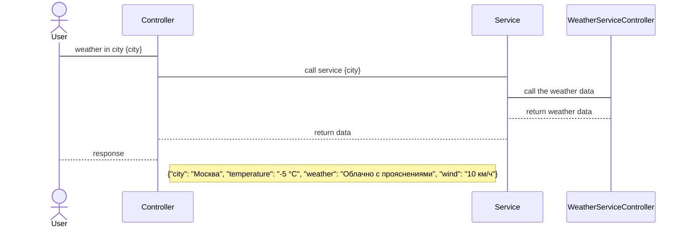

## Условия задачи:
Ограничения реализации:
Протокол: HTTP
Формат данных: JSON.
Результаты погоды передавать в виде json.
Контракт: (доступы и данные, см ниже)

Запрос только одного города (бесплатная лицензия поддерживает ограниченное кол-во запросов)

## Функиональные требования
Получать текущий погоду в требуемом городе.

## Пользовательские требования:
Пользователь обращается к системе с помощью HTTP запросов, указав город в строке запроса.

## Проектирование REST API. 
Процесс интеграции: Запрос с клиента состояние погоды в указанном городе.
### Участники:
Клиент
Система погоды

### Процесс:
Клиент составляет запрос, указав в запросе город, в котором его интересует погода.
Система получает запрос
Система проверяет запрос на корректность
Система проверяет есть ли такой город в базе погоды
Система отдает ответ на запрос с погодой в виде json 

### Проектирование метода.

- Привести SD взаимодействия (плюс таблица описания)
- проработать модель данных (необязательно, выделить  сущности)
- что является ресурсом (ресурс "Погода в городе"), выбор метода GET 
- проектирование енд-поинта: /api/v1/weatherincity/{city}

| Метод | Описание |
| --- | --- |
| `GET` | Получение информации о погоде в заданном городе |
| **URL-адрес** | `/api/v1/weatherincity?city={city}` |
| **Параметры запроса** | `city` - название города, для которого запрашивается информация о погоде |
| **Тело запроса** | Нет |
| **Заголовки запроса** | Нет |
| **Успешный ответ** | Код состояния: `200 OK` Тело ответа: JSON-объект, содержащий информацию о погоде в заданном городе |
| **Ошибка запроса** | Код состояния: `404 Not Found` Тело ответа: JSON-объект с сообщением об ошибке |

Описание параметров

| Параметр | Тип данных | Описание | Обязательный |
| --- | --- | --- | --- |
| `id` | Целое число | Уникальный идентификатор ресурса | Да |
| `name` | Строка | Имя пользователя | Да |
| `email` | Строка | Адрес электронной почты пользователя | Да |
| `password` | Строка | Пароль пользователя | Да |
| `age` | Целое число | Возраст пользователя | Нет |
| `gender` | Строка | Пол пользователя | Нет |
| `address` | Строка | Адрес пользователя | Нет |
| `phone` | Строка | Номер телефона пользователя | Нет |

