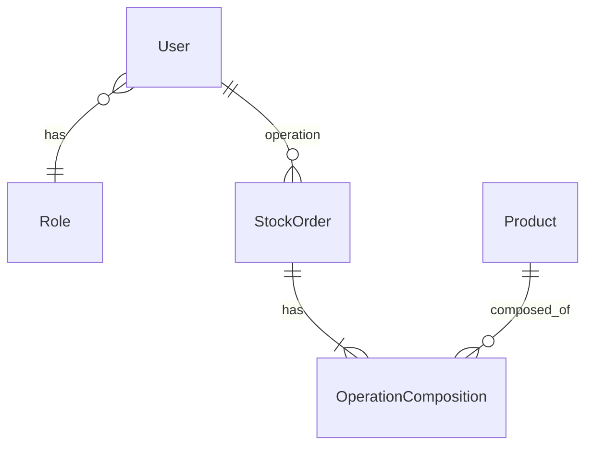
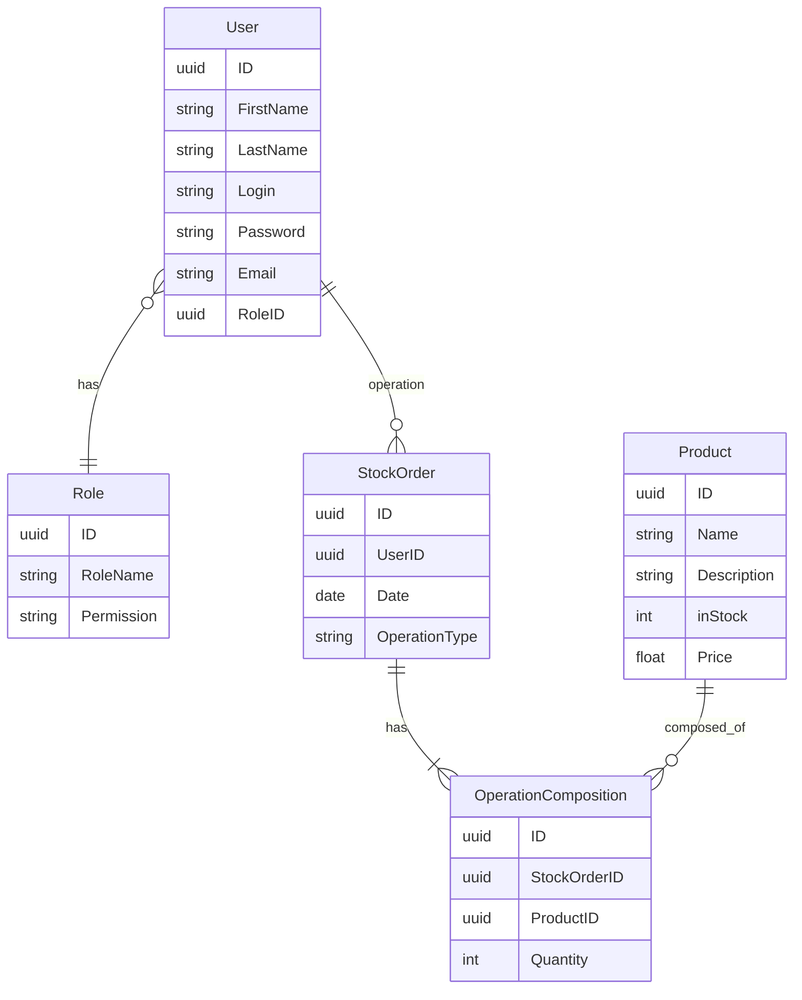
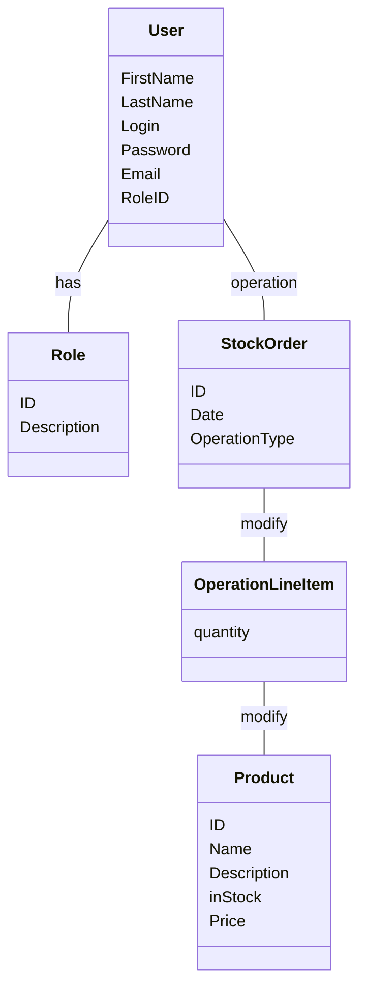
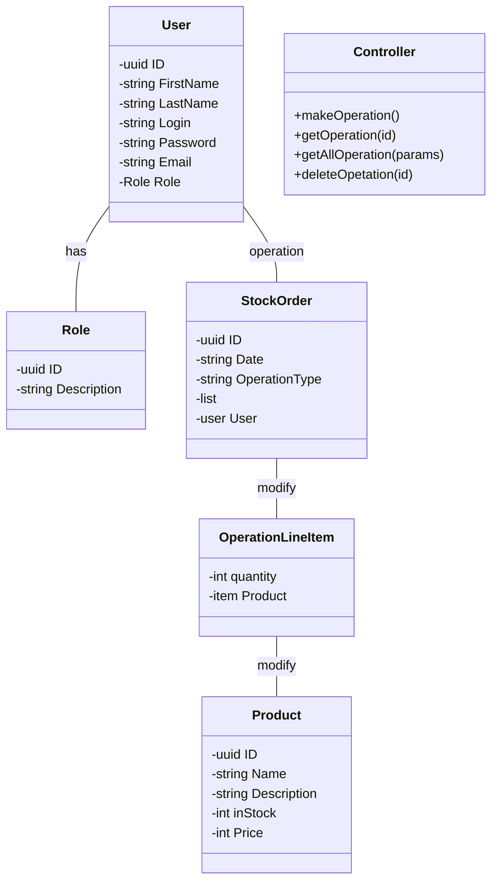
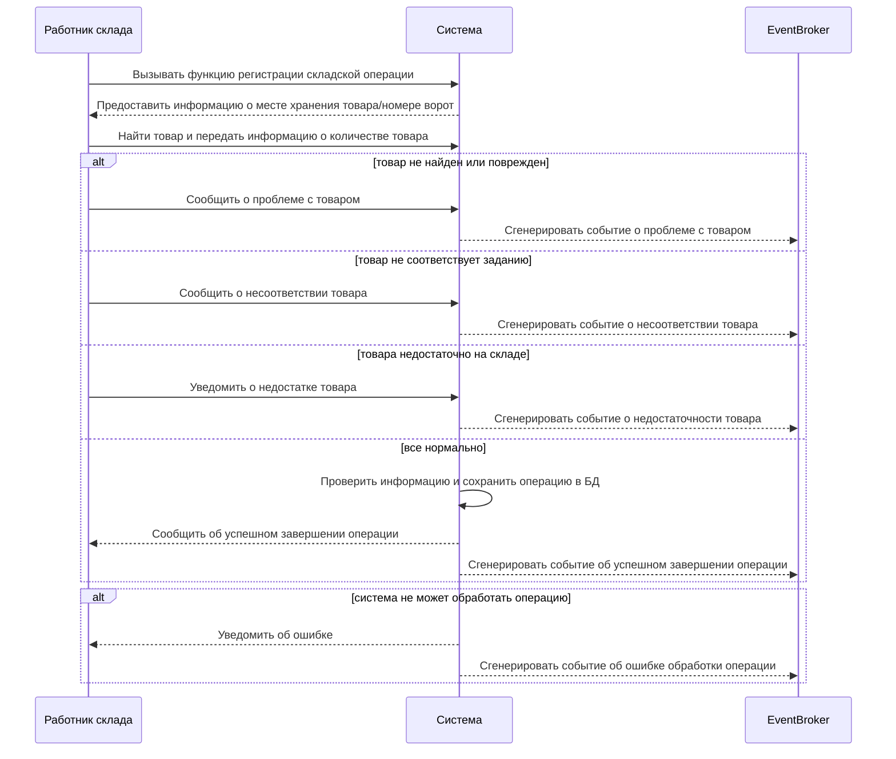

## Моделирование предметной области
> **Технология:** порядок моделирования предметной области:  
>  Где потренироваться: на воркшопе - [Школа системного анализа "Моделирование предметной области"](https://systems.education/mpo-workshop)
>  - [ ] На основе контекстной диаграммы построить модель состава данных
>  - [ ] Проверить наличие связи между всеми информационными сущностями
>   - [ ] Указать наличие установленных связей на схеме (построить модель структуры) 
>   - [ ] Установить пропущенные информационные сущности 

### Выделение сущностей из контекстной диаграммы
Сущности выделены только для UC с приоритетом **Высокий**.
| № | Таблица | Описание  |
|--|--|--|
| 1 | User    | Таблица для хранения информации о пользователях, такой как логин, пароль, электронная почта, ФИО и другие атрибуты в зависимости от требований к системе.                               | 
| 2 | Role    | Таблица для хранения информации о различных ролях пользователей в системе. Каждая роль может иметь уникальный идентификатор и набор разрешений для доступа к различным функциям системы.  |
| 3 | Product | Таблица для хранения информации о товарах, такой как название, описание, категория, характеристики, цена и другие атрибуты в зависимости от требований к системе.                         |
| 4 | StockOrder | Таблица для хранения информации Заявках на проведение складских операциях, совершенных Пользователями с товарами на складе.                                           |
| 5 | OperationComposition | Таблица для хранения перечня (список) товаров, учавствующих в складских операциях (для разрыва связи N-N)                                           |

### Entity Relationship Diagram (ERD)

### Entity Relationship Diagram (ERD) с атрибутами

### Диаграмма объектов

### Диаграмма классов

### Use case для основного релиза MVP

Нужно по шагам расписать какой-то юскейс с альтернативами и исключениями, и по нему построить диаграмму последовательности. кейс Провести складскую операцию *приход или расход)

Управление складскими операциями.
UC-1.1 Провести складскую операцию

| **Источник:** Business Use Case Управление складскими операциями|  
|--|
| **Название:** UC 1.1 Провести складскую операцию  |
| **Актор** Работник склада  |
| **Предусловия** Работник склада получил задание **[StockOrder]** из системы на проведение складской операции. Работнику известен тип операции, код товара и необходимое количество товара для перемещения.   |
| **Триггер** Работник склада вызывает функцию  подтверждения начала складской операции (Работник склада приступил к выполнению задания на проведение складской операции) |
| **Постусловие** Складская операция проведена. Информация (тип операции, наименование, код, количество товара) о складской операции сохранена в системе. Информация об остатках обновлена и сгенерировано **событие** об изменении остатка товара  |
| **Основной поток** | 
| 1.Работник склада вызывает функцию регистрации складской операции в системе  |
| 2.Система предоставляет Работнику склада информацию о месте хранения товара(при расходе товара) или номер ворот склада (при приемке товара) |
| 3.Работник склада находит товар и проверяет количество товара. Далее Работник склада передает в систему информацию о количестве товара  |
| 4.Система проверяет введенную информацию и сохраняет складскую операцию в БД  |
| 5.Система сообщает об успешном завершении складской операции |
| **Альтернативные потоки** | 
| 1а. Если Работник склада не отвечает или не выполняет задание в течение определенного периода времени, система может отправить уведомление или эскалировать ситуацию на следующий уровень управления. |
| 3а. Если Работник склада обнаруживает, что при операции "расход" товара не достаточно на складе, он уведомляет систему о недостатке товара на складе. Система завершает сценарий с генерацией события о недостаточности товара на складе |
| 3б. Если Работник склада не может найти товар на складе (например, из-за неверного расположения), Работник склада сообщает систему, которая сгенерирует событие об отсутствии товара на указанном месте.  Завершение сценария.| 
| 3в. Если товар поврежден или непригоден для использования, Работник склада сообщает системе о состоянии товара. Система генерирует событие о повреждении товара. Завершение сценария. |
| 3г.  Если при выполнении операции "приход" Работник склада обнаруживает, что товары не соответствуют тем, которые указаны в задании (например, неверный товар или неверное количество), он сообщает об этом систему. Система генерирует событие о несоответствии товара прихода указанным в задании. Завершение сценария.|
|4а. Если система не может обработать складскую операцию из-за технической проблемы, она уведомляет Работника склада об ошибке. Завершение сценария.|

