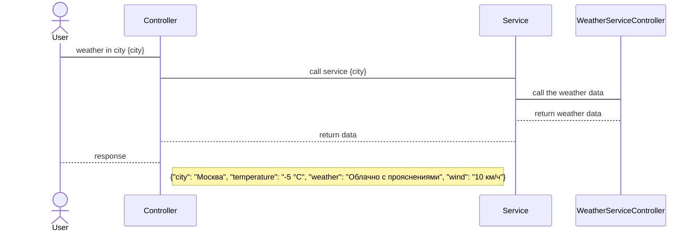
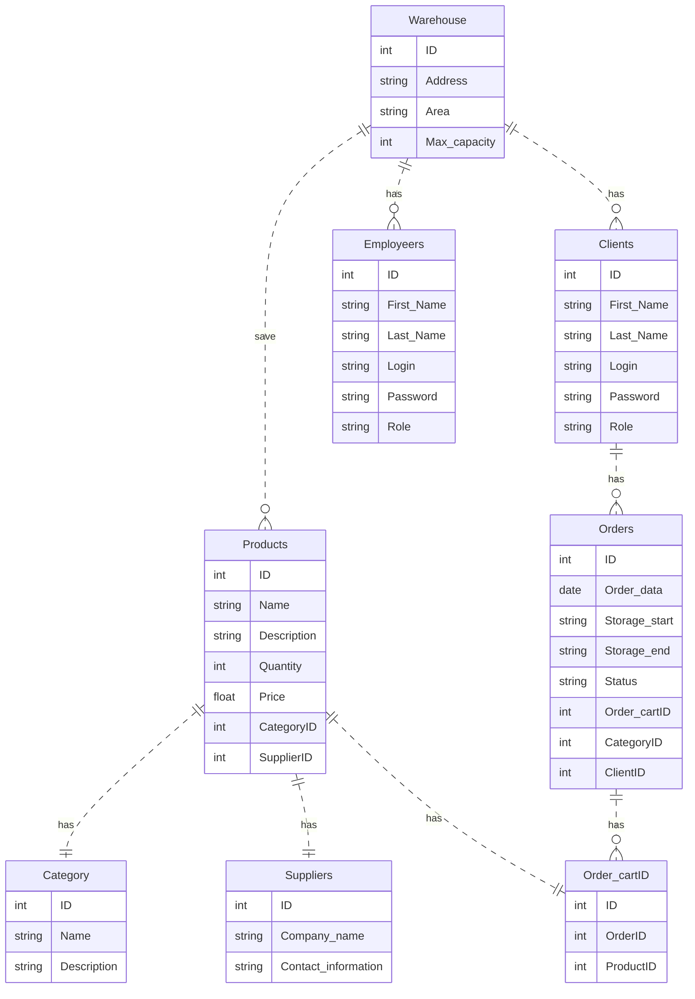

# Система управления складом версия 0.0.1

## Оглавление

1. [Концепция системы](#карточка-проекта-концепция-системы)
2. [Тип проекта](#тип-проекта-серверная-часть-бекенд-nodejs-системы-управления-складом)
3. [Пользователи](#пользователи-системы)
4. [Роли пользователей](#роли-пользователей-в-системе)
5. [Функциональные требования](#основные-функциональные-требования)
6. [Дополнительные требования](#дополнительные-требования)
7. [Пользовательские требования](#пользовательские-требования)
8. [Проектирование REST API](#проектирование-rest-api)
9. [Участники](#участники)
10. [Обобщенный процесс взаимодействия с системой](#обобщенный-процесс-взаимодействия-с-системой)
11. [Проектирование методов](#проектирование-методов)
12. [Модель предметной области. ER diagram](#модель-предметной-области-er-diagram)

## Тип проекта: серверная часть (бекенд NodeJS) системы управления складом  

⚠️ Это учебный проект курса https://www.udemy.com/course/nodejs-start/ (https://learn.purpleschool.ru/public/products) в рамках которого необходимо отработать навык реализации слоеной архитектуры (middlewares, exceptions filters,  controller, error handler, services, repository, orm prisma) для выполнения CRUD операций с ресурсом (товары на складе) и JWT авторизация с ролевой моделью. Просьба не брать описание проекта за основу, так как он не выверен профессиональными системными аналитиками.

- доп материал https://github.com/GnuriaN/format-README/blob/master/README.md
- научится 4с model https://structurizr.com/

## Концепция системы (Фрагмент Карточки проекта)

| Карточка проекта              |                                                                                                                                                                                                                                          |
|-------------------------------|------------------------------------------------------------------------------------------------------------------------------------------------------------------------------------------------------------------------------------------|
| Автоматизируемая деятельность | Управление складом (отслеживание актуальным состоянием склада)                                                                                                                                                                           |
| Заинтересованные стороны      | Пользователи услуг склада, Владельц склада, Работники склада                                                                                                                                                                             |
| Текущее решение               | Учет и регистрация товаров на складе ведется вручную с использованием журналов                                                                                                                                                           |
| Решаемые проблемы             | Уменьшение ошибок, вызванных человеческим фактором: ошибки при записи в журнал, расчет количества остатков, учет суммарного веса, объема товаров, снижение затрат на бумажные носители, увеличение скорости обслуживания клиентов склада |
| Целевая ситуация              |                                                                                                                                                                                                                                          |
| Цель для заказчика            | Снизить расходы на операционную деятельность по управлению склада на 20%, увеличить приток клиентов на 15%                                                                                                                               |
| Назначение                    | Для пользователй услуг склада: увеличить скорость обслуживания от момента поступления заявки до выдачи или приемки товара на склад,                                                                                                      |
|                               | Для работника склада: автоматизировать процессы приемки и выдачи товаров, инвентаризации склада                                                                                                                                          |

## Основные функциональные требования
_Лексическая формула требований: [Условие][Субъект][Действие][Объект][Ограничение/Значение]_  
### Релиз 1
1. Система должна хранить информацию о заполненности склада товарами (Емкость склада ограничена площадью зоны хранения)
2. Система должна поддерживать авторизированный доступ к системе с ограничением по доступу к функционалу согласно ролевой модели. 
3. Система должна обеспечивать генерацию нового типа Пользователя с набором прав доступа.  
4. Система должна обеспечить по запросу Пользователя операцию по добавлению товара на склад с указанием причины добавления и источника.
5. Система должна обеспечить по запросу Пользователя операцию по убытию товара со склада, направление убытия и причина убытия.  
6. Система должна обеспечить по запросу Пользователя операцию по изменению свойств товара с указанием причин изменения.  
7. Система должна обеспечить по запросу Пользователя операцию по изменению свойств товара с указанием причин изменения.  
8. Система должна по запросу Пользователя сгенерировать отчет об остатках товара на складе.  
9. Система должна обеспечить поиск с фильтрацией товара на складе по различным параметрам, таким как наименование товара, количество, стоимость, дата добавления.
### Релиз 2
1. Система должна обеспечивать возможность уведомления пользователей об изменении статуса товара (добавление, убытие, изменение свойств) с помощью электронной почты или мобильных уведомлений с возможностью настройки параметров уведомлений (например, учет часового пояса). Это поможет пользователям оперативно узнавать о изменениях на складе и планировать свою работу соответствующим образом.

## Пользователи системы

|               Пользователь         | Описание  |
|------------------------------------|---|
| Заказчик          | Владелец склада   |
| Клиент  | Пользователь услуг склада  |
| Работник           | Работник склада. Роль - Администратор системы   |
| Работник           | Работник склада. Роль - Начальник склада   |

## Пользовательские требования

> **Пользовательские требования** - это требования, выраженные пользователями и описывающие, каким образом система должна быть использована. Эти требования обычно формулируются на естественном языке и представляют собой описание того, что должна делать система для пользователя, а не как она это должна делать.  
**Функциональные требования**, с другой стороны, описывают, каким образом система должна выполнять конкретную функцию или задачу. Они описывают, что должна делать система и как она должна это делать. Функциональные требования обычно выражаются в терминах конкретных функций, операций или процессов, которые система должна выполнять.  
**Таким образом**, пользовательские требования фокусируются на том, что должна делать система для пользователя, а функциональные требования - на том, каким образом это должно происходить в системе.

### Реестр пользовательских требований
| №UserReq | Пользовательское требование                                                                                            |
|----------|------------------------------------------------------------------------------------------------------------------------|
| 1        | Возможность зарегистрироваться в системе и получить доступ к функционалу в соответствии с ролью.                       |
| 2        | Возможность авторизироваться в системе и получать доступ к своим данным и функционалу в соответствии с ролью.          |
| 3        | Возможность просматривать список товаров на складе с возможностью фильтрации по категориям и характеристикам товаров.  |
| 4        | Возможность добавлять новый товар на склад с указанием причины добавления и источника.                                 |
| 5        | Возможность убирать товар со склада с указанием причины убытия и направления убытия.                                   |
| 6        | Возможность изменять характеристики товара на складе с указанием причины изменения.                                    |
| 7        | Возможность получать отчет об остатках товаров на складе.                                                              |
| 8        | Возможность поиска товара на складе с использованием фильтрации по характеристикам товара.                             |
| 9        | Возможность просматривать список пользователей системы с разделением по типам пользователей.                           |
| 10       | Возможность просматривать информацию о конкретном пользователе.                                                        |
| 11       | Возможность создавать нового пользователя в системе с набором прав доступа.                                            |
| 12       | Возможность обновлять информацию о пользователе.                                                                       |
| 13       | Возможность удалять пользователя из системы.                                                                           |
| 14       | Возможность получать список ролей в системе.                                                                           |
| 15       | Возможность получать список ролей с фильтрацией по ролям.                                                              |
| 16       | Возможность изменять роли у пользователей в системе.                                                                   |

### Роли пользователей в системе

|  Пользователь | Функционал   |
| :------------: | :------------: |
| **Работник**  | **Роль: Администратор**  |
|   | Авторизация  |
|   | Создание нового пользователя  |
|   | Получение списка пользователей  |
|   | Получение информации о пользователе  |
|   | Обновление информации о пользователе  |
|   | Удаление пользователя  |
|   | Получение списка ролей  |
|   | Получение списка ролей с фильтрацией по ролям  |
|   | Обновление ролей у пользователей  |
|   | Обновление информации о товаре  |
|   | Удаление товара  |
|   | Получение отчета о товарах на складе   |
|   | Получение отчета о клиентах склада |
|   | Получение отчета о работниках склада  |
|   | Получение отчета о движении товаров  |
|   | Получение списка заказа Клиента  |
|   | Создание нового заказа Клиента  |
|   | Получение информации о конкретном заказе Клиента |
|   | Обновление информации о конкретном заказе Клиента  |
|   | Удаление заказа Клиента  |
|   | Получение списка всех заказов |
| **Работник**  | **Роль: Начальник склада** |
|   | Изменение остатков на складе |
|   | Получение остатка конкретного товара |
| **Работник**  | **Роль: любая** |
|   | Получение списка товаров |
|   | Поиск товара с поисковыми параметрами фильтрации |
|   | Получение остатка конкретного товара  |
| **Клиент** | **Роль: авторизированный клиент** |
|   | Получение списка заказов Клиента |
|   | Создание нового заказа Клиента |
|   | Получение информации о конкретном заказе Клиента |
|   | Обновление информации о конкретном заказе Клиента |
|   | Удаление заказа Клиента |

## Дополнительные требования

Документацию на API привести в формате openAPI. Предоставить swagger.
CRUD для управления новыми пользователями в рамках данного релиза не требуется.


## Проектирование REST API
Процесс интеграции Клиент - Сервис:  
#### Разбиение на ресурсы (сущности) и методы работы с ними
**Управление ресурсом "Пользователи"**
1. Авторизация пользователя
2. Создание нового пользователя с набором ролей
3. Получение списка пользователей (с разделение по типу Пользователей в запросе: Клиенты, Работники склада)
4. Получение информации о конкретном пользователе
5. Обновление информации о пользователе
6. Удаление пользователя
7. Получение списка ролей
8. Получение списка ролей с фильтрации по ролям
9. Обновление ролей у пользователей

**Управление ресурсом "Товары на складе"**
1. Получение списка товаров
2. Создание нового товара
3. Получение информации о конкретном товаре
4. Обновление информации о товаре
5. Удаление товара
6. Поиск товара с поисковыми параметрами фильтрации
7. Изменение остатков на складе (отдельный метод на изменение количества товара на складе)
8. Получение остатка конкретного товара

**Управление ресурсом "Отчеты"**
1. Получение отчета о товарах на складе (имитация движения товаров за период)
2. Получение отчета о клиентах склада (имитация маркетинговых исследований)
3. Получение отчета о работниках склада (имитация учета рабочего времени и т.п.)
4. Получение отчета о движении товаров по конкретному типу товара (по категории)

**Управление ресурсом "Заказы клиентов"**
*Все ниже приведенные методы требуют авторизации Клиента.*
1. Получение списка заказа Клиента
2. Создание нового заказа Клиента
3. Получение информации о конкретном заказе Клиента
4. Обновление информации о конкретном заказе Клиента
5. Удаление заказа Клиента
6. Получение списка всех заказов

### Участники:
Работник склада - Администратор  
Работник склада - Работник: "Начальник склада"  
Пользователь услуг склада - Клиент  
Система управления складом (бекенд)  
### Обобщенный процесс взаимодействия с системой
Пользователь отправляет запрос в Систему     
Система получает запрос  
Система проверяет запрос на корректность  
Система проверяет запрос на правомерность доступа  
Система выполняет запрос и отдает ответ, включая HTTP статус и json с требуемой информацией   
### Проектирование REST API


#### Диаграмма последовательности

#### Запрос погоды в заданном городе


Regenerate response


#### Параметры запроса
| Параметр | Тип | Описание |
| --- | --- | --- |
| `city` | строка | **Обязательный.** Название города, для которого запрашивается погода. |
| `units` | строка | Единицы измерения, используемые для температуры. Возможные значения: `metric`, `imperial`, `standard`. По умолчанию используются единицы измерения по системе СИ (метрическая система). |
| `lang` | строка | Язык, на котором должен быть возвращен ответ. Возможные значения: `en`, `ru`, `uk`, `pl`, `de`, `es`, `fr`, `it`, `pt`, `ro`, `tr`. По умолчанию используется английский язык (`en`). |
| `appid` | строка | **Обязательный.** Ключ API, используемый для доступа к данным о погоде. |
#### Пример запроса
```http
GET /api/v1/weatherincity?city=London&units=metric&lang=en&appid=abcdefg123456
```
#### Пример ответа
```json
    {
      "city": "Москва",
      "temperature": "-5 °C",
      "weather": "Облачно с прояснениями",
      "wind": "10 км/ч"
    }
```
## Архитектура системы и проектное решение

- Пользовательский интерфейс
  - Представлен RESTful API на Node.js с использованием пакета express
- Middleware
  - Обрабатывает GET запроса по роуту /api/v1/weatherincity
  - Валидирует параметры запроса на наличие обязательного параметра `city`
- Controller
  - Использует маршрутизацию запросов с помощью пакета express
  - При получении запроса на /api/v1/weatherincity передает его в слой бизнес-логики
- Adapter
  - Обращается к API сервису https://openweathermap.org/api с помощью пакета axios
  - Передает параметры запроса в формате, необходимом для API сервиса с ключом API и названием города
- Бизнес-логика
  - Получает запрос от Controller и трансформирует его в формат, необходимый для API сервиса, добавляя к запросу ключ API и приводит название города к нужному формату.
  - Отправляет запрос к API сервису с помощью Adapter и получает ответ
  - Обрабатывает полученные данные, выбирая только необходимые поля и трансформируя их для передачи в ответ клиенту в формате json
- Exceprion handler
  - Обрабатывает ошибки, возникающие в Middleware, Controller и Business Logic.
  - Возврат пользователю ответа в едином формате с уведомлением об ошибке
  - Логирование ошибок для последующего анализа

## Модель предметной области. ER diagram



## Физическая модель данных для ORM Prisma NodeJS
    model User {
      id         Int      @id @default(autoincrement())
      firstName  String
      lastName   String
      login      String   @unique
      password   String
      role       Role     @default(USER)
      createdAt  DateTime @default(now())
      updatedAt  DateTime @updatedAt
      orders     Order[]
    }
    
    model Category {
      id          Int        @id @default(autoincrement())
      name        String
      description String?
      products    Product[]
    }
    
    model Product {
      id          Int       @id @default(autoincrement())
      name        String
      description String?
      quantity    Int
      price       Float
      category    Category @relation(fields: [categoryId], references: [id])
      categoryId  Int
      supplier    Supplier @relation(fields: [supplierId], references: [id])
      supplierId  Int
      inventories Inventory[]
    }
    
    model Inventory {
      id         Int      @id @default(autoincrement())
      quantity   Int
      updateDate DateTime @default(now())
      productId  Int
      product    Product  @relation(fields: [productId], references: [id])
    }
    
    model Supplier {
      id               Int       @id @default(autoincrement())
      companyName      String
      address          String
      contactInformation String
      products         Product[]
    }
    
    model Warehouse {
      id          Int       @id @default(autoincrement())
      address     String
      area        Float
      warehouseType String
      maxCapacity Int
    }
    
    model Order {
      id               Int       @id @default(autoincrement())
      orderDate        DateTime  @default(now())
      storageStartDate DateTime?
      storageEndDate   DateTime?
      orderStatus      String
      client           User      @relation(fields: [clientId], references: [id])
      clientId         Int
    }
    
    enum Role {
      ADMIN
      CLIENT
      EMPLOYEE
    }

