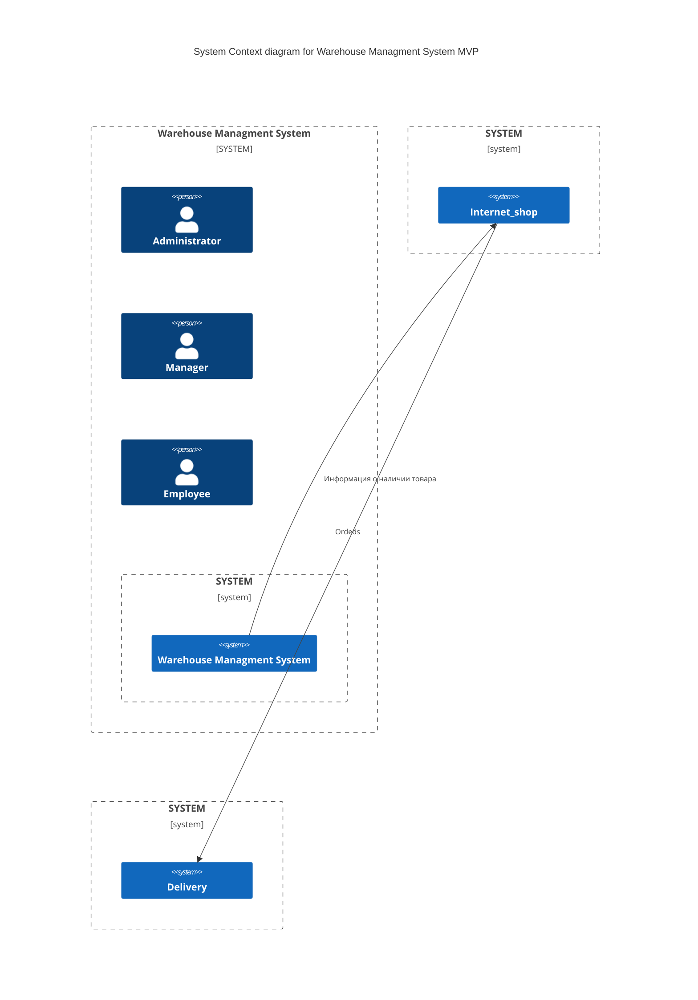

```mermaid
C4Context
title System Context diagram for Warehouse Managment System MVP

System_Boundary(Users, "Warehouse Managment System") {
System_Boundary("Warehouse Managment System") {

System(wms, "Warehouse Managment System")

}
Person(admin, "Administrator")
Person(mgr, "Manager")
Person(employee, "Employee")
}

System_Boundary("Internet_shop") {

System(i_shop, "Internet_shop")

}
System_Boundary("Deliverym") {

System(delivery, "Delivery")

}


Rel(i_shop, delivery , "Ordeds")
Rel_D(wms, i_shop , "Информация о наличии товара")

UpdateRelStyle(i_shop, delivery, $offsetX="-20", $offsetY="-20")
UpdateRelStyle(delivery, wms, $textColor="red", $lineColor="red", $offsetX="-50", $offsetY="-20")
UpdateRelStyle(wms, i_shop,  $offsetX="-80", $offsetY="80") 
```
