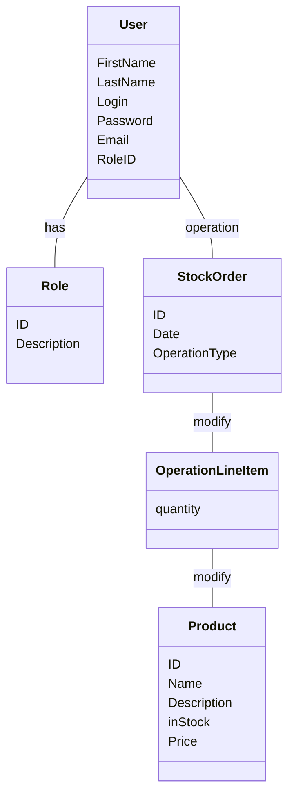
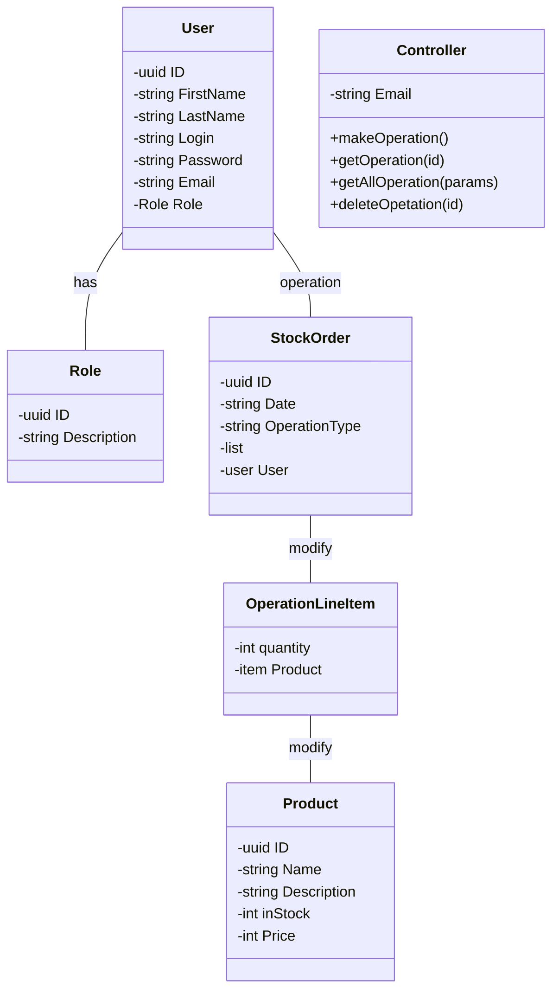

### Диаграмма объектов

```mermaid
classDiagram
    class User{
        FirstName
        LastName
        Login
        Password
        Email
        RoleID   
    }
    class Role{
        ID
        Description
    }
    
    class StockOrder{
        ID
        Date
        OperationType
            }
        class OperationLineItem{
quantity
            }
    
    class Product{
        ID
        Name
        Description
        inStock
        Price
    }
    
    User  --  StockOrder : operation
    User  --  Role : has
    StockOrder  --  OperationLineItem : modify
    OperationLineItem  --  Product : modify
```

### Диаграмма классов

```mermaid
classDiagram

    class User{
        -uuid ID
        -string FirstName
        -string LastName
        -string Login
        -string Password
        -string Email
        -Role Role   
    }
    class Role{
        -uuid ID
        -string Description
    }
    
    class StockOrder{
        -uuid ID
        -string Date
        -string OperationType
        -list<OperationLineItem>
        -user User
            }
        class OperationLineItem{
-int quantity
-item Product
            }
    
    class Product{
        -uuid ID
        -string Name
        -string Description
        -int inStock
        -int Price
    }
    
        class Controller {
        -string Email
        +makeOperation()
        +getOperation(id)
        +getAllOperation(params)
        +deleteOpetation(id)
    }
    
    User  --  StockOrder : operation
    User  --  Role : has
    StockOrder  --  OperationLineItem : modify
    OperationLineItem  --  Product : modify
```
