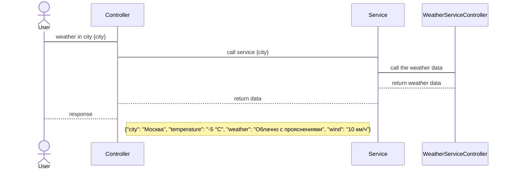
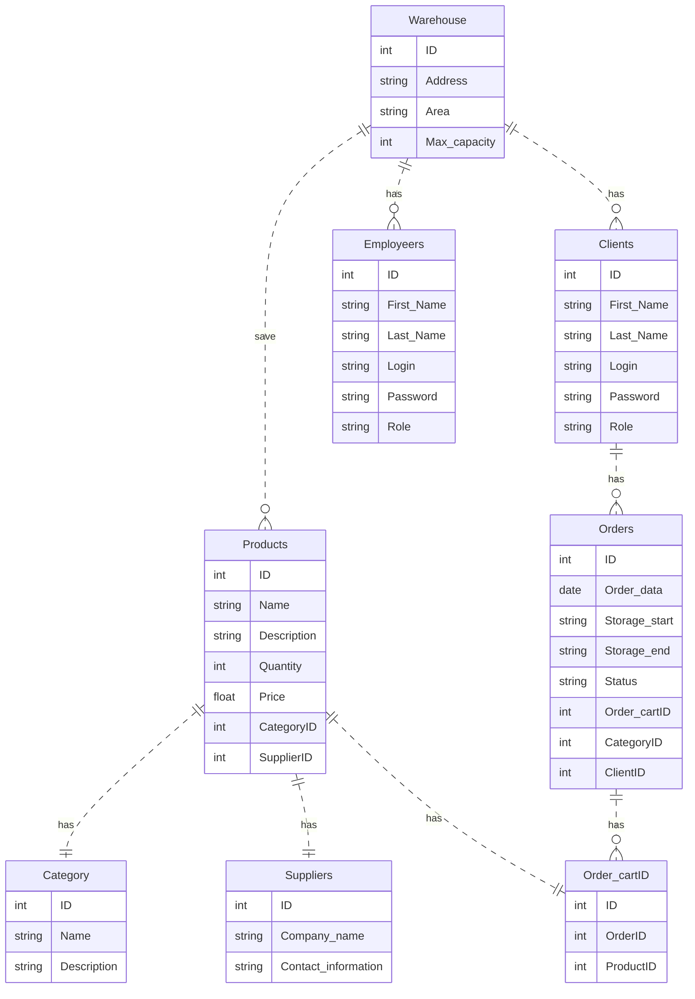

# Система управления складом версия 0.0.1

## Оглавление

1. [Концепция системы](#карточка-проекта-концепция-системы)
2. [Тип проекта](#тип-проекта-серверная-часть-бекенд-nodejs-системы-управления-складом)
3. [Пользователи](#пользователи-системы)
4. [Роли пользователей](#роли-пользователей-в-системе)
5. [Функциональные требования](#основные-функциональные-требования)
6. [Дополнительные требования](#дополнительные-требования)
7. [Пользовательские требования](#пользовательские-требования)
8. [Проектирование REST API](#проектирование-rest-api)
9. [Участники](#участники)
10. [Обобщенный процесс взаимодействия с системой](#обобщенный-процесс-взаимодействия-с-системой)
11. [Проектирование методов](#проектирование-методов)
12. [Модель предметной области. ER diagram](#модель-предметной-области-er-diagram)

## Тип проекта: серверная часть (бекенд NodeJS) системы управления складом  
- доп материал https://github.com/GnuriaN/format-README/blob/master/README.md

## Карточка проекта (Концепция системы)

| Карточка проекта              |                                                                                                                                                                                                                                          |
|-------------------------------|------------------------------------------------------------------------------------------------------------------------------------------------------------------------------------------------------------------------------------------|
| Автоматизируемая деятельность | Управление складом (отслеживание актуальным состоянием склада)                                                                                                                                                                           |
| Заинтересованные стороны      | Пользователи услуг склада, Владельц склада, Работники склада                                                                                                                                                                             |
| Текущее решение               | Учет и регистрация товаров на складе ведется вручную с использованием журналов                                                                                                                                                           |
| Решаемые проблемы             | Уменьшение ошибок, вызванных человеческим фактором: ошибки при записи в журнал, расчет количества остатков, учет суммарного веса, объема товаров, снижение затрат на бумажные носители, увеличение скорости обслуживания клиентов склада |
| Целевая ситуация              |                                                                                                                                                                                                                                          |
| Цель для заказчика            | Снизить расходы на операционную деятельность по управлению склада на 20%, увеличить приток клиентов на 15%                                                                                                                               |
| Назначение                    | Для пользователй услуг склада: увеличить скорость обслуживания от момента поступления заявки до выдачи или приемки товара на склад,                                                                                                      |
|                               | Для работника склада: автоматизировать процессы приемки и выдачи товаров, инвентаризации склада                                                                                                                                          |

## Пользователи системы

|               Пользователь         | Описание  |
|------------------------------------|---|
| Заказчик          | Владельц склада   |
| Клиент  | Пользователь услуг склада  |
| Работник           | Работник склада. Роль - Администратор системы   |
| Работник           | Работник склада. Роль - Начальник склада   |

## Роли пользователей в системе

|               Пользователь         | Функционал  |
|------------------------------------|---|
|    **Работник**      | **Администратор**   |
|   | Авторизация    |
|   | Просмотр списка товаров с остатком    |
|            |  Добавление товара |
|            |  Удаление товара |
|            |  Изменение товара |
|            |  Поиск товара |
|            |  Создание новых пользователей (CRUD) |
|            |  Просмотр отчетов о товарах в наличии |
|            |  Просмотр отчетов о клиентах склада |
|            |  Просмотр отчетов о зарегистрированных работниках склада |
| **Работник** |  **Начальник склада** |
|            |  Просмотр списка товаров с остатком  |
|            |  Изменение остатка|
| **Клиент**     |  Авторизация |
|            |  Просмотр заказов на хранение|


## Основные функциональные требования

Система должна обеспечить хранение информации о заполненности склада товарами.  
Система должна поддерживать авторизированный доступ к системе.  
Система должна обеспечивать доступ к функционалу согласно ролевой модели.  
Система должна обеспечивать генерацию нового типа Пользователя с набором прав доступа.  
Система должна обеспечить по запросу Пользователя операцию по добавлению товара на склад с указанием причины добавления и источника.  
Система должна обеспечить по запросу Пользователя операцию по убытию товара со склада, направление убытия и причина убытия.  
Система должна обеспечить по запросу Пользователя операцию по изменению свойств товара с указанием причин изменения.  
Система должна обеспечить по запросу Пользователя операцию по изменению свойств товара с указанием причин изменения.  
Система должна по запросу Пользователя сгенерировать отчет об остатках товара на складе.  
Система должна по запросу Пользователя обеспечить поиск с фильтрацией товара на складе.  

Формула требований: [Условие][Субъект][Действие][Объект][Ограничение/Значение]  

## Дополнительные требования

Документацию на API привести в формате openAPI. Предоставить swagger.
CRUD для управления новыми пользователями в рамках данного релиза не требуется.

## Пользовательские требования
Пользователь обращается к системе с помощью HTTP запросов, используя веб-клиент, например, swagger.

## Проектирование REST API
Процесс интеграции Клиент - Сервес: 
- Авторизация пользователя
- Просмотр товаров на складе
- Добавление товара на складе
- Удаление товара на складе
- Изменение товара на складе
- Поиск товара с поисковыми параметрами фильтрации
- Создание нового пользователя с набором ролей
- Запрос отчета о товарах в наличии
- Запрос о клиентах Склада
- Запрос о заказах Клиента
- Запрос о зарегистрированных работниках Склада
- Просмотр заказов авторизованным Клиентом
- Изменение остатоков на складе (при наличии прав на операцию)
### Участники:
Работник склада - Администратор  
Работник склада - Работник: "Начальник склада"  
Пользователь услуг склада - Клиент  
Система управления складом (бекенд)  
### Обобщенный процесс взаимодействия с системой
Пользователь отправляет запрос в Систему     
Система получает запрос  
Система проверяет запрос на корректность  
Система проверяет запрос на правомерность доступа  
Система выполняет запрос и отдает ответ, включая HTTP статус и json с требуемой информацией   
### Проектирование методов
#### Диаграмма последовательности

#### Запрос погоды в заданном городе
| Метод | Описание |
| --- | --- |
| `GET` | Получение информации о погоде в заданном городе |
| **URL-адрес** | `/api/v1/weatherincity?city={city}` |
| **Параметры запроса** | `city` - название города, для которого запрашивается информация о погоде |
| **Тело запроса** | Нет |
| **Заголовки запроса** | Нет |
| **Успешный ответ** | Код состояния: `200 OK`<br>Тело ответа: JSON-объект, содержащий информацию о погоде в заданном городе |
| **Ошибка запроса** | Код состояния: `404 Not Found`<br>Тело ответа: JSON-объект с сообщением об ошибке |
#### Параметры запроса
| Параметр | Тип | Описание |
| --- | --- | --- |
| `city` | строка | **Обязательный.** Название города, для которого запрашивается погода. |
| `units` | строка | Единицы измерения, используемые для температуры. Возможные значения: `metric`, `imperial`, `standard`. По умолчанию используются единицы измерения по системе СИ (метрическая система). |
| `lang` | строка | Язык, на котором должен быть возвращен ответ. Возможные значения: `en`, `ru`, `uk`, `pl`, `de`, `es`, `fr`, `it`, `pt`, `ro`, `tr`. По умолчанию используется английский язык (`en`). |
| `appid` | строка | **Обязательный.** Ключ API, используемый для доступа к данным о погоде. |
#### Пример запроса
```http
GET /api/v1/weatherincity?city=London&units=metric&lang=en&appid=abcdefg123456
```
#### Пример ответа
```json
    {
      "city": "Москва",
      "temperature": "-5 °C",
      "weather": "Облачно с прояснениями",
      "wind": "10 км/ч"
    }
```
## Архитектура системы и проектное решение

- Пользовательский интерфейс
  - Представлен RESTful API на Node.js с использованием пакета express
- Middleware
  - Обрабатывает GET запроса по роуту /api/v1/weatherincity
  - Валидирует параметры запроса на наличие обязательного параметра `city`
- Controller
  - Использует маршрутизацию запросов с помощью пакета express
  - При получении запроса на /api/v1/weatherincity передает его в слой бизнес-логики
- Adapter
  - Обращается к API сервису https://openweathermap.org/api с помощью пакета axios
  - Передает параметры запроса в формате, необходимом для API сервиса с ключом API и названием города
- Бизнес-логика
  - Получает запрос от Controller и трансформирует его в формат, необходимый для API сервиса, добавляя к запросу ключ API и приводит название города к нужному формату.
  - Отправляет запрос к API сервису с помощью Adapter и получает ответ
  - Обрабатывает полученные данные, выбирая только необходимые поля и трансформируя их для передачи в ответ клиенту в формате json
- Exceprion handler
  - Обрабатывает ошибки, возникающие в Middleware, Controller и Business Logic.
  - Возврат пользователю ответа в едином формате с уведомлением об ошибке
  - Логирование ошибок для последующего анализа

## Модель предметной области. ER diagram



## Физическая модель данных для ORM Prisma NodeJS
    model User {
      id         Int      @id @default(autoincrement())
      firstName  String
      lastName   String
      login      String   @unique
      password   String
      role       Role     @default(USER)
      createdAt  DateTime @default(now())
      updatedAt  DateTime @updatedAt
      orders     Order[]
    }
    
    model Category {
      id          Int        @id @default(autoincrement())
      name        String
      description String?
      products    Product[]
    }
    
    model Product {
      id          Int       @id @default(autoincrement())
      name        String
      description String?
      quantity    Int
      price       Float
      category    Category @relation(fields: [categoryId], references: [id])
      categoryId  Int
      supplier    Supplier @relation(fields: [supplierId], references: [id])
      supplierId  Int
      inventories Inventory[]
    }
    
    model Inventory {
      id         Int      @id @default(autoincrement())
      quantity   Int
      updateDate DateTime @default(now())
      productId  Int
      product    Product  @relation(fields: [productId], references: [id])
    }
    
    model Supplier {
      id               Int       @id @default(autoincrement())
      companyName      String
      address          String
      contactInformation String
      products         Product[]
    }
    
    model Warehouse {
      id          Int       @id @default(autoincrement())
      address     String
      area        Float
      warehouseType String
      maxCapacity Int
    }
    
    model Order {
      id               Int       @id @default(autoincrement())
      orderDate        DateTime  @default(now())
      storageStartDate DateTime?
      storageEndDate   DateTime?
      orderStatus      String
      client           User      @relation(fields: [clientId], references: [id])
      clientId         Int
    }
    
    enum Role {
      ADMIN
      CLIENT
      EMPLOYEE
    }

