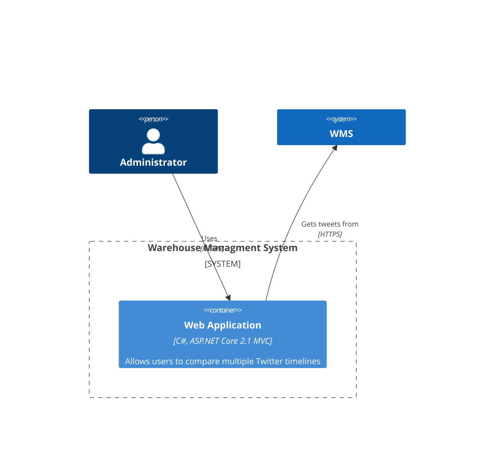

```mermaid
C4Context
Person(admin, "Administrator")
System_Boundary(c1, "Warehouse Managment System") {
    Container(web_app, "Web Application", "C#, ASP.NET Core 2.1 MVC", "Allows users to compare multiple Twitter timelines")
}
System(wms, "WMS")

Rel(admin, web_app, "Uses", "HTTPS")
Rel(web_app, wms, "Gets tweets from", "HTTPS")
```
