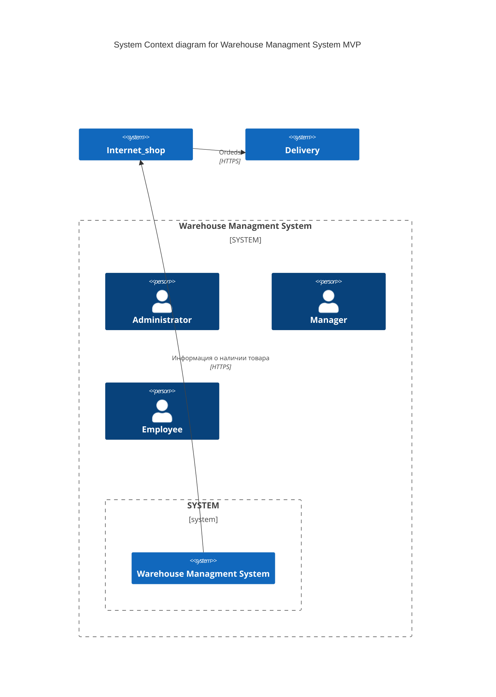

```mermaid
C4Context
title System Context diagram for Warehouse Managment System MVP

System_Boundary(Users, "Warehouse Managment System") {
System_Boundary("Warehouse Managment System") {

System(wms, "Warehouse Managment System")

}
Person(admin, "Administrator")
Person(mgr, "Manager")
Person(employee, "Employee")
}


System(i_shop, "Internet_shop")
System(delivery, "Delivery")


Rel(i_shop, delivery , "Ordeds", "HTTPS")
Rel(wms, i_shop , "Информация о наличии товара", "HTTPS")

UpdateRelStyle(delivery, $textColor="red", $lineColor="red", $offsetX="-50", $offsetY="20")

  
```
