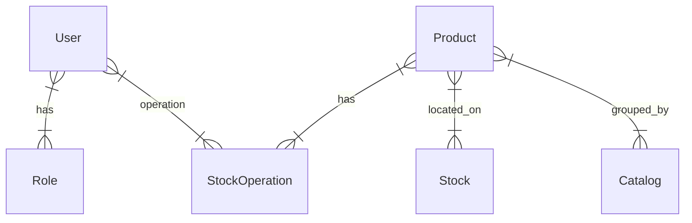

 
Дальнейшая детализация требований будет ориентирована на реализацию функционала согласно указанным **Product owner`ом приоритетам**. В первом релизе продукта ожидается функции с приоритетом **Высокий**.

### Реестр системных Use cases 
| Участник |Код UC  | Описание | Приоритет|
|--|--|--|--|
|Работник склада  |UC-1|Управление складскими операциями  | |
|  | UC-1.1 |Приход товара на склад  | Высокий |
|  | UC-1.2 |Расход товара на складе | Высокий |
|  | UC-1.3 |Провести инвентаризацию на складе  | |
|  | UC-1.4 |Собрать заказ| |
|Менеджер склада |UC-2|Управление каталогом товаров  | |
|  | UC-2.1 |Создать каталог  | |
|  | UC-2.2 |Удалить каталог  | |
|  | UC-2.3 |Изменить имя каталога  | |
|  |UC-2.4  |Добавить товар в каталог| Высокий  |
|  |UC-2.5  |Удалить товар из каталога| Высокий  |
|  |UC-2.6  |Изменить товар в каталога| Высокий  |
|  |UC-2.7  |Посмотреть список товаров в каталоге| Высокий  |
|  |UC-2.8  |Найти товар в каталоге по наименованию| Высокий  |
|  |UC-2.9  |Найти товар в каталоге по наименованию| |
|  |UC-2.10  |Найти товар в каталоге по артикулу| |
|  |UC-2.11 |Получить историю операций над товарами| |
|Менеджер склада |UC-3|Планирование сборки заказов  | |
|  | UC-3.1 |Посмотреть список заявок на сборку  | |
|  | UC-3.2 |Найти заявку на сборку по номеру заказа | |
|  | UC-3.3 |Назначить сборщика на сборку заказа  | |
|  | UC-3.4 |Назначить время сборки заказа| |
|  | UC-3.5 |Назначить время и место погрузки заказа| |
|  | UC-3.6 |Просмотреть отчет о сборке заказов| |
|  | UC-3.7 |Передать информацию о завершении сборки заказа смежной системе| |
|Менеджер склада |UC-4|Мониторинг остатков товаров  | |
|  | UC-4.1 |Назначить товару минимальный остаток   | Высокий  |
|  | UC-4.2 |Просмотреть динамику изменения остатков товара| |
|  | UC-4.3 |Назначить график инвентаризации  | |
|  | UC-4.4 |Просмотреть отчет о запасах| |
|  | UC-4.5 |Подписаться на уведомление о снижении остатков | |
|Администратор |UC-5|Управление пользователями и группами доступа  | |
|  | UC-4.1 |Создать нового пользователя   | Высокий  |
|  | UC-4.2 |Удалить пользователя| Высокий  |
|  | UC-4.3 |Изменить нового пользователя  | |
|  | UC-4.4 |Создать группу доступа| |
|  | UC-4.5 |Назначить пользователя в группу доступа | |
|Работник склада  |UC-6|Обработка заявок на сборку заказа  | |
|  | UC-6.1 |Просмотреть заявки на сборку заказа  | |
|  | UC-6.2 |Подтвердить начало сборки заказа | |
|  | UC-6.3 |Подтвердить завершение сборки заказа  | |
|Служба доставки  |UC-7|Передача заявок на сборку заказов  | |
|  | UC-7.1 |Передать заявки на сборку заказа  | |
|  | UC-7.2 |Получить время и место сборки заказа | |
|Интернет-магазин |UC-8|Мониторинг остатков товаров  | |
|  | UC-8.2 |Получить остаток товара | Высокий  |

Проверить на полноту:

 - [ ] трассировка до пользовательских или бизнес-требований  
 - [ ] привязка к шагам бизнес-процессов  
 - [ ] проверка на CRUDLs  (проверить сущности и их операции)

## Моделирование предметной области
> **Технология:** порядок моделирования предметной области:  
>  Где потренироваться: на воркшопе - [Школа системного анализа "Моделирование предметной области"](https://systems.education/mpo-workshop)
>  - [ ] На основе контекстной диаграммы построить модель состава данных
>  - [ ] Проверить наличие связи между всеми информационными сущностями
>   - [ ] Указать наличие установленных связей на схеме (построить модель структуры) 
>   - [ ] Установить пропущенные информационные сущности 

### Выделение сущностей из контекстной диаграммы

|Сущность  | Описание |
|--|--|
| User  | Пользователь (Работник склада, Менеджер склада), Администратор |
| Role | Группа доступа |
| Product | Товар |
| Catalog| Каталог товаров|
| StockOperation| Складская операция, включает в себя операции прихода и расхода|
|Stock | Склад, место хранения товаров|

### Выделение связей между сущностями
|Сущность  | Связь| Тип связи |Сущность |
|--|--|--|--|
|Работник склада| Оперирует |Функциональная |Складские операции, Товар|
|Менеджер склада| Оперирует |Функциональная |Товар, Каталог |
|Администратор| Управляет |Функциональная |Пользователями |

