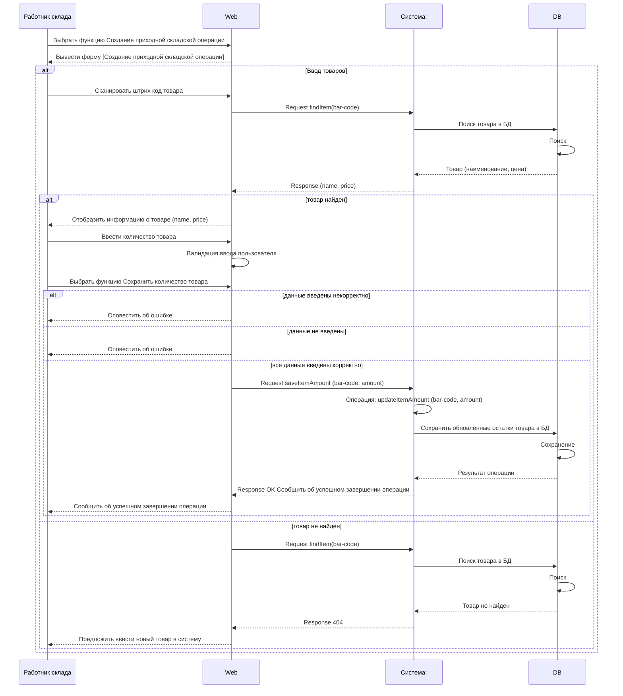

```mermaid
sequenceDiagram
participant R as Работник склада
participant W as Web
participant S as Система:
participant D as DB


R ->> W: Выбрать функцию Создание приходной складской операции
W -->> R: Вывести форму [Создание приходной складской операции]

alt Ввод товаров
R ->> W: Сканировать штрих код товара
W ->> S: Request findItem(bar-code)
S ->> D: Поиск товара в БД
D ->> D: Поиск
D -->> S: Товар (наименование, цена)
S -->> W: Response (name, price)

 alt товар найден
	W -->> R: Отобразить информацию о товаре (name, price)
    R ->> W: Ввести количество товара
	W ->> W: Валидация ввода пользователя
    R ->> W: Выбрать функцию Сохранить количество товара
    alt данные введены некорректно
        W -->> R: Оповестить об ошибке
    else данные не введены
        W -->> R: Оповестить об ошибке
    else все данные введены корректно
        W ->> S: Request saveItemAmount (bar-code, amount)
        S ->> S: Операция: updateItemAmount (bar-code, amount)
        S ->> D: Сохранить обновленные остатки товара в БД
			D ->> D: Сохранение
			D -->> S: Результат операции
		S -->> W: Response OK Сообщить об успешном завершении операции
        W -->> R: Сообщить об успешном завершении операции
    end
else товар не найден
	W ->> S: Request findItem(bar-code)
		S ->> D: Поиск товара в БД
		D ->> D: Поиск
		D -->> S: Товар не найден
	S -->> W: Response 404
    W -->> R: Предложить ввести новый товар в систему
end
end
```
