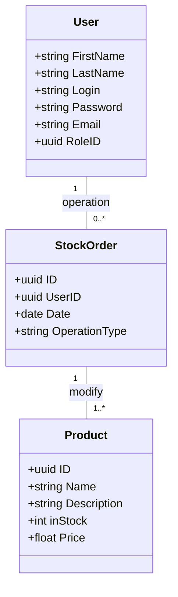

```mermaid
classDiagram
    class User{
        +string FirstName
        +string LastName
        +string Login
        +string Password
        +string Email
        +uuid RoleID   
    }
    
    class StockOrder{
        +uuid ID
        +uuid UserID
        +date Date
        +string OperationType
            }
    
    class Product{
        +uuid ID
        +string Name
        +string Description
        +int inStock
        +float Price
    }
    
    User "1" -- "0..*" StockOrder : operation
    StockOrder "1" -- "1..*" Product : modify
   
```
