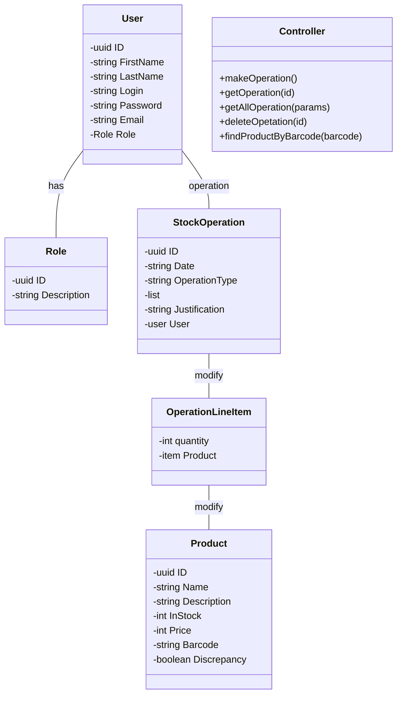

### Диаграмма классов

### Use case для основного релиза MVP

Нужно по шагам расписать какой-то юскейс с альтернативами и исключениями, и по нему построить диаграмму последовательности. кейс Провести складскую операцию *приход или расход)

 Источник: Business Use Case Управление складскими операциями 
**ID:** UC-1.1 
 **Название:** UC 1.1 Создать приходную складской операции  
 **Действующее лицо:** Работник склада 
 **Предусловие:** Пользователь авторизован в системе и имеет права на создание приходной складской операции
**Основной поток:** 

 1. **Пользователь** выбирает функцию Создание приходной складской операции
 2. **Система** выводит форму [Создание приходной складской операции] для ввода информации. В форме уже заполнены значения, недоступные для изменения:
-   Тип операции = Приход
-   Обоснование = Поставка
-   Дата = Текущая дата
-   Ответственный = Текущий авторизованный пользователь
3. **Пользователь** вносит данные о товаре, который он принимает, а именно считывает штрих код товара
4. **Система** ищет в справочнике товаров элемент по штрих-коду. Товар найден. **Система** добавляет товар в состав товаров и отображает на экране:
-   Наименование товара
-   Цену
5. **Пользователь** вводит количество товара.  
6. Повтор п. 3-5 для каждого товара из накладной
7. **Пользователь** выбирает функцию Сохранить данные
8. **Система** убеждается в полноте данных, введенных пользователем
9. **Система** сохраняет введенные пользователем данные и обновляет актуальные остатки.
10. **Система** сообщает о успешном завершении операции

**Расширение:**
**4a. Товар по штрих-коду не найден в системе**
4а1.Система предлагает ввести новый товар в систему. Ссылка на юскейс “Создание товара”
4а2 Переход на п. 5 основного сценария

**7a. Данные по количеству в накладной и фактическому количеству не совпадают**
7а1.Пользователь устанавливает флаг Есть расхождения = Истина
7а2.Переход на п.6 основного сценария

**9a. Данные не введены**
9а1 Система обнаруживает обязательные поля, в которые пользователь не ввел данные
9а2 Система оповещает пользователя об ошибке
9а3 Выполнение сценария возвращает в основной поток в п.5

**9б. Данные введены некорректно**
9б1 Система обнаруживает поля, в которые пользователь ввел некорректные данные
9б2 Система оповещает пользователя об ошибке
9б3 Выполнение сценария возвращается в основной поток в п.5

**10а. Ошибка обращения в БД**
10а1 Система оповещает пользователя об ошибке при обращении к БД
10а2 Завершение выполнения сценария
