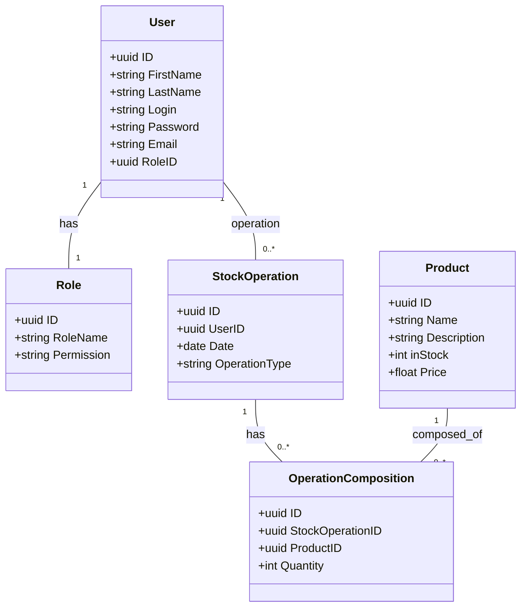
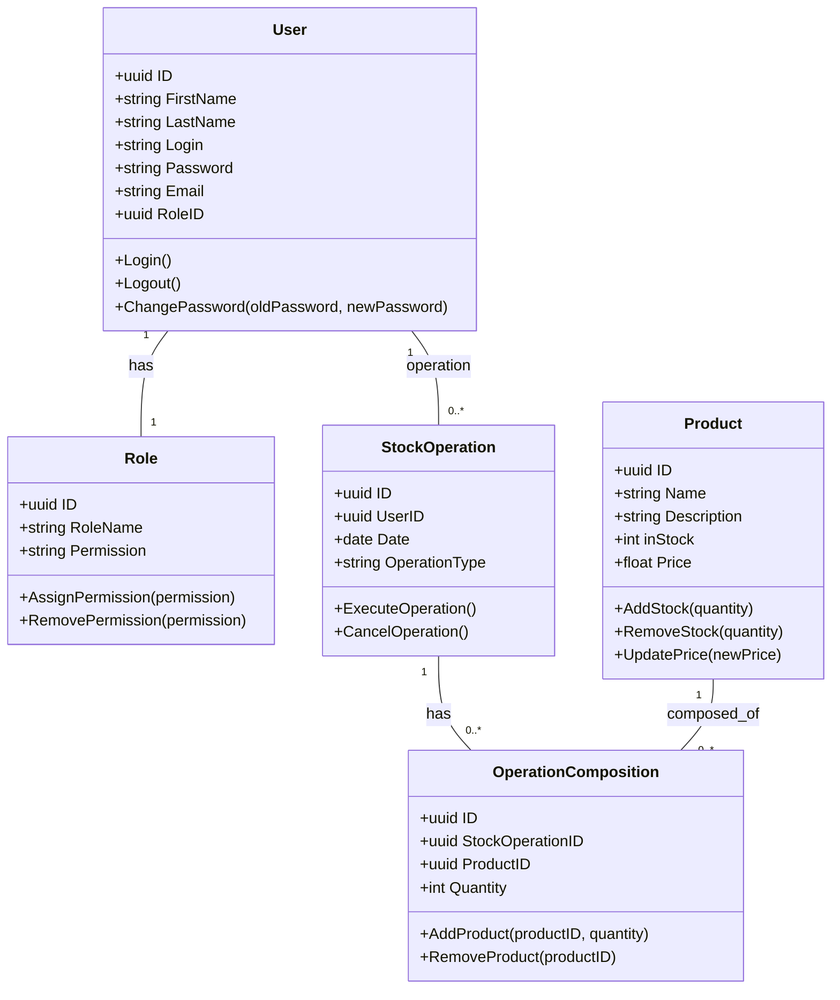

```mermaid

classDiagram
    class User{
        +uuid ID
        +string FirstName
        +string LastName
        +string Login
        +string Password
        +string Email
        +uuid RoleID
    }
    
    class Role{
        +uuid ID
        +string RoleName
        +string Permission
    }
    
    class StockOperation{
        +uuid ID
        +uuid UserID
        +date Date
        +string OperationType
    }
    
    class Product{
        +uuid ID
        +string Name
        +string Description
        +int inStock
        +float Price
    }
    
    class OperationComposition{
        +uuid ID
        +uuid StockOperationID
        +uuid ProductID
        +int Quantity
    }

    User "1" -- "1" Role : has
    User "1" -- "0..*" StockOperation : operation
    StockOperation "1" -- "0..*" OperationComposition : has
    Product "1" -- "0..*" OperationComposition : composed_of
    
    
    
    
    
```
    

```mermaid
classDiagram
    class User{
        +uuid ID
        +string FirstName
        +string LastName
        +string Login
        +string Password
        +string Email
        +uuid RoleID
        +Login()
        +Logout()
        +ChangePassword(oldPassword, newPassword)
    }
    
    class Role{
        +uuid ID
        +string RoleName
        +string Permission
        +AssignPermission(permission)
        +RemovePermission(permission)
    }
    
    class StockOperation{
        +uuid ID
        +uuid UserID
        +date Date
        +string OperationType
        +ExecuteOperation()
        +CancelOperation()
    }
    
    class Product{
        +uuid ID
        +string Name
        +string Description
        +int inStock
        +float Price
        +AddStock(quantity)
        +RemoveStock(quantity)
        +UpdatePrice(newPrice)
    }
    
    class OperationComposition{
        +uuid ID
        +uuid StockOperationID
        +uuid ProductID
        +int Quantity
        +AddProduct(productID, quantity)
        +RemoveProduct(productID)
    }

    User "1" -- "1" Role : has
    User "1" -- "0..*" StockOperation : operation
    StockOperation "1" -- "0..*" OperationComposition : has
    Product "1" -- "0..*" OperationComposition : composed_of
```
