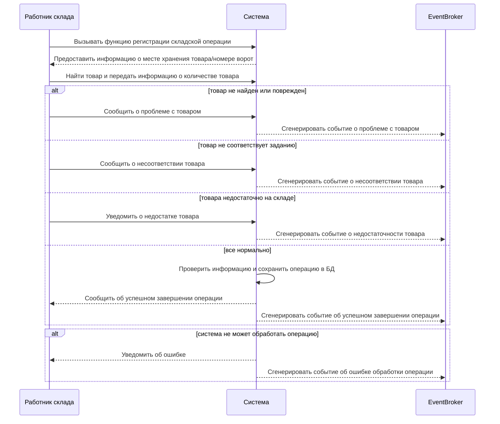

### Реестр системных Use cases 

На основании высокоуровневых бизнес-use cases разработан реестр системных Use cases.

| Участник |Код UC  | Описание | Приоритет|
|--|--|--|--|
|Работник склада  |UC-1|Управление складскими операциями  | |
|  | UC-1.1 |Провести складскую операцию  | Высокий |
|Менеджер склада |UC-2|Управление каталогом товаров  | |
|  |UC-2.1  |Добавить товар| Высокий  |
|  |UC-2.2  |Удалить товар| Высокий  |
|  |UC-2.3  |Изменить товар| Высокий  |
|  |UC-2.4  |Посмотреть список товаров с учетом фильтров поиска| Высокий  |
|  |UC-2.5 |Отчет по складским операциям над товарами| |
|Менеджер склада |UC-3|Планирование сборки заказов  | |
|  | UC-3.1 |Посмотреть список заявок на сборку  | |
|  | UC-3.2 |Найти заявку на сборку по номеру заказа | |
|  | UC-3.3 |Назначить сборщика на сборку заказа  | |
|Менеджер склада |UC-4|Мониторинг остатков товаров  | |
|  | UC-4.2 |Отчет по остаткам товаров| |
|Администратор |UC-5|Управление пользователями и группами доступа  | |
|  | UC-5.1 |CRUD операции с пользователями   | Высокий  |
|  | UC-5.2 |Просмотреть список пользователей   | Высокий  |
|  | UC-5.3 |CRUD операции группы доступа| |

