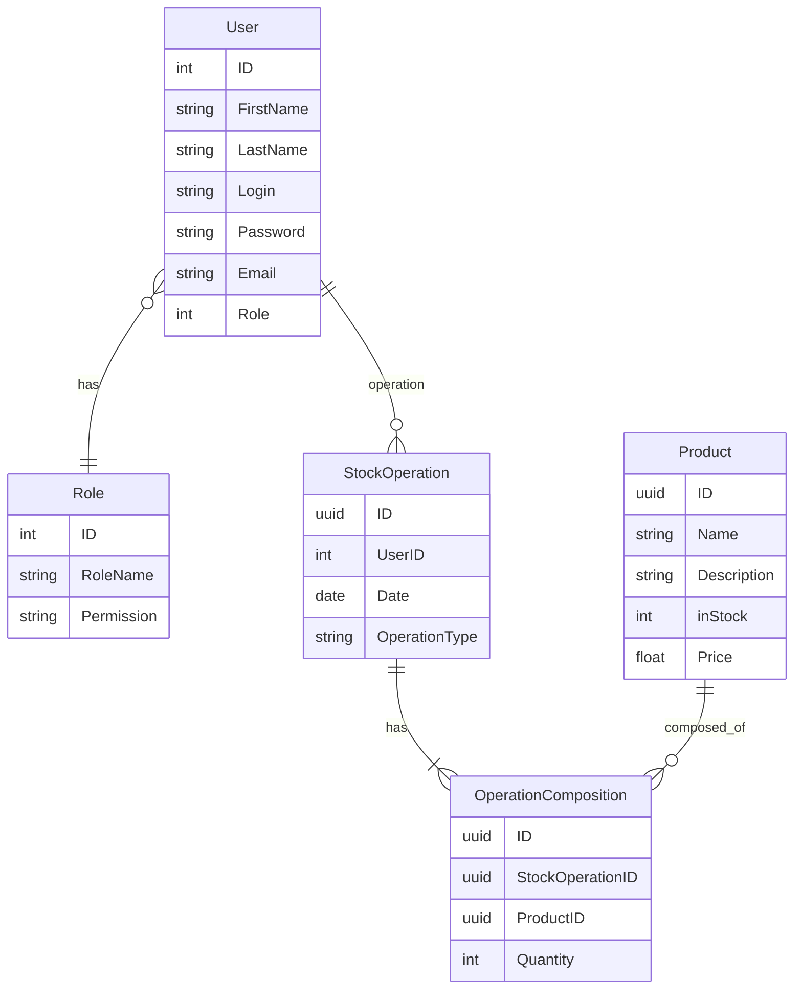

### Entity Relationship Diagram (ERD)

```mermaid
erDiagram

    User }o--|| Role : has
        
    User {
        int ID
        string FirstName
        string LastName
        string Login
        string Password
        string Email
        int Role
    }
    
    Role {
        int ID
        string RoleName
        string Permission
    }
    
    User ||--o{ StockOperation : operation	  
    StockOperation ||--|{ OperationComposition : has
    Product ||--o{ OperationComposition : composed_of
    
    StockOperation {
        uuid ID
        int UserID
        date Date
        string OperationType
    }
    
    Product {
        uuid ID
        string Name
        string Description
        int inStock
        float Price
    }
    
    OperationComposition {
        uuid ID
        uuid StockOperationID
        uuid ProductID
        int Quantity
    }
```
