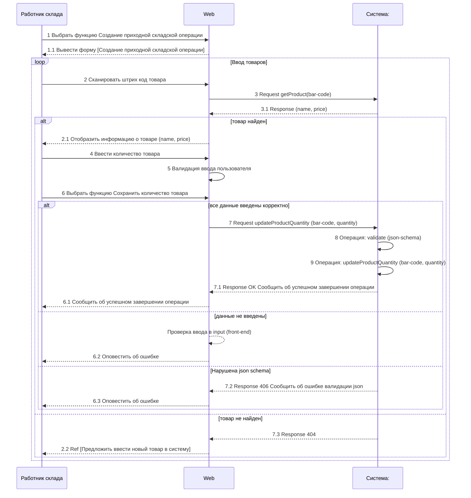
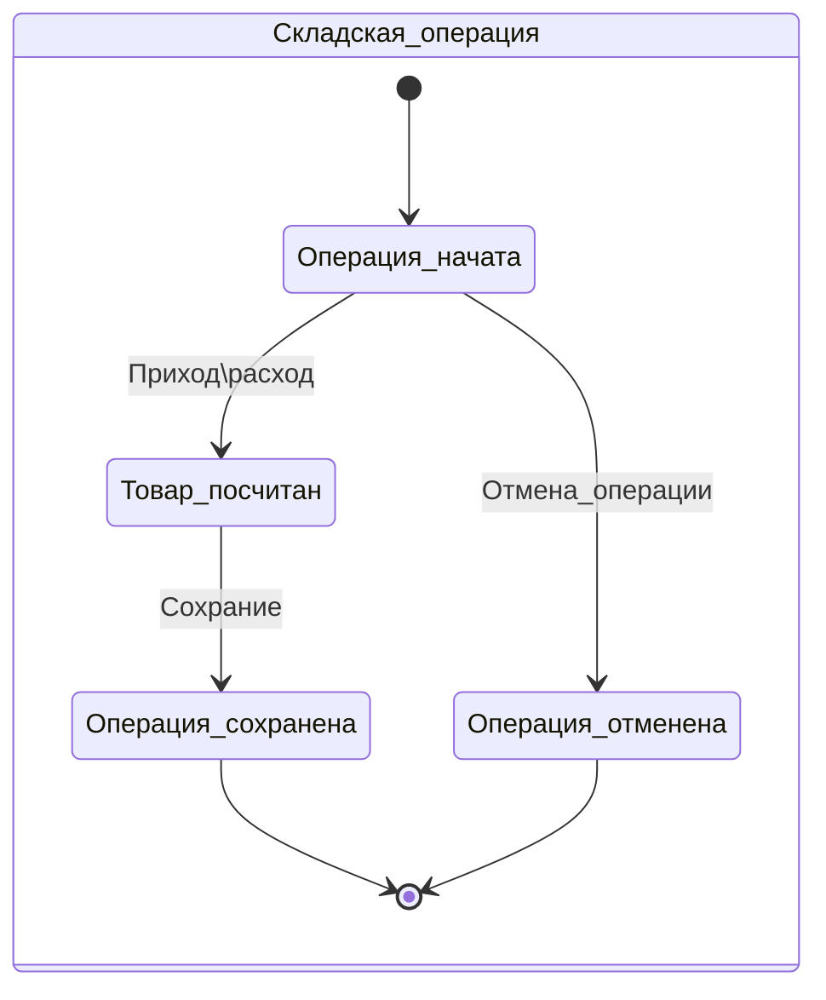

### Системная диаграмма последовательности UC-1.1.
> Примечание:  для упрощения выберем, что сканер возвращает штрих-код
> товара (bar-code) в Web форму. На практике сканер может быть подключен
> к порту, и бек опрашивает сканер. Принципиально, поиск по бар коду
> будет на беке, но для наглядности отобразим процесс через Web.



Примечание: нотация Ref в mermaid не поддерживается на момент разработки диаграммы.

# Проектирование REST API


> Общий подход к проектированию REST API. Перед началом проектирования
> REST API, необходимо проработать модель предметной области и выделить
> сущности, логику работы которых реализует система. На основе диаграммы последовательности выделим запросы. В нашем примере,
> выделено две сущности: Пользователь и Товары (на складе) и определим
> CRUDLs операции для них. Далее, опишем методы и параметры запросов ,
> ожидаемые ответы, включая http статусы.

## Проектирование по диаграмме Последовательности (SD)

| № шага | Описание | Запрос | Ответ |
|---|---|---|---|
| 3 | Получить информацию о продукте по бар-коду (штрих-коду) | GET [https://v1/route/products/{barCode}](https://v1/route/products/) | Информация о товаре |
| 7 | Обновить информацию о продукте по бар-коду (штрих-коду) | PATCH [https://v1/route/products/{barCode}](https://v1/route/products/) <br> Тело запроса: <br> `{ "quantity": <new_quantity> }` | Информация об успешном обновлении или ошибке |

> **Примечание**: далее представлен расширенный вариант таблицы, который мог
> бы быть на реальном проекте. По каждому ресурсу возможно
> проектирование CRUDLs операций, в работе показано фрагментами, чтобы
> не загромождать проект. Например, ниже представлен сжатый вариант продолжения таблицы описания диаграммы последовательности.
> 
| № шага | Описание | Запрос | Ответ |
|---|---|---|---|
| 3 | Получить информацию о продукте по бар-коду (штрих-коду) | GET [https://v1/route/products/{barCode}](https://v1/route/products/) | Информация о товаре |
| 7 | Обновить информацию о продукте по бар-коду (штрих-коду) | PATCH [https://v1/route/products/{barCode}](https://v1/route/products/) <br> Тело запроса: <br> `{ "quantity": <new_quantity> }` | Информация об успешном обновлении или ошибке |
| ... | Создать нового пользователя | POST [https://v1/route/users](https://v1/route/users) <br> Тело запроса: <br> `{ "firstName": "<first_name>", "lastName": "<last_name>", "login": "<login>", "password": "<password>", "email": "<email>", "roleID": "<role_uuid>" }` | Информация о созданном пользователе или ошибка |
| ...| Получить информацию о пользователе | GET [https://v1/route/users/{uuid}](https://v1/route/users/) | Информация о пользователе или ошибка |
| ...| Создать новый товар | POST [https://v1/route/products](https://v1/route/products) <br> Тело запроса: <br> `{ "name": "<product_name>", "description": "<description>", "inStock": <in_stock>, "price": <price>, "barcode": "<barcode>" }` | Информация о созданном товаре или ошибка |
| ...| Создать новую операцию на складе | POST [https://v1/route/operations](https://v1/route/operations) <br> Тело запроса: <br> `{ "userID": "<user_uuid>", "date": "<date>", "operationType": "<operation_type>", "justification": "<justification>" }` | Информация о созданной операции или ошибка |

### Спецификация методов

> По аналогии можно продолжить для всех необходимых методов REST API
> 
#### **Метод 1: GET - Получить информацию о продукте по бар-коду (штрих-коду)**

**Входные параметры:**
| Название | Тип | Обязательность | Значение по умолчанию | Комментарий |
|---|---|---|---|---|
| barCode | string | Да | - | Штрих-код товара |

**Выходные параметры:**
| Название | Тип | Обязательность | Значение по умолчанию | Комментарий |
|---|---|---|---|---|
| ID | string(uuid) | Да | - | Уникальный id товара |
| Name | string | Да | - | Название товара |
| Description | string | Нет | - | Описание товара |
| InStock | int | Да | - | Количество товара на складе |
| Price | float | Да | - | Цена товара |
| Barcode | string | Да | - | Штрих-код товара |
| Discrepancy| boolean | Да | - | Несоответствие наличию на складе  |

#### **Метод 2: PATCH - Обновить информацию о продукте по бар-коду (штрих-коду)**

**Входные параметры:**
| Название | Тип | Обязательность | Значение по умолчанию | Комментарий |
|---|---|---|---|---|
| barCode | string | Да | - | Штрих-код товара |
| quantity | int | Да | - | Новое количество товара на складе |

**Выходные параметры:**
Response
| Название | Тип | Обязательность | Значение по умолчанию | Комментарий |
|---|---|---|---|---|
| message | string | Да | - | Сообщение об успешном обновлении или об ошибке |

#### Значение кодов ответов HTTP
| **№** | **Код ответа HTTP** | **Описание**                                                                                    | **User**                                                                                  | **Product**                              |
|-------|---------------------|-------------------------------------------------------------------------------------------------|------------------------------------------------------------------------------------------------|------------------------------------------------|
| 1 | 200                 | Успешный запрос, данные успешно возвращены                                                      | Получение списка пользователей, информации о пользователе, списка товаров, информации о товаре | Получение списка товаров, информации о товаре  |
| 2 | 201                 | Запрос успешно выполнен, новый ресурс был создан                                                | Создание нового пользователя, товара                                                           | Создание нового товара                         |
| 3 | 204                 | Успешный запрос, но нет данных для возврата                                                     | Обновление данных пользователя, товара                                                         | Обновление данных товара                       |
| 4 | 400                 | Ошибка запроса, запрос не может быть обработан сервером                                         | Некорректный запрос                                                                            | Некорректный запрос                            |
| 5 | 401                 | Ошибка авторизации, отсутствуют или некорректные авторизационные данные                         | Ошибка авторизации                                                                             | Ошибка авторизации                             |
| 6 | 403                 | Ошибка доступа, сервер понимает запрос, но отказывается его выполнять из-за ограничений доступа | Доступ запрещен                                                                                | Доступ запрещен                                |
| 7 | 404                 | Ошибка запроса, запрашиваемый ресурс не найден                                                  | Пользователь или ресурс не найден                                                              | Товар или ресурс не найден                     |
| 8 | 409                 | Ошибка конфликта, запрос не может быть обработан из-за конфликтующих данных                     | Дублирование существующего пользователя                                                        | Дублирование существующего товара              |
| 9 | 500                 | Ошибка сервера, запрос не может быть обработан из-за ошибки на стороне сервера                  | Ошибка на стороне сервера                                                                      | Ошибка на стороне се                           |

### Роли пользователей в системе

Ролевая модель **Роль: Администратор**
|  № | Описание   |
| :------------: | :------------: |
| 1 | Создание нового пользователя  |
| 2 | Удаление пользователя  |
| 3 | Добавление нового товара  |
| 4 | Удаление товара  |
| 5 | Обновление информации о товаре  |
| 6 | Изменение остатков на складе |

Ролевая модель **Роль: Начальник склада**
|  № | Описание   |
| :------------: | :------------: |
| 1 | Изменение остатков на складе |

Ролевая модель **Роль: общий доступ для всех зарегистрированных сотрудников склада**
|  № | Описание   |
| :------------: | :------------: |
| 1 | Авторизация  |
| 2 | Получение списка товаров |
| 3 | Получение конкретного товара |
| 4  | Поиск товара с поисковыми параметрами фильтрации |

###  Проектирование структуры объектов запросов. Опционально. 
> Примечание: большинство мною опрошенных команд разработки **против** детального
> документирования структур объектов, так как очень сложно и
> поддерживать документацию в актуальном состоянии и иногда
> аналитики могут пропустить важные при реализации моменты. Но все же,
> в качестве примера приведем описание структуры объектов в
> теле запросов и ответов.  

#### Структуры объекта Пользователь (user)
##### User data
```json
{
  "name": "John Doe",
  "email": "johndoe@example.com",
  "password": "password123",
  "role": "User"
}
```

##### Role data
```json
{
  "name": "Admin",
  "description": "Administrator role with full access."
}
```
#### Структуры объекта Продукт(product)
##### Product data and Stock data
```javascript
Product data = {
    'name': str,
    'category': str,
    'description': str,
    'characteristics': dict
}

Stock data = {
    'quantity': int,
    'reason': str
}

##### Responses objects
```javascript
Список товаров = [
    {
        'id': int,
        'name': str,
        'category': str,
        'description': str,
        'characteristics': dict,
        'quantity': int
    },
    {...},
    {...}
]
```

### Диаграмма состояний.


## Функциональные требования

В случае необходимости, системные Use case могут быть дополнены функциональными требования.

> Функциональные требования приведены согласно лексическим формулам: 
> [Условие][Субъект][Действие][Объект][Ограничение/Значение]
> Система должна [ДЕЙСТВИЕ][ОБЪЕКТ ДЕЙСТВИЯ][атрибуты объекта]
**Функциональные требования** описывают, каким образом система должна выполнять конкретную функцию или задачу. Они описывают, что должна делать система и как она должна это делать. Функциональные требования обычно выражаются в терминах конкретных функций, операций или процессов, которые система должна выполнять.  

### Функциональные требования
1. Система должна хранить информацию о количестве товара на складе
2. Система должна поддерживать авторизированный доступ к системе с ограничением по доступу к функционалу согласно ролевой модели. 
3. Система должна обеспечивать генерацию нового типа Пользователя с набором прав доступа (Администратор, Начальник склада)
4. Система должна обеспечить по запросу Пользователя операцию по предоставлению всех товаров на складе.   
5. Система должна обеспечить по запросу Пользователя операцию по добавлению товара на склад с указанием причины добавления и источника.
6. Система должна обеспечить по запросу Пользователя операцию по удалению товара со склада, направление убытия и причина убытия.  
7. Система должна обеспечить по запросу Пользователя операцию по изменению свойств товара с указанием причин изменения. Нулевое значение количества отстатков не приводит к удалению товара со склада.
8. Система должна обеспечить поиск с фильтрацией товара на складе по различным параметрам, таким как наименование товара, количество, стоимость, дата добавления.

## User story for Telegram-bot. Опционально.

> При создании продукта необходимо учитывать потребности пользователей.
> Если продукт будет неудобный и не будет покрывать истинных
> потребностей пользователей, то его просто никто не купит. Поэтому в
> продуктовой разработке **user и job story** это основа разработки.
> Убедиться в том, что мы делаем крутую фичу, которая будет реально
> полезна и востребована пользователями, и даст нам конкурентное
> преимущество в сравнении с другими продуктами.

Продуктовый подход рассмотрен в другом портфолио. Но так как в рамках проекта  WMS (warehouse-api) разработан телеграмм-бот, приведем краткое описание требований.

**Проблема:**

Площадь склада довольно большая и складским работникам нужно перемещаться по складу и иметь мобильное устройство, с помощью которого можно было бы регистрировать операции в месте где например происходит инвентаризация.

Процесс инвентаризации обычно происходит как:

1.  Менеджер печатает на листе ведомость с перечнем товаров и количеством, которое учтено в системе
2.  Потом идет с этим листком к полке и начинает считать фактическое количество, пишет его на лист
3.  Потом идет к программе и вбивает в неё фактическое количество
4.  Программа на основе расхождения учетного остатка и фактического регистрирует оприходование или списание.

Тут много времени уходит на переписывание и вбивание данных, риск ошибок большой. Поэтому желательно если бы у кладовщика было бы мобильное устройство, с помощью которого можно было бы поиск товара в каталоге производить по штрих-коду (в устройстве должен быть встроенный сканер) + сразу вводить в устройство фактическое количество (с помощью клавиатуры или голосом например), то бизнес процесс явно бы ускорился и снизился риск ошибок. Такие специальные устройства и сервисы есть. Например 1С Кладовщик.
  
Кстати и юскейсы, основанные на пользовательских историях будут звучать и строиться немного по другому.
  
Пример:
  
Если думать в терминах CRUDL, то вот есть сущности Каталог(список товаров) и Товар. Вот они связаны отношением 1: N или N : N. Вот нужны кейсы для того, чтобы каждую сущность создать, удалить, изменить, прочитать, просмотреть список и попутно проставить связь. Всё просто. Простота это наверное единственный плюс этого подхода.
  
Если думать о контексте, в котором находится пользователь, и о его потребностях, то раз у нас склад, то будет писать job story.
  
Представь что с тобой разговаривает менеджер склада. Практически жалуется))) как на приеме у врача. Он будет говорить не про сущности системы. Он о них вообще не думает. Он про свои проблемы будет говорить.
  
**В твоем “виртуальном” бизнесе у тебя менеджер склада занимается вводом товаров. Вообще конечно этим занимается отдел закупок или маркетинга, который работает с поставщиками и решает какой ассортимент будет продаваться в интернет магазине. Ну допустим ты взвалил эти обязанности на бедного менеджера склада).
Рассказ менеджера склада (это супер адекватный менеджер - сразу дает нужную информацию):
Мне как менеджеру склада ( на которого взвалили обязанности маркетолога) необходимо регистрировать товары, которые компания планирует закупать у поставщиков и продавать в интернет магазине. Необходимо учитывать более 3000 наименований товаров. Обычно (в 90% случаев) новые товары в ассортименте “появляются” пачками по 200 шт. У меня есть каталоги поставщиков в бумажном и электронном виде. Бывают ситуации, когда приходят заявки на ввод новых единичных товаров в ассортимент от других подразделений.
Потом еще выясняется, что есть возможность выгрузки каталога поставщиков с сайта поставщиков в формате эксель. А еще у поставщиков есть публичный API, по которому можно получить список товаров по фильтру.

job story будет следующая:
-   Как менеджеру склада, выполняющего по совместительству обязанности маркетолога, мне необходима возможность массового ввода товаров из файла excel, так как я выбираю на сайте поставщиков нужные мне товары и выгружаю их в файл.
Представь как бы “обрадовался” менеджер, если бы ему предоставили возможность ввода товаров руками и только по одной штуке в соответствии с CRUDL.
Эта стори должна быть включена в MVP, так как это способ ввода товаров в 90% случаев.
—-----------------------------------------------------------------------------------------------
Конечно все CRUDL операции с сущностями будут нужны, но далеко не всегда их нужно вытаскивать в интерфейс пользователя или API прямо вот в таком вот виде. Это вопрос проектирования интерфейса, ориентированного на реальные потребности. Об этом хорошо написано в книге Арно Логе Проектирование web api.
