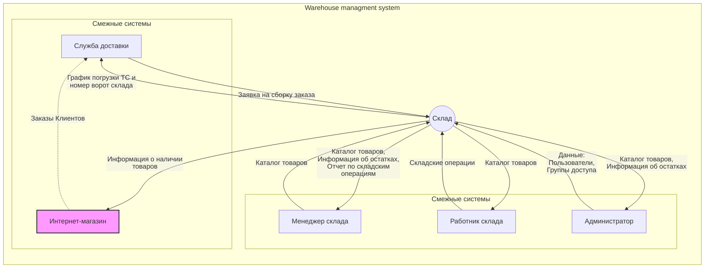

## Введение в проект

> ⚠️ В рамках проекта имитируется проект разработки WMS для
> интернет-магазина. Необходимо учитывать, что реальная система
> складского учета очень сложная, поэтому в проекте используется очень
> упрощенная модель, задача которой демонстрация навыков, перечисленных
> в  [Техническом введении](#техническое-введение).

Задача раздела помочь команде разработки ознакомится с бизнес-контекстом задачи. 

Наш интернет-магазин является активно развивающимся проектом, который занимается продажей товаров в онлайн-режиме.

Одной из важнейших доменных областей нашего интернет-магазина является Склад. Задача нашего проекта - обеспечить эффективное и надежное управление товарными запасами для поддержки онлайн-продаж, с минимальными операционными расходами на складские операции.

Текущая боль нашего проекта заключается в отсутствии системы управления складскими операциями (WMS). Для решения этой проблемы необходимо провести анализ требований к системе WMS и выбрать подходящую систему, которая удовлетворит наши потребности. Реализация данного проекта позволит нам повысить эффективность управления запасами товаров и улучшить обслуживание наших клиентов, что приведет к увеличению прибыли и укреплению нашей позиции на рынке электронной коммерции.

⚠️Примечание:
Количественные показатели целей бизнеса вида:
> Освоить Х% рынка за Y месяцев. Увеличить сектор рынка в стране X на Y%
> за Z месяцев. Достигнуть объема продаж X единиц или дохода, равного
> $Y, за Z месяцев.
>
не рассматриваются в рамках портфолио.
Артефакт анализа бизнес-требований Vision так же не рассматривается. 

## Бизнес требования

Бизнес - систематическая деятельность, направленная на получение прибыли.

**Для** :  
>  - определения смысла проекта и обоснования его необходимости;
>  - разработки основы контракта; 
>  - разработки критериев приемки проекта;
>  - определения рамок проекта; 
>  - критериев приоритезации задач в ходе  разработки; 
>  - для формирования Product owners backlog,

необходимо выделить **бизнес-требования** к проекту, так как задача информационной системы или программного обеспечения достижение целей бизнеса за счет автоматизации бизнес-процессов.

Основная потребность бизнеса в сфере электронной коммерции, связанная с продажей товаров, может быть сформулирована следующим образом:

> Обеспечение эффективного и надежного управления товарными запасами для
> поддержки онлайн-продаж

Чтобы ответить на вопрос “Зачем бизнесу нужен этот проект?” рассмотрим пример, на основе которого будет сформулирован ответ:

> В электронной коммерции необходимо удовлетворять потребности клиентов
> и удерживать их внимание. Для этого, с точки зрения WMS, важно знать
> актуальное количество товара в наличии на складе. В противном случае,
> существует вероятность, что клиент будет разочарован, так как он не
> получит товар, который заказывал, либо товар, который есть в наличии
> не будет выставлен в Каталоге интернет-магазина как доступный. В
> итоге, клиент может обратиться к конкурентам, где найдет необходимый
> товар, и наш интернет-магазин потеряет клиента. Поэтому знать точное
> количество товаров на складе важно для сохранения
> конкурентоспособности и удержания клиентов. Так как это позволит запланировать поставки нового товара.

**Зачем** это нужно:
> Обеспечить конкурентоспособность интернет-магазина за счет:
>  - учета актуальных остатков товаров 
>  - минимизации времени выполнения всех складских операций, в частности сборки заказов 
>  - оптимизации использования полезной площади хранения склада 
>  - минимизации операционных издержек

Какие **проблемы** решает система:
> - неактуальные остатки
> - переполнение склада
> - недоиспользование площадей склада
> - неоптимальное расположение товара на складе, что приводит к повышенным затратам на поиск и перемещение товаров;
> - неоптимальное время сборки заказов из-за неоптимального расположения товаров на складе
> - ошибки в сборке заказа, которые приводят к затратам на возврат заказа или к репутационным рискам
> - трудоемкость и возможные ошибки при ручном планировании графика сборки заказов

Решение указанных проблем позволит не терять доход из-за оттока клиентов к конкурентами по причине отсутствия товара, а также позволит снизить и удерживать уровень операционных расходов в рамках запланированных бюджетов. Соответственно, потребность бизнеса заключается в решении указанных ранее проблем:

> Бизнесу в сфере электронной коммерции необходимо обеспечить постоянную
> доступность товаров для своих покупателей, а также оптимизировать
> процессы хранения, перемещения и контроля запасов.

Для достижения этой цели требуется разработка и внедрение системы управления складом (WMS), которая позволит более эффективно управлять товарными запасами, снижать издержки и улучшать обслуживание клиентов.

В обобщенном виде в рамках проекта выделим две основные бизнес-потребности:
| Бизнес-потребность | Описание  |
|--|--|
| Знать точное кол-во товаров на складе на момент запроса | Нужно для планирования поставок, чтобы обеспечить непрерывность продаж |
| Минимизировать затраты на перемещение товара по складу | Нужно для снижения затрат на содержание склада  |
| Минимизировать простои транспортных средств логистических служб | Нужно для снижения затрат на логистику  |
Сформулируем реестр бизнес-требования на основе потребностей для последующей **трассировки** требований.

### Реестр бизнес-требований

Шаблон кода требования - Роль/Система + Глагол/Отглагольное существительное + Объект действия

| Код требования | Описание требования |
| :--- | :--- |
| BREQ-01 WMS.УчетОстатков | Система WMS должна обеспечивать точный учет остатков товаров на складе согласно BRULE-01 |
| BREQ-02 WMS.УправлениеХранениемТовара| Система WMS должна обеспечивать хранение товара с оптимальным расположением на складе для минимизации времени поиска и перемещения товара к месту сборки согласно BRULE-02,|
| BREQ-03 WMS.ФормированиеГрафикаСборки| Система WMS должна обеспечивать автоматическое формирование графика сборки заказов|

### Реестр бизнес-правил
| Код BRULE | Описание BRULE | Код требования |
| :--- | :--- | :--- |
| BRULE-01 | Остатки товаров на складе должны обновляться автоматически после каждой операции приемки, отгрузки (сборки), перемещения или инвентаризации товаров | BREQ-01 WMS.УчетОстатков |
| BRULE-02 | Товары на складе должны располагаться в соответствии с их характеристиками (габариты, вес, пожароопасность) и **частотой обращения**, чтобы максимально использовать полезную площадь склада и **время поиска и перемещения** товаров | BREQ-02 WMS.УправлениеХранениемТовара |
| BRULE-03 | График сборки заказов должен формироваться автоматически на основе текущей загруженности   склада(кол-во операций из BRULE-01) и времени, необходимого для выполнения этих операций | BREQ-03 WMS.ФормированиеГрафикаСборки |

### Стейкхолдеры

**Владельцы интернет-магазина:** Заинтересованы в оптимизации складских операций и снижении операционных издержек для повышения прибыльности бизнеса.  
**Менеджеры интернет-магазина:** Заинтересованы в улучшении качества обслуживания клиентов и ускорении выполнения заказов.  
**IT-специалисты:** Ответственны за поддержку и интеграцию WMS с другими системами компании.  
**Поставщики товаров:** Заинтересованы в точном и своевременном контроле и учете поставляемых товаров на складе интернет-магазина.  
**Клиенты интернет-магазина:** Заинтересованы в актуальности товарных предложений и быстром выполнении своих заказов.  

### Концепция системы (Фрагмент Карточки проекта)

*Карточка проекта используется для снижения уровня сложности реальной системы WMS до практического задания курса NodeJS (сейчас реализованные CRUD операции отличают от описания, ну, зато как в реальных проектах :-) ). На втором этапе планируется рефакторинг*

| **Карточка проекта**              |                                                                                                                                                                                                                                          |
|-------|--------|
| Тема проекта | Управление товарными запасами и складскими операциями для интернет-магазина                                                                                                                                                                           |
| Категория системы                                                                                                                                                                           | Серверное приложение имеющее REST API для интеграции и Telegram-bot
 | Заказчик                                                                                                                                                                           | Департамент электронной коммерции Торгового дома "Итальянские Диваны"
 | **Настоящая ситуация**                                                                                                                                                                          
| Решаемые проблемы             | Автоматизация ручных рутинных операций [BRULE-01], учет которых ведется вручную и с использованием бумажных журналов учета |
 |   Заинтересованные стороны      | Пользователи услуг интернет-магазина, Владелец интернет-магазина, Менеджеры интернет-магазина, Работники склада, Поставщики товаров                                                                                                                                                                             |
| Текущее решение               | Учет и регистрация товаров на складе ведутся вручную с использованием бумажных журналов, дозаказ товаров со сниженным запасами производится не вовремя, инвентаризация происходит нерегулярно, водители и курьеры долго ждут сборки заказов или отгрузки, что приводит к штрафным санкциям.                                                                                                                                                            |
| **Целевая ситуация**              |                                                                                                                                                                                                                                          |
| Цель для заказчика            | Увеличить эффективность и надежность управления товарными запасами для поддержки онлайн-продаж, сократить операционные издержки на 25% и сохранить конкурентоспособность интернет-магазина.                                                                                                                               |
| Назначение                    | **Для пользователей услуг и менеджеров(*) интернет-магазина**: обеспечить наличие товаров, снизить вероятность несоответствия товара заказу;  (* - бонусная часть зарплаты менеджеров интернет-магазина зависит от продаж)                                                                                                    |
|                               | **Для работников склада**: упростить процессы приемки и выдачи товаров [BRULE-01], инвентаризации склада, минимизировать время сборки заказов[BRULE-02], сократить "пробег" на перемещения товаров при сборке заказов[BRULE-02], сократить кол-во ручных операции[BRULE-01] ;                                                                                                                           |
|                               | **Для менеджеров склада**: добавление/удаление нового товара в каталог, мониторинг остатков товаров,  формирование графика сборки заказов и графиков погрузки транспортных средств  логистических служб, работа с отчетами о работе склада ;                                                                                                                           |
|  **Концепция решения**  | 
|  Количество видов пользователей | 1 Складские работники |
|   | 2 Менеджеры склада|
|   | 3 Администраторы WMS |
|  **Ключевые свойства и возможности** (features) |  |
|   | Управление каталогом (справочником) товаров |
|   | Приемка/отгрузка товаров |
|   | Мониторинг остатков товаров |
||Управление пользователями и правами|
| **Для складских работников**  | |
| |1 Складские операции (Приемка/отгрузка товара) (Update quantity)  |
|   | 2 Инвентаризация (future release) |
|   |3 Сборка заказа (future release) |
|**Для менеджера склада**  | |
| | 1 Управление каталогом (справочником) товаров (CRUDL)|
|  |2 Мониторинг остатков товаров в через REST API и Telegram-bot (inStock)  | 
|  |3 Планирование графика сборки заказов (future release) |
|  |4 Работа с отчетами о работе склада(future release) |
| **Для Администраторов склада**  | |
|  |1 Управление пользователями (CRUDL) |
|  | 2 Настройка прав доступа пользователям (ABAC)|
|  |3 Настройка параметров системы WMS(future release)|
|  |4 Обновление и поддержка WMS(future release)|

## Граница проекта. Контекстная диаграмма

Порядок разработки контекстной диаграммы:  

 - [ ] Из числа заинтересованных лиц собирается рабочая группа (обычно
       от 3 до 5 человек)
 - [ ] Рабочая группа фиксирует в центре диаграммы  **название** 
       конкретной системы
 - [ ] Рабочая группа выдвигает и отображает  **группы**  пользователей,
       которые должны взаимодействовать с системой, обсуждает их
       перечень, дополняет его (группа первого контакта с системой)
 - [ ] Рабочая группа выдвигает и отображает  **смежные системы**,
       которые должны взаимодействовать с системой, обсуждает их
       перечень, дополняет его
 - [ ] Рабочая группа последовательно проходит по каждому элементу
       окружения и описывает  **потоки данных**, связывающие его с
       системой
 - [ ] Рабочая группа проводит  **тестирование**  контекстной диаграммы,
       дополняя диаграмму по ходу тестирования

Таблица Групп пользователей и смежных систем
|Наименование  |Описание  |
|--|--|
|Система  |Описание  |
|Склад  |Черный ящик  |
|Группа пользователей  |Работник склада  |
|  |Менеджер склада |
|  |Администратор  |
|Смежные системы  |Интернет-магазин  |
|  |Служба доставки  |
Таблица Данных 
|Данные  |Описание  |
|--|--|
|Пользователи  | Данные о пользователях  |
|Группы пользователи  | Данные о группе пользователях  |
|Отчет о пользователях| Информация о пользователях и их действиях|
|Каталог товаров| Перечень товаров на складе (справочник)|
|Информация об остатках| Информация о остатках товара на складе|
|Отчет по складским операциям| Информация об истории складских операций |
|График и место погрузки| Данные о графике и месте погрузки (ворота склада) собранного заказа |
|Заявки на сборку заказа| Заявка на сборку заказа (формирует Служба доставки после подтверждения оплаты заказа Интернет-магазином)|
|Заказы| Информация о заказах|
|Складские операции (приход/расход)|Информация об операциях с товарами на складе|

ДАЛЕЕ НЕ ГОТОВО!! DRAFT!!! только эскиз структуры

