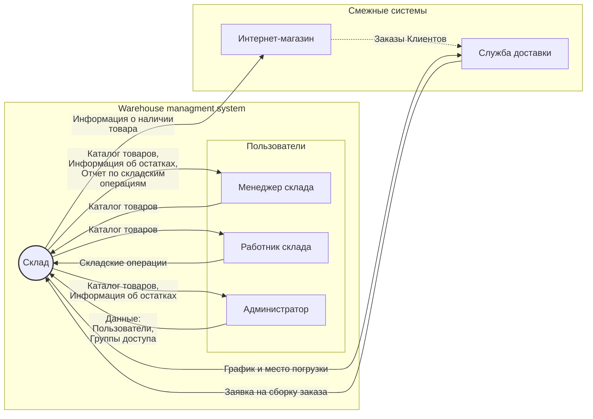

### Концепция системы (Фрагмент Карточки проекта)

*Карточка проекта используется для снижения уровня сложности реальной системы WMS до практического задания курса NodeJS (сейчас реализованные CRUD операции отличают от описания, ну, зато как в реальных проектах :-) ). На втором этапе планируется рефакторинг*

| **Карточка проекта**              |                                                                                                                                                                                                                                          |
|-------|--------|
| Тема проекта | Управление товарными запасами и складскими операциями для интернет-магазина                                                                                                                                                                           |
| Категория системы                                                                                                                                                                           | Серверное приложение имеющее REST API для интеграции и Telegram-bot
 | Заказчик                                                                                                                                                                           | Департамент электронной коммерции Торгового дома "Итальянские Диваны"
 | **Настоящая ситуация**                                                                                                                                                                          
| Решаемые проблемы             | Автоматизация ручных рутинных операций [BRULE-01], учет которых ведется вручную и с использованием бумажных журналов учета |
 |   Заинтересованные стороны      | Пользователи услуг интернет-магазина, Владелец интернет-магазина, Менеджеры интернет-магазина, Работники склада, Поставщики товаров                                                                                                                                                                             |
| Текущее решение               | Учет и регистрация товаров на складе ведутся вручную с использованием бумажных журналов, дозаказ товаров со сниженным запасами производится не вовремя, инвентаризация происходит нерегулярно, водители и курьеры долго ждут сборки заказов или отгрузки, что приводит к штрафным санкциям.                                                                                                                                                            |
| **Целевая ситуация**              |                                                                                                                                                                                                                                          |
| Цель для заказчика            | Увеличить эффективность и надежность управления товарными запасами для поддержки онлайн-продаж, сократить операционные издержки на 25% и сохранить конкурентоспособность интернет-магазина.                                                                                                                               |
| Назначение                    | **Для пользователей услуг и менеджеров(*) интернет-магазина**: обеспечить наличие товаров, снизить вероятность несоответствия товара заказу;  (* - бонусная часть зарплаты менеджеров интернет-магазина зависит от продаж)                                                                                                    |
|                               | **Для работников склада**: упростить процессы приемки и выдачи товаров [BRULE-01], инвентаризации склада, минимизировать время сборки заказов[BRULE-02], сократить "пробег" на перемещения товаров при сборке заказов[BRULE-02], сократить кол-во ручных операции[BRULE-01] ;                                                                                                                           |
|                               | **Для менеджеров склада**: добавление/удаление нового товара в каталог, мониторинг остатков товаров,  формирование графика сборки заказов и графиков погрузки транспортных средств  логистических служб, работа с отчетами о работе склада ;                                                                                                                           |
|  **Концепция решения**  | 
|  Количество видов пользователей | 1 Складские работники |
|   | 2 Менеджеры склада|
|   | 3 Администраторы WMS |
|  **Ключевые свойства и возможности** (features) |  |
|   | Управление каталогом (справочником) товаров |
|   | Приемка/отгрузка товаров |
|   | Мониторинг остатков товаров |
||Управление пользователями и правами|
| **Для работника склада**  | |
| |1 Складские операции (Приемка/отгрузка товара) (Update quantity)  |
|   | 2 Инвентаризация (future release) |
|   |3 Сборка заказа (future release) |
|**Для менеджера склада**  | |
| | 1 Управление каталогом (справочником) товаров (CRUDL)|
|  |2 Мониторинг остатков товаров в через REST API и Telegram-bot (inStock)  | 
|  |3 Планирование графика сборки заказов (future release) |
|  |4 Работа с отчетами о работе склада(future release) |
| **Для Администраторов склада**  | |
|  |1 Управление пользователями (CRUDL) |
|  | 2 Настройка прав доступа пользователям (ABAC)|
|  |3 Настройка параметров системы WMS(future release)|
|  |4 Обновление и поддержка WMS(future release)|

## Граница проекта. Контекстная диаграмма

Порядок разработки контекстной диаграммы:  

 - [ ] Из числа заинтересованных лиц собирается рабочая группа (обычно
       от 3 до 5 человек)
 - [ ] Рабочая группа фиксирует в центре диаграммы  **название** 
       конкретной системы
 - [ ] Рабочая группа выдвигает и отображает  **группы**  пользователей,
       которые должны взаимодействовать с системой, обсуждает их
       перечень, дополняет его (группа первого контакта с системой)
 - [ ] Рабочая группа выдвигает и отображает  **смежные системы**,
       которые должны взаимодействовать с системой, обсуждает их
       перечень, дополняет его
 - [ ] Рабочая группа последовательно проходит по каждому элементу
       окружения и описывает  **потоки данных**, связывающие его с
       системой
 - [ ] Рабочая группа проводит  **тестирование**  контекстной диаграммы,
       дополняя диаграмму по ходу тестирования

Таблица Групп пользователей и смежных систем
|Наименование  |Описание  |
|--|--|
|Система  |Описание  |
|Склад  |Черный ящик  |
|Группа пользователей  |Работник склада  |
|  |Менеджер склада |
|  |Администратор  |
|Смежные системы  |Интернет-магазин  |
|  |Служба доставки  |

Таблица Данных 
|Данные  |Описание  |
|--|--|
|Пользователи  | Данные о пользователях  |
|Группы пользователей  | Данные о группе пользователях  |
|Отчет о пользователях| Информация о пользователях и их действиях|
|Каталог товаров| Перечень товаров на складе (справочник)|
|Информация об остатках| Информация об остатках товара на складе|
|Информация о наличии товара| Информация о наличии товара на складе|
|Отчет по складским операциям| Информация об истории складских операций |
|График и место погрузки| Данные о графике и месте погрузки (ворота склада) собранного заказа |
|Заявки на сборку заказа| Заявка на сборку заказа (формирует Служба доставки после подтверждения оплаты заказа Интернет-магазином)|
|Заказы| Информация о заказах|
|Складские операции |Информация об операциях (приход/расход) с товарами на складе|

