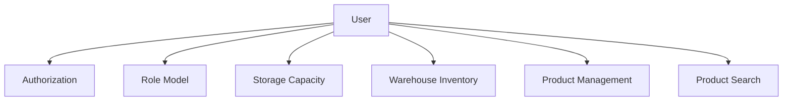
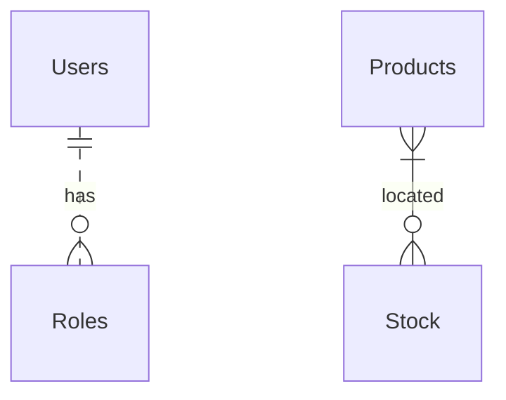
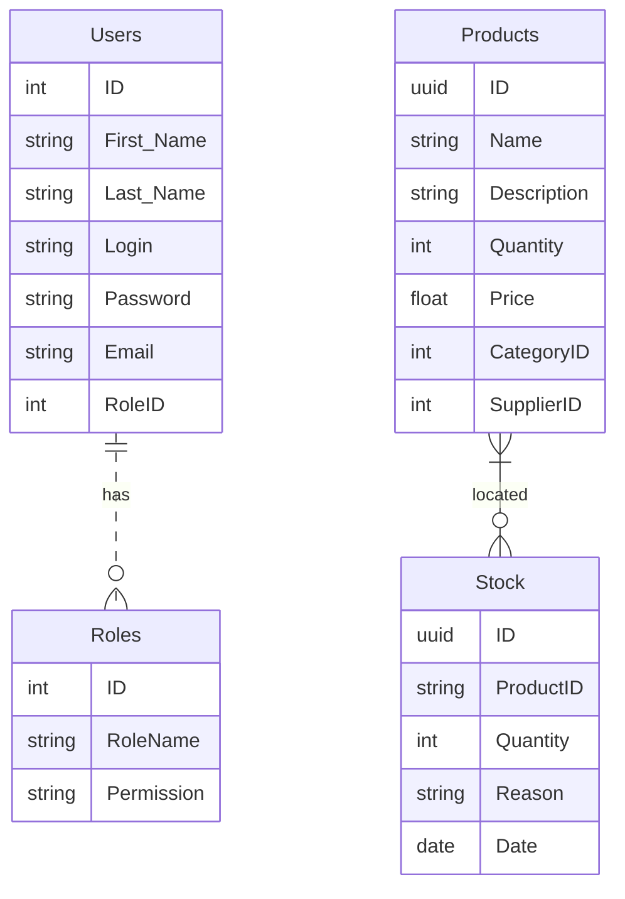

# Система управления складом версия 0.0.1  (WMS) - серверная часть (backend NodeJS/TS)

## Оглавление

1. [Введение](#введение)
2. [Бизнес требования](#бизнес-требования)
3. [Концепция системы](#концепция-системы-фрагмент-карточки-проекта)
4. [Функциональные требования](#основные-функциональные-требования)
5. [Пользовательские требования](#пользовательские-требования)
6. [Пользователи](#пользователи-системы)
7. [Роли пользователей](#пользователи-системы)
8. [Проектирование REST API](#проектирование-rest-api)
9. [Участники](#участники)
10. [HTTP ответы ресурса Пользователи](#http-ответы-ресурса-пользователи)
11. [HTTP ответы ресурса Продукты](#http-ответы-ресурса-продукты)
12. [Архитектура приложения](#архитектура-приложения)
13. [Проектирование модели предметной области](#проектирование-модели-предметной-области)
14. [ER diagram](#er-diagram-users-and-products)
15. [Физическая модель данных для ORM Prisma NodeJS](#физическая-модель-данных-для-orm-prisma-nodejs)
16. [Список литературы](#используемая-литература-в-ходе-подготовки-проекта)

------------
**⚠️ RUN**  
1 env config:

PORT=set the port as number  
SALT=set the salt as number  
SECRET='set the secret as string' 
SKIP = 0
TAKE = 20

2 npm ci && npm start 
3 e2e test: npm test:e2e

------------
## Введение

⚠️ Это учебный проект курса https://www.udemy.com/course/nodejs-start/ (https://learn.purpleschool.ru/public/products) в рамках которого я выступаю в ролях:

- Junior Backend Developer for JS/NodeJS/TS (implementing backend)
- Middle System Analyst (describing business and system requirements)

В роли **Junior Backend Developer**:
- непосредственно сама реализация приложения;  
- проектирование слоеной архитектуры (middlewares, exceptions filters,  controller, error handler, services, repository, orm prisma);
- реализация CRUD операции с ресурсом (товары на складе);  
- реализация JWT авторизация с ролевой моделью;  
- реализация документации REST API (swagger);
- использование при разработке тестирования (unit, e2e);
- использование DI, логгирования ошибок, работа Git и тп.
- разработка Telegram-bot с использованием функционала слоя бизнес-логики (DI)
    
В роли **Middle System Analyst**:
- выделение видов требования;
- проектирование архитектуры приложения;
- разработка и описание бизнес-требований и их артифактов;
- разработка и описание пользовательских требований (Use cases, User stories, Job stories, User stories mapping);
- разработка и описание функциональных требований;
- проработка нефункциональных требований;
- проработка качества требований и критериев приемки;
- проработка Event storming
- выделение агрегатов доменных областей и bounded contexts
- проектирование Модели предметной области и баз данных;
- проектирование REST API;
- формулирование измеримых требований к качеству интерфейсов согласно подхода стандартов семейства HCI (Human-Computer Interaction)
- базовые угрозы информационной безопасности
- проверка требований на INCOSE Requirements Writing Guide
  
&#128736;  Инструменты для редактирования README.md
- https://github.com/GnuriaN/format-README/blob/master/README.md
- https://structurizr.com/
- https://tableconvert.com/markdown-generator
- https://pandao.github.io/editor.md/en.html
- https://editor.swagger.io/
- https://emojio.ru/objects/d83ddee0-1f6e0-molot-i-gaechnyy-klyuch.html
- https://www.udemy.com/course/microservices-with-node-js-and-react/learn/lecture/19099026#overview пример проектирования метода by Stephen Grider
  
------------

## Бизнес требования

Бизнес - систематическая деятельность, направленная на получение прибыли.

    Примечание:
    Количественные показатели целей бизнеса вида: 
    Освоить Х% рынка за Y месяцев.
    Увеличить сектор рынка в стране X на Y% за Z месяцев.
    Достигнуть объема продаж X единиц или дохода, равного $Y, за Z месяцев.
    не рассматриваются в рамках проекта.
Задача раздела помочь команде проекта ознакомится с контекстом задачи.

**Для** :  

>  - определения смысла проекта и обоснования его необходимости;
>  - разработки основы контракта; 
>  - разработки критериев приемки проекта;
>  - определения рамок проекта; 
>  - критериев приоритезации задач в ходе  разработке; 
>  - для формирования Product owners backlog,

выделим **бизнес-требования** к проекту, так как задача информационной системы или программного обеспечения - удовлетворить бизнес-потребности. 

Основная потребность бизнеса в сфере электронной коммерции, связанная с продажей товаров, может быть сформулирована следующим образом:

> Обеспечение эффективного и надежного управления товарными запасами для
> поддержки онлайн-продаж

**Зачем** это нужно:
> Обеспечить конкурентоспособность интернет-магазина за счет поддержания
> остатков популярных товаров в наличии и времени сборки
> заказов на складе с минимальными операционными расходами на складские
> операции.

Рассмотрим простой пример.
В электронной коммерции необходимо удовлетворять потребности клиентов и удерживать их внимание. Для этого, важно иметь в наличии популярные товары и обеспечивать непрерывное снабжение склада товарами. В противном случае, клиент может обратиться к конкурентам, где найдет необходимый товар, и мы потеряем клиента. Поддерживать оптимальный уровень запасов товаров на складе важно для сохранения конкурентоспособности и увеличения лояльности клиентов.

Какие **проблемы** решает система:

> - отсутствие популярного товара в наличии
> - отсутствие сезонных товаров в наличии  
> - отток клиентов из-за нестабильности наличия популярного ассортимента 
> - переполнение склада
> - недоиспользование площадей склада
> - неоптимальное время сборки заказов из-за неоптимального расположения товаров на складе
> - ошибки в сборке заказа, которые приводят к затратам на возврат заказа или к репутационным рискам
> - неоптимальное расположение товара на складе, что приводит к повышенным затратам на поиск и перемещение товаров;
> - трудоемкость и возможные ошибки при ручном планировании графика сборки заказов
> - трудоемкость и возможные ошибки при ручном планировании графики погрузки транспортных средств

Описание потребностей бизнеса:
Решение указанных проблем позволит не терять доход из-за оттока клиентов к конкурентами по причине отсутствия товара, а также позволит снизить или удерживать уровень операционных расходов в рамках запланированных бюджетов. Соответственно, потребность бизнеса заключается в решении указанных ранее проблем:

> Бизнесу в сфере электронной коммерции необходимо обеспечить постоянную
> доступность товаров для своих покупателей, а также оптимизировать
> процессы хранения, перемещения и контроля запасов.

Для достижения этой цели требуется разработка и внедрение системы управления складом (WMS), которая позволит более эффективно управлять товарными запасами, снижать издержки и улучшать обслуживание клиентов.

Выделим бизнес-потребности в таблицу.

### Бизнес-потребности

| Потребность                          | Описание                                                                                                          |
|--------------------------------------|-------------------------------------------------------------------------------------------------------------------|
|    Управление инвентаризацией        |       Точное отслеживание и управление уровнем запасов, местоположением и перемещением товаров на складе.                             |
|       Обработка и выполнение заказов     |                     Эффективная обработка входящих заказов, комплектация, упаковка и доставка, чтобы удовлетворить потребности клиентов.             |
|      Управление трудовыми ресурсами      |           Оптимизация распределения рабочей силы, отслеживание производительности и балансировка нагрузки для эффективной работы.                       |
|        Интеграция и обмен данными    |                  Бесшовное взаимодействие и обмен данными с другими корпоративными системами, такими как ERP, TMS и платформы электронной коммерции.                |
|      Отчетность и аналитика      |                Получение оперативных данных и ключевых показателей эффективности (KPI) для принятия обоснованных решений и улучшения процессов.                  |
|        Оптимизация и использование пространства    |          Максимизация складской емкости и эффективность размещения товаров для сокращения затрат и улучшения работы на складе.                        |
|       Приемка и размещение товаров     |                    Оптимизация процессов приемки, проверки и хранения входящих товаров для обеспечения точности и эффективности.              |
|       Управление возвратами     |        Эффективное управление возвратами от клиентов, пополнение запасов и распределение товаров для снижения затрат и удовлетворения клиентов.                          |
|       Контроль качества и соответствие нормам     |           Обеспечение соблюдения стандартов качества, требований безопасности и отраслевых нормативов в процессах работы на складе.                       |
|        Масштабируемость и гибкость    |         Адаптация к изменениям в бизнесе, колебаниям спроса и развивающимся операционным требованиям.                         |

### Бизнес-потребности
Для обеспечения трассируемости требований, сформулируем реестр бизнес-требований,
| Номер/код бизнес-требования | Описание                                                                                                                                                                                                                                                                                                                                                                                                                                                    |
|------------------------|--------------------------------------------------------------------------------------------------------------------------------------------------------------------------------------------------------------------------------------------------------------------------------------------------------------------------------------------------------------------------------------------------------------------------------------------------------------|
| BREQ1 Склад.Запас.Регулярное.Пополнение                  | Для поддержания оптимального уровня товарных запасов (см. BR1) необходимо обеспечивать регулярное пополнение товаров на складе.                                                                                                                                                                                                                                                                                                                             |
| BREQ2 Склад.Доступность.Регулярное.Инвентаризация                  | Для обеспечения актуальной на момент запроса информации о доступных товарах, необходимо регулярно проводить учет фактического товарного запаса на складе (см. BR2).                                                                                                                                                                                                                                                                                            |
| BREQ3 Склад.Товар.Местоположение                  | Для быстрой и эффективной обработки заказов на сборку (см. BR3), необходимо отслеживать местоположение товара на складе и информацию о его размещении.                                                                                                                                                                                                                                                                                                         |
| BREQ4 Склад.Товар.Оптимизация.МестоХранения                 | Для минимизации расходов на перемещение товара по складу (приемка, сборка, выбытие, смена места хранения) (см. BR4), необходимо оптимизировать заполнение площадей склада.                                                                                                                                                                                                                                                                             |
| BREQ5 Склад.Персонал.ГрафикРаботы                  | Для повышения эффективности работы сборщиков заказов и грузчиков (см. BR5), необходимо оптимизировать процесс управления ими и их рабочими задачами.                                                                                                                                                                                                                                                                                                       |

    В рамках проекта не приводится описание алгоритмов определения оптимальных запасов на складе, или методы оптимизации заполнения складов. 

| Бизнес-правила (BRULE) | Описание                                                                                                     |
|---------------------|--------------------------------------------------------------------------------------------------------------|
| BRULE1                 | Определение оптимального уровня товарных запасов.                                                            |
| BRULE2                 | Регулярность проведения учета фактического товарного запаса.                                                 |
| BRULE3                 | Критерии быстрой и эффективной обработки заказов на сборку.                                                  |
| BRULE4                 | Методы оптимизации заполнения площадей склада.                                                                |
| BRULE5                 | Процессы управления сборщиками заказов и грузчиками.                                                          |


## Концепция системы (Фрагмент Карточки проекта)


| Карточка проекта              |                                                                                                                                                                                                                                          |
|-------------------------------|------------------------------------------------------------------------------------------------------------------------------------------------------------------------------------------------------------------------------------------|
| Автоматизируемая деятельность | Управление складом (отслеживание актуальным состоянием склада)                                                                                                                                                                           |
| Заинтересованные стороны      | Пользователи услуг склада, Владелец склада, Работники склада, Владелец интернет-магазина                                                                                                                                                                             |
| Текущее решение               | Учет и регистрация товаров на складе ведутся вручную с использованием журналов, дозаказ товаров со сниженным запасами производится не вовремя.                                                                                                                                                            |
| Решаемые проблемы             | Уменьшение ошибок, вызванных человеческим фактором: ошибки при записи в журнал, расчет количества остатков, учет суммарного веса, объема товаров, снижение затрат на бумажные носители, увеличение скорости обслуживания клиентов склада |
| Целевая ситуация              |                                                                                                                                                                                                                                          |
| Цель для заказчика            | Снизить расходы на операционную деятельность по управлению склада на 20%, увеличить приток клиентов на 15% за счет наличия популярных товаров                                                                                                                               |
| Назначение                    | Для пользователей услуг склада: увеличить скорость обслуживания от момента поступления заявки до выдачи или приемки товара на склад;                                                                                                      |
|                               | Для работника склада: автоматизировать процессы приемки и выдачи товаров, инвентаризации склада; Для курьеров транспортных компаний: предсказуемый график погрузки                                                                                                                            |
|                               | Для курьеров транспортных компаний: предсказуемый график погрузки                                                                                                                            | 
| Основные фичи системы         |    1 Администрирование пользователей системы (CRUDL, Roles)                                                                                                                         | 
|          |    2 Управление товарами на складе (CRUDL, inStock)                                                                                                                         | 
|          |    3 Управление складом через Telegram бота                                                                                                                      | 

 
## Основные функциональные требования

> Функциональные требования приведены согласно лексическим формулам: 
> [Условие][Субъект][Действие][Объект][Ограничение/Значение]
> Система должна [ДЕЙСТВИЕ][ОБЪЕКТ ДЕЙСТВИЯ][атрибуты объекта]
**Функциональные требования** описывают, каким образом система должна выполнять конкретную функцию или задачу. Они описывают, что должна делать система и как она должна это делать. Функциональные требования обычно выражаются в терминах конкретных функций, операций или процессов, которые система должна выполнять.  

### Функциональные требования
1. Система должна хранить информацию о количестве товара на складе
2. Система должна поддерживать авторизированный доступ к системе с ограничением по доступу к функционалу согласно ролевой модели ([Роли пользователей](#пользователи-системы)). 
3. Система должна обеспечивать генерацию нового типа Пользователя с набором прав доступа (Администратор, Начальник склада)
4. Система должна обеспечить по запросу Пользователя операцию по предоставлению всех товаров на складе.   
5. Система должна обеспечить по запросу Пользователя операцию по добавлению товара на склад с указанием причины добавления и источника.
6. Система должна обеспечить по запросу Пользователя операцию по удалению товара со склада, направление убытия и причина убытия.  
7. Система должна обеспечить по запросу Пользователя операцию по изменению свойств товара с указанием причин изменения. Нулевое значение количества отстатков не приводит к удалению товара со склада.
8. Система должна обеспечить поиск с фильтрацией товара на складе по различным параметрам, таким как наименование товара, количество, стоимость, дата добавления.

## Пользователи системы
о чем эта диаграмма? может лучше сюда Use case?


| Пользователь | Описание                                       |
|------------------------------------|---|
| Работник | Работник склада. Роль - Администратор системы      |
| Работник | Работник склада. Роль - Начальник склада           |

## Пользовательские требования
> Пользовательские требования приведены согласно лексическим формулам: 
> Система должна позволять Пользователю [РОЛЬ][ДЕЙСТВИЕ][ОБЪЕКТ ДЕЙСТВИЯ][атрибуты объекта]
> **Пользовательские требования** - это требования, выраженные пользователями и описывающие, каким образом система должна быть использована. Эти требования обычно формулируются на естественном языке и представляют собой описание того, что должна делать система для пользователя, а не как она это должна делать.  
**Таким образом**, пользовательские требования фокусируются на том, что должна делать система для пользователя, а функциональные требования - на том, каким образом это должно происходить в системе.

### Реестр пользовательских требований. 

| №USERREQ | Пользовательское требование                                                                                            |
|----------|------------------------------------------------------------------------------------------------------------------------|
| 1 Пользователь.Авторизация       | Возможность авторизироваться в системе и получать доступ к своим данным и функционалу в соответствии с ролью.          |
| 2 Пользователь.Создание      | Возможность создавать нового пользователя в системе с набором прав доступа.                                             |
| 3 Пользователь.Удаление       | Возможность удаления пользователя.                                             |
| 4 Пользователь.Просмотр.Товары        | Возможность просматривать список товаров или один товар с остатками на складе с возможностью фильтрации по категориям и характеристикам товаров.  |
| 5 Пользователь.Добавление.Товара       | Возможность добавлять новый товар на склад с указанием причины добавления и источника.                                 |
| 6 Пользователь.Удаление.Товара       | Возможность удалять товар со склада с указанием причины убытия и направления убытия.                                   |
| 7 Пользователь.Обновление.Товара       | Возможность обновлять характеристики товара на складе с указанием причины изменения.                                    |
| 8 Пользователь.Поиск.Товара       | Возможность поиска товара на складе с использованием фильтрации по характеристикам товара.                             |
| 9 Пользователь.ИзменениеКоличества.Товара       | Возможность изменять количество товара на складе с указанием причины изменения.                                        |

### Роли пользователей в системе

Ролевая модель **Роль: Администратор**
|  №USERREQ | Описание   |
| :------------: | :------------: |
| 2 | Создание нового пользователя  |
| 3 | Удаление пользователя  |
| 5 | Добавление нового товара  |
| 6 | Удаление товара  |
| 7 | Обновление информации о товаре  |
| 9 | Изменение остатков на складе |

Ролевая модель **Роль: Начальник склада**
|  №UserReq | Описание   |
| :------------: | :------------: |
| 9 | Изменение остатков на складе |

Ролевая модель **Роль: общий доступ для всех зарегистрированных сотрудников склада**
|  №UserReq | Описание   |
| :------------: | :------------: |
| 1 | Авторизация  |
| 4 | Получение списка товаров |
| 4 | Получение конкретного товара |
| 8  | Поиск товара с поисковыми параметрами фильтрации |

## Проектирование REST API

> Общий подход к проектированию REST API. Перед началом проектирования
> REST API, необходимо проработать модель предметной области и выделить
> сущности, логику работы которых реализует система. В нашем примере,
> выделено две сущности: Пользователь и Товары (на складе) и определим
> CRUDLs операции для них. Далее, опишем методы и параметры запросов ,
> ожидаемые ответы, включая http статусы.

#### Разбиение на ресурсы (сущности) и методы работы с ними
**Управление ресурсом "Пользователи"**
1. Авторизация пользователя
2. Создание нового пользователя с набором ролей
5. Обновление информации о пользователе
6. Удаление пользователя
 
| **№** | **Path**                   | **Method** | **Body**  | **Response**              | **Description**                                |
|-------|----------------------------|------------|-----------|---------------------------|------------------------------------------------|
| 1     | /users                     | GET        | -         | Список пользователей      | Получить список всех пользователей             |
| 2     | /users/{id}                | GET        | -         | Информация о пользователе | Получить информацию о конкретном пользователе  |
| 3     | /users                     | POST       | User data | Новый пользователь        | Создать нового пользователя                    |
| 4     | /users/{id}                | PUT        | User data | Обновленный пользователь  | Обновить информацию о пользователе             |
| 5     | /users/{id}                | DELETE     | -         | -                         | Удалить пользователя                           |
| 6     | /users/{id}/roles          | GET        | -         | Список ролей пользователя | Получить список ролей пользователя             |
| 7     | /users/{id}/roles          | POST       | Role data | -                         | Добавить роль пользователю                     |
| 8     | /users/{id}/roles/{roleId} | DELETE     | -         | -                         | Удалить роль у пользователя                    |
| 9     | /login                     | POST       | User creds | Jwt token                | Аутентификация пользователя                    |
#### Описание структуры объектов в теле запроса
##### User data
```json
{
  "name": "John Doe",
  "email": "johndoe@example.com",
  "password": "password123",
  "role": "User"
}
```

##### Role data
```json
{
  "name": "Admin",
  "description": "Administrator role with full access."
}
```

##### Response Список пользователей
```json
[
  {
    "id": "1",
    "name": "John Doe",
    "email": "johndoe@example.com",
    "role": "User"
  },
  {
    "id": "2",
    "name": "Jane Doe",
    "email": "janedoe@example.com",
    "role": "Admin"
  }
]
```

##### Response Информация о пользователе
```json
{
  "id": "1",
  "name": "John Doe",
  "email": "johndoe@example.com",
  "role": "User"
}
```

##### Response Новый пользователь
```json
{
  "id": "3",
  "name": "Alice Smith",
  "email": "alicesmith@example.com",
  "role": "User"
}
```

##### Response Список ролей пользователя
```json
[
  {
    "id": "1",
    "name": "Admin",
    "description": "Administrator role with full access."
  },
  {
    "id": "2",
    "name": "User",
    "description": "Regular user role."
  }
]
```

##### User creds
```json
{
  "email": "johndoe@example.com",
  "password": "password123",
}
```

**Управление ресурсом "Товары на складе"**
1. Получение списка товаров
2. Получение информации о конкретном товаре
3. Создание нового товара
4. Обновление информации о товаре
5. Удаление товара
6. Поиск товара с поисковыми параметрами фильтрации
7. Изменение остатков на складе (отдельный метод на изменение количества товара на складе)
8. Получение остатка конкретного товара

|   | № | Path                 | Method | Body         | Response                     |
|---|---|----------------------|--------|--------------|------------------------------|
|   | 1 | /products            | GET    | -            | Список товаров               |
|   | 2 | /products/{id}       | GET    | -            | Информация о товаре          |
|   | 3 | /products            | POST   | Product data | Новый товар                  |
|   | 4 | /products/{id}       | PUT    | Product data | Обновленный товар            |
|   | 5 | /products/{id}       | DELETE | -            | -                            |
|   | 6 | /products/search     | GET    | -            | Список товаров               |
|   | 7 | /products/{id}/stock | PUT    | Stock data   | Измененный остаток товара    |
|   | 8 | /products/{id}/stock | GET    | -            | Информация об остатке товара |

#### Описание структуры объектов в теле запроса
##### Product data and Stock data
```javascript
Product data = {
    'name': str,
    'category': str,
    'description': str,
    'characteristics': dict
}

Stock data = {
    'quantity': int,
    'reason': str
}
```

##### Responses objects
```javascript
Список товаров = [
    {
        'id': int,
        'name': str,
        'category': str,
        'description': str,
        'characteristics': dict,
        'quantity': int
    },
    {...},
    {...}
]

Информация о товаре = {
    'id': int,
    'name': str,
    'category': str,
    'description': str,
    'characteristics': dict,
    'quantity': int
}

Новый товар = {
    'id': int,
    'name': str,
    'category': str,
    'description': str,
    'characteristics': dict,
    'quantity': int
}

Обновленный товар = {
    'id': int,
    'name': str,
    'category': str,
    'description': str,
    'characteristics': dict,
    'quantity': int
}

Измененный остаток товара = {
    'id': int,
    'quantity': int,
    'reason': str
}

Информация об остатке товара = {
    'id': int,
    'quantity': int
}

```

### Участники:
Работник склада - Администратор  
Работник склада - Работник: "Начальник склада"  
Система управления складом (бекенд)  

### HTTP ответы ресурса Пользователи
| **№** | **Path**                   | **Method** | **Successful HTTP code** | **Unsuccessful HTTP code** | **Description**                               |
|-------|----------------------------|------------|--------------------------|----------------------------|------------------------------------------------|
| 1     | /users                     | GET        | 200                      | 401, 403, 404              | Получить список всех пользователей             |
| 2     | /users/{id}                | GET        | 200                      | 401, 403, 404              | Получить информацию о конкретном пользователе  |
| 3     | /users                     | POST       | 201                      | 400, 401, 403              | Создать нового пользователя                    |
| 4     | /users/{id}                | PUT        | 200                      | 400, 401, 403, 404         | Обновить информацию о пользователе             |
| 5     | /users/{id}                | DELETE     | 204                      | 401, 403, 404              | Удалить пользователя                           |
| 6     | /users/{id}/roles          | GET        | 200                      | 401, 403, 404              | Получить список ролей пользователя             |
| 7     | /users/{id}/roles          | POST       | 201                      | 400, 401, 403, 404         | Добавить роль пользователю                     |
| 8     | /users/{id}/roles/{roleId} | DELETE     | 204                      | 401, 403, 404              | Удалить роль у пользователя                    |
| 9     | /login                     | POST       | 200                      | 400, 401                   | Аутентификация пользователя                    |


### HTTP ответы ресурса Продукты
| **№** | **Path**                 | **Method** | **Успешный HTTP-код** | **Неуспешный HTTP-код** | **Описание**                                 | **** |
|-------|--------------------------|------------|-----------------------|-------------------------|-----------------------------------------------|------|
| 1     | /products                | GET        | 200                   | 404                     | Получить список всех товаров                  |      |
| 2     | /products/{id}           | GET        | 200                   | 404                     | Получить информацию о товаре по ID            |      |
| 3     | /products                | POST       | 201                   | 400, 401, 500           | Создать новый товар                           |      |
| 4     | /products/{id}           | PUT        | 200                   | 400, 401, 404, 500      | Обновить информацию о товаре по ID            |      |
| 5     | /products/{id}           | DELETE     | 204                   | 401, 404, 500           | Удалить товар по ID                           |      |
| 6     | /products/{id}/stock     | GET        | 200                   | 404                     | Получить информацию об остатках товара по ID  |      |
| 7     | /products/{id}/stock     | POST       | 200                   | 400, 401, 404, 500      | Изменить остатки товара по ID                 |      |
| 8     | /products/{id}/stock     | PUT        | 200                   | 400, 401, 404, 500      | Обновить информацию об остатках товара по ID  |      |
| 9     | /products/{id}/stock     | DELETE     | 204                   | 401, 404, 500           | Удалить информацию об остатках товара по ID   |      |
| 10    | /products/{id}/thumbnail | PUT        | 200                   | 400, 401, 404, 500      | Загрузить изображение для товара по ID        |      |


#### Значение кодов ответов HTTP
| **№** | **Код ответа HTTP** | **Описание**                                                                                    | **Users_api**                                                                                  | **Products_api**                              |
|-------|---------------------|-------------------------------------------------------------------------------------------------|------------------------------------------------------------------------------------------------|------------------------------------------------|
| 1 | 200                 | Успешный запрос, данные успешно возвращены                                                      | Получение списка пользователей, информации о пользователе, списка товаров, информации о товаре | Получение списка товаров, информации о товаре  |
| 2 | 201                 | Запрос успешно выполнен, новый ресурс был создан                                                | Создание нового пользователя, товара                                                           | Создание нового товара                         |
| 3 | 204                 | Успешный запрос, но нет данных для возврата                                                     | Обновление данных пользователя, товара                                                         | Обновление данных товара                       |
| 4 | 400                 | Ошибка запроса, запрос не может быть обработан сервером                                         | Некорректный запрос                                                                            | Некорректный запрос                            |
| 5 | 401                 | Ошибка авторизации, отсутствуют или некорректные авторизационные данные                         | Ошибка авторизации                                                                             | Ошибка авторизации                             |
| 6 | 403                 | Ошибка доступа, сервер понимает запрос, но отказывается его выполнять из-за ограничений доступа | Доступ запрещен                                                                                | Доступ запрещен                                |
| 7 | 404                 | Ошибка запроса, запрашиваемый ресурс не найден                                                  | Пользователь или ресурс не найден                                                              | Товар или ресурс не найден                     |
| 8 | 409                 | Ошибка конфликта, запрос не может быть обработан из-за конфликтующих данных                     | Дублирование существующего пользователя                                                        | Дублирование существующего товара              |
| 9 | 500                 | Ошибка сервера, запрос не может быть обработан из-за ошибки на стороне сервера                  | Ошибка на стороне сервера                                                                      | Ошибка на стороне се                           |

## Архитектура приложения

В основе приложения лежит слоеная архитектура, с выделением следующих модулей:
- слой бизнес-логики (services Products service, Users service)
- слой контроллеров (Products controller, Users controller)
- слой работы с репозиторием (Products repository, Users repository)
- слой middleware, DTO
- cлой для работы с Telegram ботом (bot.connector)

- Пользовательский интерфейс
  - Представлен RESTful API на Node.js с использованием пакета express
- Middleware
  - Обрабатывает запросы и валидирует параметры запроса на наличие обязательного параметра
- Controller
  - Использует маршрутизацию запросов с помощью пакета express и вызывает методы слоя бизнес-логики
- Бизнес-логика
  - Получает запрос от Controller;
  - Обрабатывает полученные данные, согласно бизнес-логике, обращается к слою Репозитория;
- Exceprion handler
  - Обрабатывает ошибки, возникающие в Middleware, Controller и Business Logic.
  - Возврат пользователю ответа в едином формате с уведомлением об ошибке
  - Логирование ошибок для последующего анализа
 - Авторизация и ролевая модель:
  - используется JWT token.

## Проектирование модели предметной области
### Сущности Entities
Моделирование предметной области необходимо для выявления сущностей и их атрибутов, а также определяются связи между сущностями (1:1, 1:n). По результатам моделирования предметной области разрабатывается схема базы данных.
|   |          |                                                                                                                                                                                           |
|---|----------|-------------------------------------------------------------------------------------------------------------------------------------------------------------------------------------------|
| № | Сущность | Описание                                                                                                                                                                                  |
| 1 | Users    | Таблица для хранения информации о пользователях, такой как логин, пароль, электронная почта, ФИО и другие атрибуты в зависимости от требований к системе.                                 |
| 2 | Roles    | Таблица для хранения информации о различных ролях пользователей в системе. Каждая роль может иметь уникальный идентификатор и набор разрешений для доступа к различным функциям системы.  |
| 3 | Products | Таблица для хранения информации о товарах, такой как название, описание, категория, характеристики, цена и другие атрибуты в зависимости от требований к системе.                         |
| 4 | Stock    | Таблица для хранения информации о наличии товаров на складе, такой как идентификатор товара, количество и причина изменения остатков на складе.                                           |

#### Users
| **1** | **Атрибут** | **Описание**                             |
|-------|-------------|-------------------------------------------|
| 2     | ID          | Уникальный идентификатор пользователя     |
| 3 | Login       | Логин пользователя для входа в систему    |
| 4 | Password    | Пароль пользователя для входа в систему   |
| 5 | Email       | Электронная почта пользователя для связи  |
| 6 | FullName    | Полное имя пользователя                   |
| 7 | RoleID      | Идентификатор роли пользователя в системе |

#### Roles 
| **1** | **Атрибут** | **Описание**                               |
|-------|-------------|---------------------------------------------|
| 2     | ID          | Уникальный идентификатор роли               |
| 3 | Name        | Название роли                               |
| 4 | Permissions | Список разрешений, связанных с данной ролью |

#### Products
| **1** | **Атрибут** | **Описание**                              |
|-------|-------------|--------------------------------------------|
| 2     | ID          | Уникальный идентификатор товара            |
| 3 | Name        | Название товара                            |
| 4 | Size_Length | Длина товара                               |
| 5 | Size_Height | Высота товара                              |
| 6 | Size_Width  | Ширина товара                              |
| 7 | Weight      | Вес товара                                 |
| 8 | Description | Описание товара                            |
| 9 | Price       | Цена товара                                |
| 10 | ActualDate  | Дата, на которую установлена цена на товар |

#### Stock
| **1** | **Атрибут** | **Описание**                              |
|-------|-------------|--------------------------------------------|
| 2     | ID          | Уникальный идентификатор записи на складе  |
| 3 | ProductID   | Идентификатор товара                       |
| 4 | Quantity    | Количество товара на складе                |
| 5     | Reason      | Причина изменения остатков на складе       |
| 6     | Date        | Дата изменения остатков на складе          |


## ER diagram Users and Products


## Физическая модель базы данных


## Физическая модель данных для ORM Prisma NodeJS
```javascript
    model User {
      id         Int      @id @default(autoincrement())
      firstName  String
      lastName   String
      login      String   @unique
      password   String
      email   String
      role       Role     @default(USER)
    }
      
    model Product {
      id          Int       @id @default(autoincrement())
      name        String
      description String?
      price       Float
      inventories Inventory[]
    }
    
    model Inventory {
      id         Int      @id @default(autoincrement())
      quantity   Int
      updateDate DateTime @default(now())
      productId  Int
      product    Product  @relation(fields: [productId], references: [id])
    }
     
    enum Role {
      ADMIN
      CLIENT
      EMPLOYEE
    }
```

## Используемая литература в ходе подготовки проекта

1. Dean, L. Managing Software Requirements.
2. Wiegers, K. and Bitti, L. Cars: Requirements Analysis and Specification for Software Engineers. Second Edition. Microsoft Press.
3. Rational Unified Process (RUP).
4. Guide to the Software Engineering Body of Knowledge (SWEBOK).
5. IEEE. (1998). IEEE Recommended Practice for Software Requirements Specifications (IEEE 830).
6. ГОСТ 34.003 - 90. Информационная технология. Комплекс стандартов на автоматизированные системы. Основные положения.
7. ГОСТ 34.604 - 92. Информационная технология. Комплекс стандартов на автоматизированные системы. Требования к программным средствам.

Дополнительный список (планирую ознакомится):

8. ISO/IEC/IEEE 29148:2018 Systems and software engineering -- Life cycle processes -- Requirements engineering
9. ISO/IEC/IEEE 12207:2017 Systems and software engineering -- Software life cycle processes
10. ISO/IEC 12207:1995 Information technology -- Software life cycle processes
11. EN 50126-1:2017 Railway applications -- The specification and demonstration of Reliability, Availability, Maintainability and Safety (RAMS) -- Part 1: Generic RAMS process
12. EN 50600-1:2012 Information technology -- Data centre facilities and infrastructures -- Part 1: General concepts and requirements
13. ISO/IEC 15504-5:2012 Information technology -- Process assessment -- Part 5: An exemplar Process Assessment Model for IT service management (ISO/IEC 20000-1)
14. EN 62304:2006 Medical device software -- Software life cycle processes.
